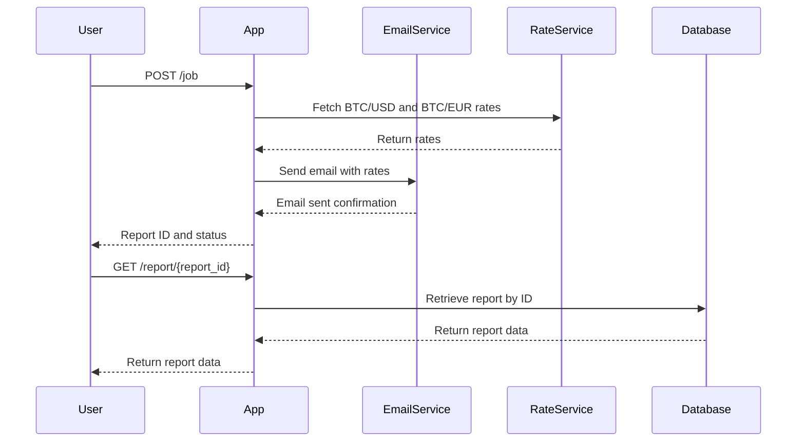

Here are the well-formatted final functional requirements for your application, structured clearly for ease of understanding:

### Functional Requirements

#### User Stories

1. **Report Creation Initiation**
   - **As a user, I want to initiate a report creation process so that I can receive the latest Bitcoin conversion rates.**
   - **Endpoint**: `POST /job`
   - **Request Format**: 
     ```json
     {
       "email": "user@example.com"
     }
     ```
   - **Response Format**: 
     ```json
     {
       "report_id": "12345",
       "status": "Report is being generated."
     }
     ```

2. **Retrieving a Report**
   - **As a user, I want to retrieve a previously generated report so that I can view the conversion rates.**
   - **Endpoint**: `GET /report/{report_id}`
   - **Request Format**: 
     - **URL Parameter**: `/report/12345`
   - **Response Format**: 
     ```json
     {
       "report_id": "12345",
       "btc_usd_rate": "50000",
       "btc_eur_rate": "42000",
       "timestamp": "2023-10-01T12:00:00Z"
     }
     ```

#### API Endpoints Summary

| Method | Endpoint        | Description                                      | Request Format                               | Response Format                             |
|--------|-----------------|--------------------------------------------------|----------------------------------------------|--------------------------------------------|
| POST   | /job            | Initiates report creation and sends an email.   | `{ "email": "user@example.com" }`          | `{ "report_id": "12345", "status": "..." }` |
| GET    | /report/{id}    | Retrieves the stored report by its ID.           | N/A (URL parameter)                          | `{ "report_id": "12345", "btc_usd_rate": "...", "btc_eur_rate": "...", "timestamp": "..." }` |

### Sequence Diagram


```mermaid
sequenceDiagram
    participant User
    participant App
    participant EmailService
    participant RateService

    User->>App: POST /job
    App->>RateService: Fetch BTC/USD and BTC/EUR rates
    RateService-->>App: Return rates
    App->>EmailService: Send email with rates
    EmailService-->>App: Email sent confirmation
    App-->>User: Report ID and status

    User->>App: GET /report/{report_id}
    App->>Database: Retrieve report by ID
    Database-->>App: Return report data
    App-->>User: Return report data
```

### Additional Considerations
- **Error Handling**: Define procedures for handling errors in rate retrieval or email sending.
- **Authentication**: Decide if endpoints should be protected or publicly accessible.
- **Rate Retrieval Frequency**: Consider whether rates should be fetched only on request or at regular intervals.

This formatting provides a clear overview of the functional requirements and serves as a solid foundation for further development. Let me know if you need any more adjustments or additional requirements!