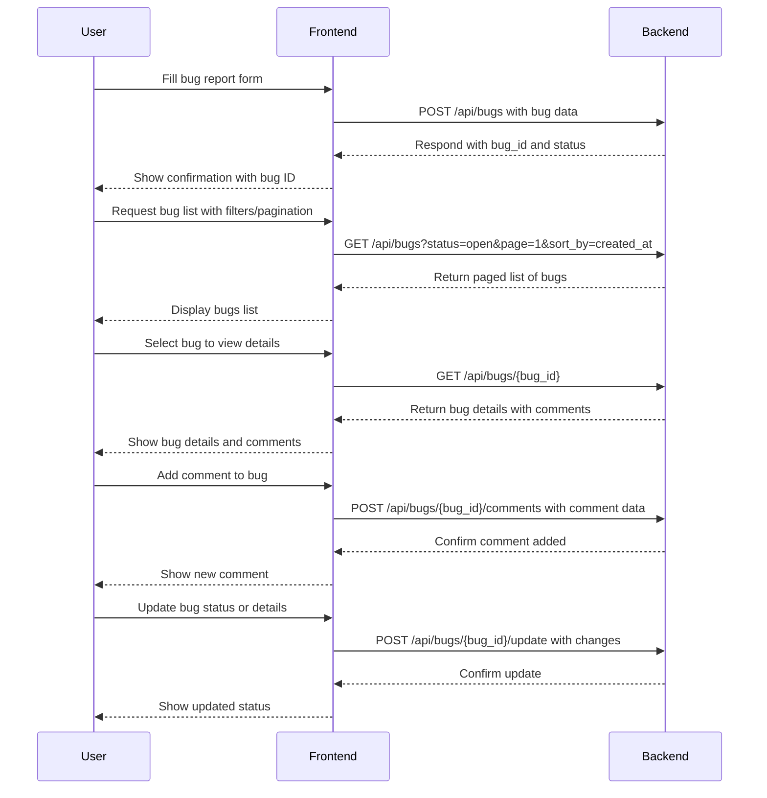
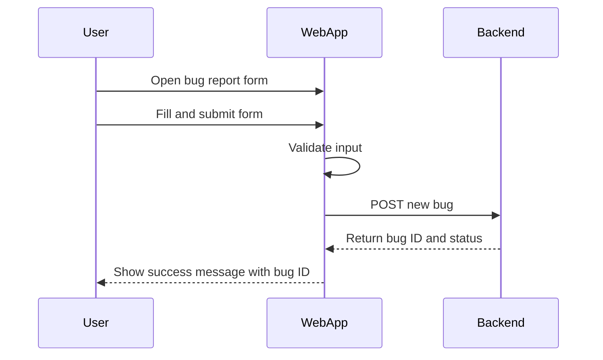

```markdown
# Functional Requirements for Bug Tracking Application

## API Endpoints

### 1. Create Bug Report  
- **Endpoint:** `POST /api/bugs`  
- **Description:** Submit a new bug report via web form.  
- **Request Body:**  
```json
{
  "title": "string",
  "description": "string",
  "reported_by": "string",
  "severity": "low|medium|high",
  "steps_to_reproduce": "string"
}
```  
- **Response:**  
```json
{
  "bug_id": "string",
  "status": "open",
  "created_at": "ISO8601 timestamp"
}
```

---

### 2. Get Bug Details  
- **Endpoint:** `GET /api/bugs/{bug_id}`  
- **Description:** Retrieve details of a specific bug report by ID.  
- **Response:**  
```json
{
  "bug_id": "string",
  "title": "string",
  "description": "string",
  "reported_by": "string",
  "severity": "low|medium|high",
  "status": "open|in_progress|closed",
  "steps_to_reproduce": "string",
  "created_at": "ISO8601 timestamp",
  "updated_at": "ISO8601 timestamp",
  "comments": [
    {
      "comment_id": "string",
      "author": "string",
      "message": "string",
      "created_at": "ISO8601 timestamp"
    }
  ]
}
```

---

### 3. Update Bug Status or Details  
- **Endpoint:** `POST /api/bugs/{bug_id}/update`  
- **Description:** Update bug status or other editable fields.  
- **Request Body:**  
```json
{
  "status": "open|in_progress|closed",
  "description": "string (optional)",
  "severity": "low|medium|high (optional)",
  "steps_to_reproduce": "string (optional)"
}
```  
- **Response:**  
```json
{
  "bug_id": "string",
  "status": "updated_status",
  "updated_at": "ISO8601 timestamp"
}
```

---

### 4. List Bugs  
- **Endpoint:** `GET /api/bugs`  
- **Description:** Retrieve a list of bugs with optional filters, pagination, sorting and keyword search.  
- **Query Parameters (optional):**  
  - `status` (open|in_progress|closed)  
  - `severity` (low|medium|high)  
  - `search` (string, keyword in title or description)  
  - `page` (integer, default 1)  
  - `page_size` (integer, default 20)  
  - `sort_by` (created_at|severity|status)  
  - `sort_order` (asc|desc)  
- **Response:**  
```json
{
  "total": 100,
  "page": 1,
  "page_size": 20,
  "bugs": [
    {
      "bug_id": "string",
      "title": "string",
      "status": "open|in_progress|closed",
      "severity": "low|medium|high",
      "created_at": "ISO8601 timestamp"
    }
  ]
}
```

---

### 5. Add Comment to Bug  
- **Endpoint:** `POST /api/bugs/{bug_id}/comments`  
- **Description:** Add a comment or update note to a bug.  
- **Request Body:**  
```json
{
  "author": "string",
  "message": "string"
}
```  
- **Response:**  
```json
{
  "comment_id": "string",
  "bug_id": "string",
  "author": "string",
  "message": "string",
  "created_at": "ISO8601 timestamp"
}
```

---

## User-App Interaction Sequence Diagram


```mermaid
sequenceDiagram
    participant User
    participant Frontend
    participant Backend

    User->>Frontend: Fill bug report form
    Frontend->>Backend: POST /api/bugs with bug data
    Backend-->>Frontend: Respond with bug_id and status
    Frontend-->>User: Show confirmation with bug ID

    User->>Frontend: Request bug list with filters/pagination
    Frontend->>Backend: GET /api/bugs?status=open&page=1&sort_by=created_at
    Backend-->>Frontend: Return paged list of bugs
    Frontend-->>User: Display bugs list

    User->>Frontend: Select bug to view details
    Frontend->>Backend: GET /api/bugs/{bug_id}
    Backend-->>Frontend: Return bug details with comments
    Frontend-->>User: Show bug details and comments

    User->>Frontend: Add comment to bug
    Frontend->>Backend: POST /api/bugs/{bug_id}/comments with comment data
    Backend-->>Frontend: Confirm comment added
    Frontend-->>User: Show new comment

    User->>Frontend: Update bug status or details
    Frontend->>Backend: POST /api/bugs/{bug_id}/update with changes
    Backend-->>Frontend: Confirm update
    Frontend-->>User: Show updated status
```

---

## Bug Reporting Flow (User Journey)


```mermaid
sequenceDiagram
    participant User
    participant WebApp

    User->>WebApp: Open bug report form
    User->>WebApp: Fill and submit form
    WebApp->>WebApp: Validate input
    WebApp->>Backend: POST new bug
    Backend-->>WebApp: Return bug ID and status
    WebApp-->>User: Show success message with bug ID
```
```