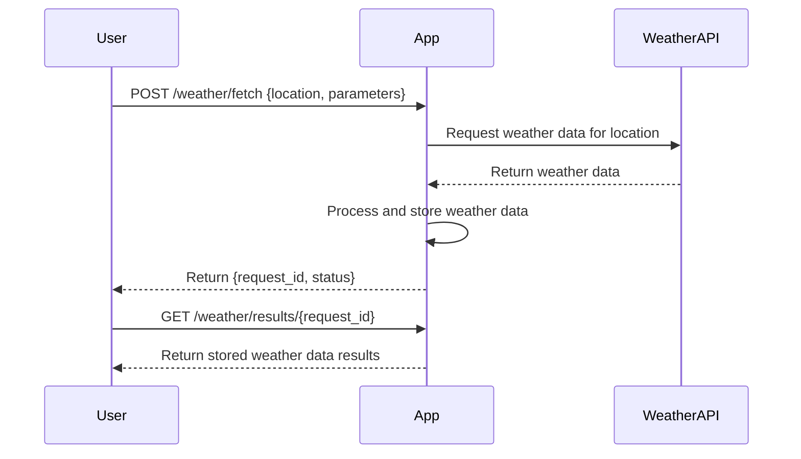

```markdown
# Functional Requirements for Weather Data Fetching App

## API Endpoints

### 1. Fetch Weather Data  
**Endpoint:** `POST /weather/fetch`  
**Description:**  
Invokes external weather API to retrieve weather data based on user input, performs any necessary calculations or transformations, and stores the result for later retrieval.

**Request Body (JSON):**  
```json
{
  "location": {
    "type": "string",  // e.g. "city", "coordinates", "zipcode"
    "value": "string"  // e.g. "London", "51.5074,-0.1278", "90210"
  },
  "parameters": [      // Optional, list of requested data fields
    "temperature",
    "humidity",
    "wind_speed",
    "forecast"
  ]
}
```

**Response (JSON):**  
```json
{
  "request_id": "string",  // unique ID for this fetch request
  "status": "processing" | "completed" | "failed",
  "message": "string"      // optional status message
}
```

---

### 2. Retrieve Weather Data  
**Endpoint:** `GET /weather/results/{request_id}`  
**Description:**  
Retrieves the weather data results for a previously fetched request.

**Response (JSON):**  
```json
{
  "request_id": "string",
  "location": {
    "type": "string",
    "value": "string"
  },
  "data": {
    "temperature": "number",
    "humidity": "number",
    "wind_speed": "number",
    "forecast": "string"
  },
  "timestamp": "ISO8601 string"
}
```

---

## Business Logic Notes
- The external weather API call and any data processing happen exclusively in the `POST /weather/fetch` endpoint.
- The `GET /weather/results/{request_id}` endpoint serves only stored application data with no external calls.
- The app generates and returns a unique `request_id` for each fetch operation to track results asynchronously.

---

## User-App Interaction Sequence


```mermaid
sequenceDiagram
    participant User
    participant App
    participant WeatherAPI

    User->>App: POST /weather/fetch {location, parameters}
    App->>WeatherAPI: Request weather data for location
    WeatherAPI-->>App: Return weather data
    App->>App: Process and store weather data
    App-->>User: Return {request_id, status}

    User->>App: GET /weather/results/{request_id}
    App-->>User: Return stored weather data results
```

---

## User Journey

```mermaid
graph TD
    A[User sends POST /weather/fetch] --> B[App calls external Weather API]
    B --> C[App processes and stores data]
    C --> D[App returns request_id and status]
    D --> E[User polls GET /weather/results/{request_id}]
    E --> F[App returns weather data]
```
```