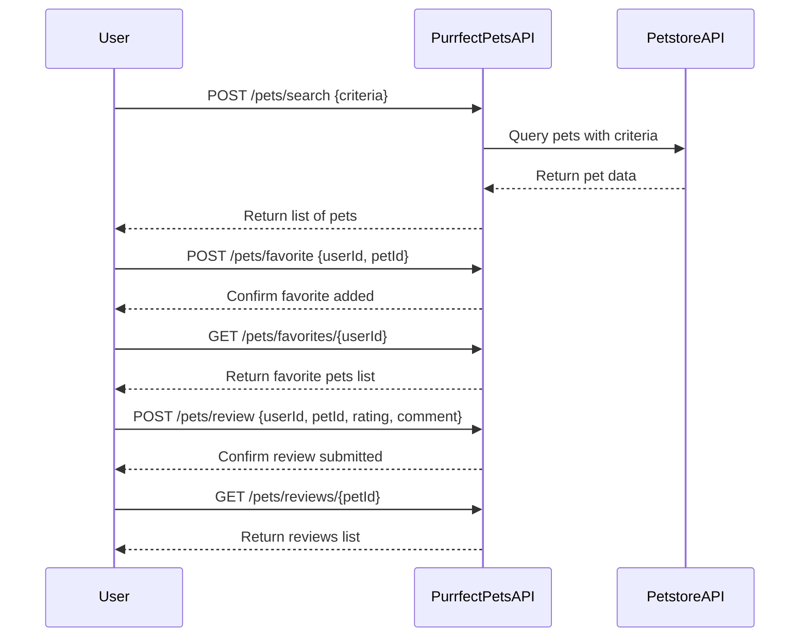

```markdown
# Purrfect Pets API - Functional Requirements

## Overview
The "Purrfect Pets" API leverages Petstore API data with added features such as favoriting pets and submitting reviews. It follows RESTful principles with:

- **POST** endpoints: invoke external Petstore API or apply business logic (e.g., data retrieval, calculations).
- **GET** endpoints: fetch stored or processed results within the application.

---

## API Endpoints

### 1. Search Pets  
**POST** `/pets/search`  
- **Description:** Search pets by criteria (e.g., status, type) by querying the external Petstore API.  
- **Request Body:**  
```json
{
  "status": "available|pending|sold",
  "type": "dog|cat|bird|..."
}
```  
- **Response:**  
```json
{
  "pets": [
    {
      "id": 123,
      "name": "Fluffy",
      "type": "cat",
      "status": "available",
      "photoUrls": ["url1", "url2"]
    },
    ...
  ]
}
```

### 2. Add Favorite Pet  
**POST** `/pets/favorite`  
- **Description:** Add a pet to the user’s favorites list (stored locally).  
- **Request Body:**  
```json
{
  "userId": "user123",
  "petId": 123
}
```  
- **Response:**  
```json
{
  "message": "Pet added to favorites"
}
```

### 3. Get Favorite Pets  
**GET** `/pets/favorites/{userId}`  
- **Description:** Retrieve all favorite pets for a user.  
- **Response:**  
```json
{
  "favorites": [
    {
      "id": 123,
      "name": "Fluffy",
      "type": "cat",
      "status": "available"
    },
    ...
  ]
}
```

### 4. Submit Pet Review  
**POST** `/pets/review`  
- **Description:** Submit a review for a pet (stored locally).  
- **Request Body:**  
```json
{
  "userId": "user123",
  "petId": 123,
  "rating": 4,
  "comment": "Very friendly and cute!"
}
```  
- **Response:**  
```json
{
  "message": "Review submitted"
}
```

### 5. Get Pet Reviews  
**GET** `/pets/reviews/{petId}`  
- **Description:** Retrieve all reviews for a given pet.  
- **Response:**  
```json
{
  "reviews": [
    {
      "userId": "user123",
      "rating": 4,
      "comment": "Very friendly and cute!"
    },
    ...
  ]
}
```

---

## User-App Interaction Sequence Diagram


```mermaid
sequenceDiagram
    participant User
    participant PurrfectPetsAPI
    participant PetstoreAPI

    User->>PurrfectPetsAPI: POST /pets/search {criteria}
    PurrfectPetsAPI->>PetstoreAPI: Query pets with criteria
    PetstoreAPI-->>PurrfectPetsAPI: Return pet data
    PurrfectPetsAPI-->>User: Return list of pets

    User->>PurrfectPetsAPI: POST /pets/favorite {userId, petId}
    PurrfectPetsAPI-->>User: Confirm favorite added

    User->>PurrfectPetsAPI: GET /pets/favorites/{userId}
    PurrfectPetsAPI-->>User: Return favorite pets list

    User->>PurrfectPetsAPI: POST /pets/review {userId, petId, rating, comment}
    PurrfectPetsAPI-->>User: Confirm review submitted

    User->>PurrfectPetsAPI: GET /pets/reviews/{petId}
    PurrfectPetsAPI-->>User: Return reviews list
```

---
```