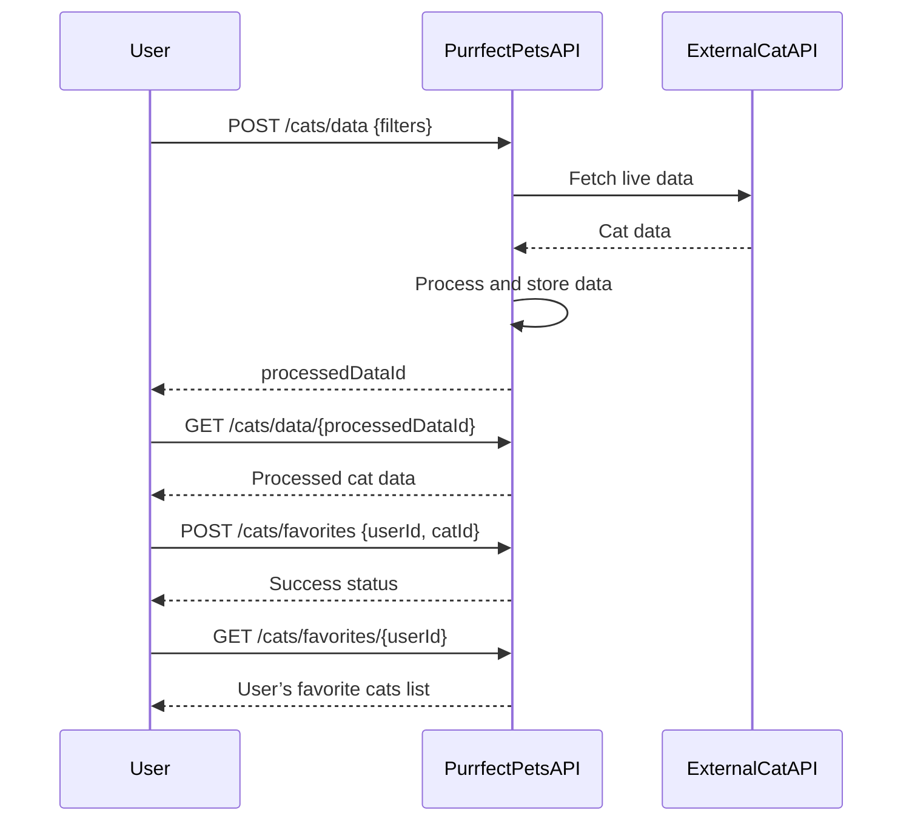

```markdown
# Purrfect Pets API - Functional Requirements

## API Endpoints

### 1. POST /cats/data
- **Purpose:** Fetch and process live cat data from external sources (breeds, images, facts).
- **Request:**
```json
{
  "source": "string",          // e.g., "externalAPIName"
  "filters": {                 // optional filters like breed, age, etc.
    "breed": "string",
    "age": "number"
  }
}
```
- **Response:**
```json
{
  "status": "success",
  "processedDataId": "string"  // ID to later retrieve processed results
}
```

### 2. GET /cats/data/{processedDataId}
- **Purpose:** Retrieve processed cat data results by ID.
- **Response:**
```json
{
  "processedDataId": "string",
  "cats": [
    {
      "id": "string",
      "breed": "string",
      "imageUrl": "string",
      "fact": "string"
    }
  ]
}
```

### 3. POST /cats/favorites
- **Purpose:** Add a cat to user favorites.
- **Request:**
```json
{
  "userId": "string",
  "catId": "string"
}
```
- **Response:**
```json
{
  "status": "success"
}
```

### 4. GET /cats/favorites/{userId}
- **Purpose:** Retrieve a user’s favorite cats.
- **Response:**
```json
{
  "userId": "string",
  "favorites": [
    {
      "catId": "string",
      "breed": "string",
      "imageUrl": "string"
    }
  ]
}
```

---

## User-App Interaction Sequence


```mermaid
sequenceDiagram
    participant User
    participant PurrfectPetsAPI
    participant ExternalCatAPI

    User->>PurrfectPetsAPI: POST /cats/data {filters}
    PurrfectPetsAPI->>ExternalCatAPI: Fetch live data
    ExternalCatAPI-->>PurrfectPetsAPI: Cat data
    PurrfectPetsAPI->>PurrfectPetsAPI: Process and store data
    PurrfectPetsAPI-->>User: processedDataId

    User->>PurrfectPetsAPI: GET /cats/data/{processedDataId}
    PurrfectPetsAPI-->>User: Processed cat data

    User->>PurrfectPetsAPI: POST /cats/favorites {userId, catId}
    PurrfectPetsAPI-->>User: Success status

    User->>PurrfectPetsAPI: GET /cats/favorites/{userId}
    PurrfectPetsAPI-->>User: User’s favorite cats list
```

---

## Summary

- POST endpoints handle all external data fetching and calculations.
- GET endpoints serve cached or processed results.
- User can fetch live cat data, save favorites, and retrieve favorites.
```
