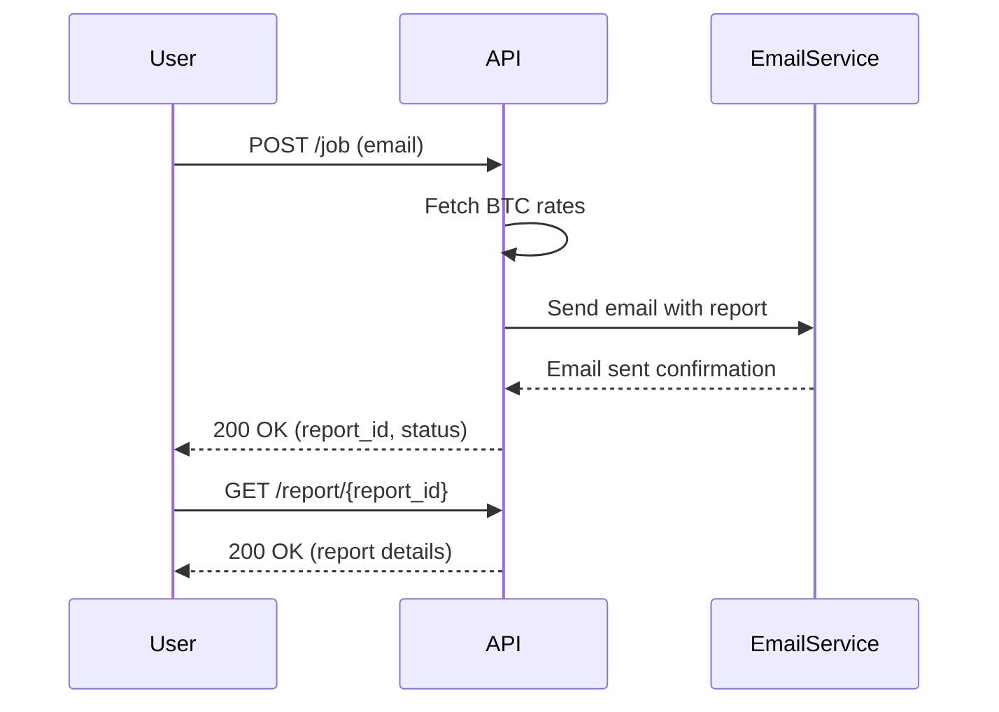

Here’s a well-structured and formatted document outlining the final functional requirements for your application:

---

# Functional Requirements Document

## Overview
The application will retrieve the current Bitcoin-to-USD and Bitcoin-to-EUR conversion rates, generate a report, and send it via email. It will provide two API endpoints for initiating report creation and retrieving stored reports.

## User Stories

### 1. Report Creation
**As a user, I want to initiate a report creation process so that I can receive the latest Bitcoin conversion rates.**

- **Endpoint**: `POST /job`
- **Request Format**:
  ```json
  {
    "email": "user@example.com"
  }
  ```
- **Response Format**:
  ```json
  {
    "report_id": "12345",
    "status": "processing"
  }
  ```

### 2. Retrieve Report
**As a user, I want to retrieve my previously generated report by its ID so that I can view the conversion rates.**

- **Endpoint**: `GET /report/{report_id}`
- **Response Format**:
  ```json
  {
    "report_id": "12345",
    "timestamp": "2023-10-01T12:00:00Z",
    "btc_usd": "50000.00",
    "btc_eur": "42000.00",
    "status": "sent"
  }
  ```

## API Endpoints

### POST /job
- **Description**: Initiates the report creation process.
- **Request Body**:
  - `email`: (string) User's email address to send the report.
- **Response**:
  - `report_id`: (string) Unique identifier for the report.
  - `status`: (string) Current status of the report (e.g., processing, sent).

### GET /report/{report_id}
- **Description**: Retrieves the stored report by its ID.
- **Response**:
  - `report_id`: (string) Unique identifier for the report.
  - `timestamp`: (string) Time when the report was generated (ISO 8601 format).
  - `btc_usd`: (string) Current Bitcoin-to-USD rate.
  - `btc_eur`: (string) Current Bitcoin-to-EUR rate.
  - `status`: (string) Status of the report (e.g., sent, failed).

## User-App Interaction Diagram


```mermaid
sequenceDiagram
    participant User
    participant API
    participant EmailService

    User->>API: POST /job (email)
    API->>API: Fetch BTC rates
    API->>EmailService: Send email with report
    EmailService-->>API: Email sent confirmation
    API-->>User: 200 OK (report_id, status)

    User->>API: GET /report/{report_id}
    API-->>User: 200 OK (report details)
```

---

This document provides a clear and concise overview of the functional requirements, user stories, API endpoints, and user-app interactions for your application. Feel free to adjust any details as needed for your specific project context.