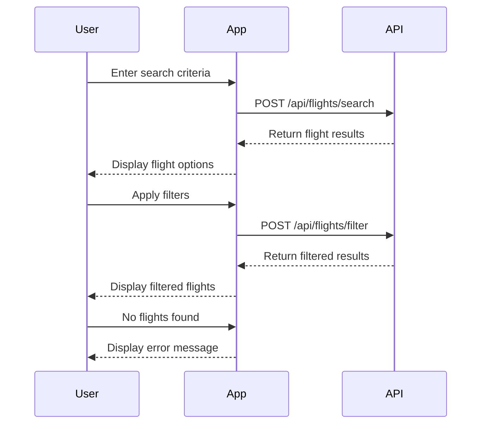

Here are the final functional requirements for your flight search application, presented in a clear and structured format:

### Functional Requirements for Flight Search Application

#### User Stories

1. **Flight Search**
   - **As a user**, I want to search for flights by entering:
     - Departure airport
     - Arrival airport
     - Departure date
     - Return date (if applicable)
     - Number of passengers
   - **Outcome**: Users can find suitable flights based on their specified criteria.

2. **View Flight Details**
   - **As a user**, I want to see a list of flights that includes:
     - Airline name
     - Flight number
     - Departure and arrival times
     - Price
     - Number of layovers
   - **Outcome**: Users can compare different flight options effectively.

3. **Filter Flight Results**
   - **As a user**, I want to filter search results based on:
     - Maximum price
     - Preferred airlines
     - Maximum number of layovers
   - **Outcome**: Users can refine their search results to find flights that meet their preferences.

4. **Error Handling**
   - **As a user**, I want to receive clear error messages in the following scenarios:
     - No flights are found based on my search criteria.
     - Issues occur with the API during the flight search.
   - **Outcome**: Users understand what went wrong and can adjust their search if necessary.

#### API Endpoints

1. **Search Flights**
   - **Endpoint**: `POST /api/flights/search`
   - **Request Format**:
     ```json
     {
       "departure_airport": "JFK",
       "arrival_airport": "LAX",
       "departure_date": "2023-12-01",
       "return_date": "2023-12-10",
       "passengers": 1
     }
     ```
   - **Response Format**:
     ```json
     {
       "flights": [
         {
           "airline": "Delta",
           "flight_number": "DL123",
           "departure_time": "2023-12-01T08:00:00Z",
           "arrival_time": "2023-12-01T11:00:00Z",
           "price": 300,
           "layovers": 0
         },
         ...
       ],
       "error": null
     }
     ```

2. **Filter Flights**
   - **Endpoint**: `POST /api/flights/filter`
   - **Request Format**:
     ```json
     {
       "flights": [...],
       "filters": {
         "max_price": 500,
         "airlines": ["Delta", "United"],
         "max_layovers": 1
       }
     }
     ```
   - **Response Format**:
     ```json
     {
       "filtered_flights": [...],
       "error": null
     }
     ```

#### User-App Interaction (Mermaid Diagram)


```mermaid
sequenceDiagram
    participant User
    participant App
    participant API

    User->>App: Enter search criteria
    App->>API: POST /api/flights/search
    API-->>App: Return flight results
    App-->>User: Display flight options

    User->>App: Apply filters
    App->>API: POST /api/flights/filter
    API-->>App: Return filtered results
    App-->>User: Display filtered flights

    User->>App: No flights found
    App-->>User: Display error message
```

This final summary captures the functional requirements for your flight search application, including user stories, API details, and user interaction flow. If you need any further modifications or additional information, feel free to ask!