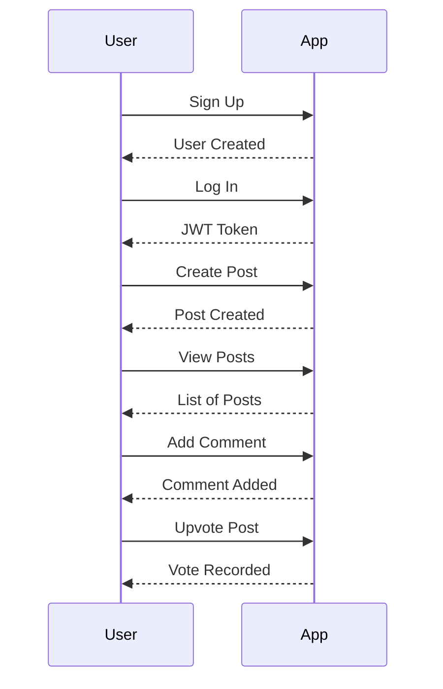

Here are the final functional requirements formatted clearly and concisely:

### Functional Requirements

#### 1. User Authentication and Authorization
- **User Sign Up**: 
  - As a user, I want to sign up to create an account.
  - **API Endpoint**: `POST /users/create`
  - **Request**:
    ```json
    {
      "username": "exampleUser",
      "password": "securePassword"
    }
    ```
  - **Response**:
    ```json
    {
      "message": "User created successfully."
    }
    ```

- **User Login**:
  - As a user, I want to log in to access my account.
  - **API Endpoint**: `POST /users/login`
  - **Request**:
    ```json
    {
      "username": "exampleUser",
      "password": "securePassword"
    }
    ```
  - **Response**:
    ```json
    {
      "token": "your_jwt_token"
    }
    ```

#### 2. Post Management
- **Create Post**:
  - As a user, I want to create a new post with a title, topic tags, and body content.
  - **API Endpoint**: `POST /posts`
  - **Request**:
    ```json
    {
      "title": "Post Title",
      "topics": ["investing", "stocks"],
      "body": "Post content here."
    }
    ```
  - **Response**:
    ```json
    {
      "post_id": "14245bac",
      "message": "Post created successfully."
    }
    ```

- **Retrieve Posts**:
  - As a user, I want to view a list of posts.
  - **API Endpoint**: `GET /posts`
  - **Response**:
    ```json
    {
      "posts": [
        {
          "post_id": "14245bac",
          "title": "How do I make money with stocks?",
          "user_id": "1234acd",
          "topics": ["investing", "stocks"],
          "upvotes": 5,
          "downvotes": 1,
          "body": "........."
        }
      ],
      "pagination": {
        "limit": 20,
        "offset": 0
      }
    }
    ```

- **Retrieve Specific Post**:
  - As a user, I want to view the details of a specific post.
  - **API Endpoint**: `GET /posts/{post-id}`
  - **Response**:
    ```json
    {
      "post_id": "14245bac",
      "title": "How do I make money with stocks?",
      "body": "........."
    }
    ```

- **Delete Post**:
  - As a user, I want to delete my own posts.
  - **API Endpoint**: `DELETE /posts/{post-id}`
  - **Response**:
    ```json
    {
      "message": "Post deleted successfully."
    }
    ```

#### 3. Comment Management
- **Add Comment**:
  - As a user, I want to add comments to posts.
  - **API Endpoint**: `POST /posts/{post-id}/comments`
  - **Request**:
    ```json
    {
      "body": "This is a comment."
    }
    ```
  - **Response**:
    ```json
    {
      "comment_id": 1234,
      "message": "Comment added successfully."
    }
    ```

- **Retrieve Comments**:
  - As a user, I want to view comments on a post.
  - **API Endpoint**: `GET /posts/{post-id}/comments`
  - **Response**:
    ```json
    {
      "comments": [
        {
          "comment_id": 1234,
          "body": "I agree",
          "user_id": "abd54232",
          "upvotes": 50,
          "downvotes": 3
        }
      ]
    }
    ```

- **Delete Comment**:
  - As a user, I want to delete my own comments.
  - **API Endpoint**: `DELETE /posts/{post-id}/comments/{comment-id}`
  - **Response**:
    ```json
    {
      "message": "Comment deleted successfully."
    }
    ```

#### 4. Image Management
- **Upload Image**:
  - As a user, I want to upload images to my posts.
  - **API Endpoint**: `POST /posts/{post-id}/images`
  - **Request**: (Multipart/form-data)
    - `image`: [file]
  - **Response**:
    ```json
    {
      "image_id": "image123",
      "message": "Image uploaded successfully."
    }
    ```

- **Retrieve Image**:
  - As a user, I want to retrieve images associated with a post.
  - **API Endpoint**: `GET /posts/{post-id}/images/{image-id}`
  - **Response**: (Image file)

#### 5. Voting System
- **Vote on Post**:
  - As a user, I want to upvote or downvote posts.
  - **API Endpoint**: `POST /posts/{post-id}/vote`
  - **Request**:
    ```json
    {
      "vote": "up" // or "down"
    }
    ```
  - **Response**:
    ```json
    {
      "message": "Vote recorded."
    }
    ```

- **Vote on Comment**:
  - As a user, I want to upvote or downvote comments.
  - **API Endpoint**: `POST /posts/{post-id}/comments/{comment-id}/vote`
  - **Request**:
    ```json
    {
      "vote": "up" // or "down"
    }
    ```
  - **Response**:
    ```json
    {
      "message": "Vote recorded."
    }
    ```

### Visual Representation
#### User-Application Interaction (Mermaid Diagram)


```mermaid
sequenceDiagram
    participant User
    participant App
    User->>App: Sign Up
    App-->>User: User Created
    User->>App: Log In
    App-->>User: JWT Token
    User->>App: Create Post
    App-->>User: Post Created
    User->>App: View Posts
    App-->>User: List of Posts
    User->>App: Add Comment
    App-->>User: Comment Added
    User->>App: Upvote Post
    App-->>User: Vote Recorded
```

This structured format provides a comprehensive overview of the functional requirements for your backend application. If you have any further requests or need modifications, feel free to ask!