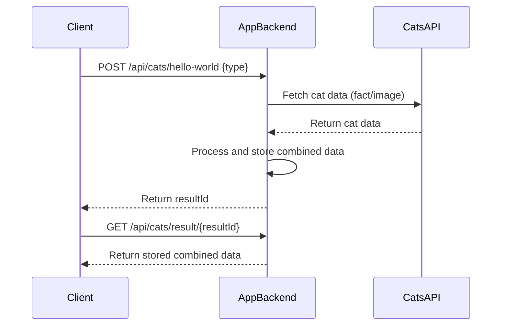

```markdown
# Functional Requirements for "Hello World" Cats API Application

## Overview
This backend application exposes RESTful API endpoints to interact with the Cats API. Business logic that involves external data retrieval or calculations will be implemented in POST endpoints. GET endpoints will be used solely for retrieving results stored or processed by the application.

---

## API Endpoints

### 1. POST /api/cats/hello-world
- **Purpose**: Trigger the core business logic: fetch data from the Cats API (e.g., a random cat fact or image), combine it with a "Hello World" message, process if needed, and store the result for later retrieval.
- **Request Body**:  
  ```json
  {
    "type": "fact" | "image" | "mixed"  // Optional, defines what kind of cat data to fetch
  }
  ```
- **Response**:  
  ```json
  {
    "status": "success",
    "message": "Hello World with cat data fetched and processed",
    "resultId": "<unique_result_id>"
  }
  ```
- **Business Logic**:  
  - Calls Cats API to fetch the requested data type.
  - Combines or processes data with "Hello World" message.
  - Stores the result internally with a unique identifier.

---

### 2. GET /api/cats/result/{resultId}
- **Purpose**: Retrieve the processed result previously generated by the POST endpoint.
- **Path Parameter**:  
  - `resultId`: string — unique identifier of the stored result.
- **Response**:  
  ```json
  {
    "resultId": "<resultId>",
    "content": {
      "helloWorldMessage": "Hello World",
      "catData": { /* cat fact/image data */ }
    },
    "timestamp": "<ISO8601_timestamp>"
  }
  ```
- **Notes**:  
  - No external calls here, simply retrieves stored data for client consumption.

---

## Request/Response Formats Summary

| Endpoint               | Method | Request Body          | Response Body                                             |
|------------------------|--------|-----------------------|-----------------------------------------------------------|
| /api/cats/hello-world  | POST   | JSON with `type`      | JSON with `status`, `message`, `resultId`                 |
| /api/cats/result/{id}  | GET    | None                  | JSON with `resultId`, `content` (hello world + cat data), `timestamp` |

---

## User-App Interaction Sequence


```mermaid
sequenceDiagram
    participant Client
    participant AppBackend
    participant CatsAPI

    Client->>AppBackend: POST /api/cats/hello-world {type}
    AppBackend->>CatsAPI: Fetch cat data (fact/image)
    CatsAPI-->>AppBackend: Return cat data
    AppBackend->>AppBackend: Process and store combined data
    AppBackend-->>Client: Return resultId

    Client->>AppBackend: GET /api/cats/result/{resultId}
    AppBackend-->>Client: Return stored combined data
```

---

## User Journey Overview

```mermaid
flowchart TD
    Start[User triggers hello world request]
    FetchCatData[POST /api/cats/hello-world]
    CallCatsAPI[Backend calls Cats API]
    ProcessData[Process and store result]
    ReturnResultId[Return resultId to user]
    RetrieveResult[User requests result by GET /api/cats/result/{id}]
    ReturnData[Return stored hello world + cat data]

    Start --> FetchCatData --> CallCatsAPI --> ProcessData --> ReturnResultId
    ReturnResultId --> RetrieveResult --> ReturnData
```
```