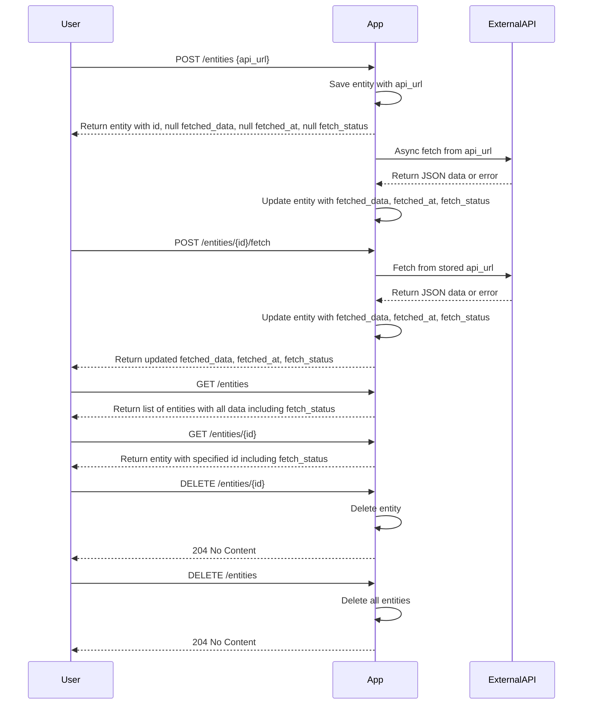
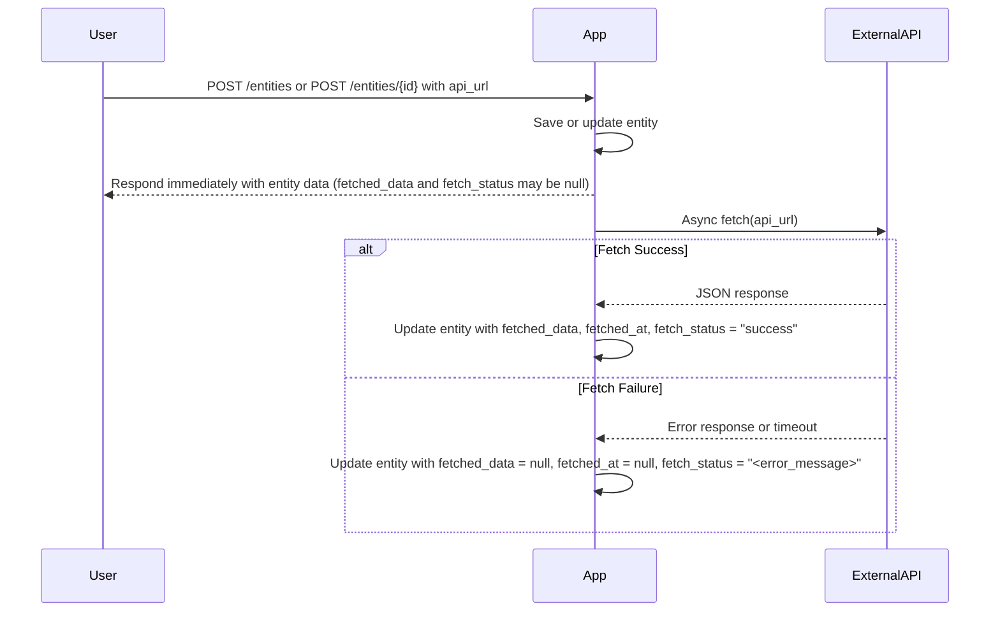

```markdown
# Functional Requirements and API Specification

## Entity Model
- **Entity** fields:
  - `id` (UUID): unique identifier
  - `api_url` (JSON): external API URL provided by the user as a JSON string
  - `fetched_data` (JSON): entire JSON response fetched from the external API
  - `fetched_at` (string): ISO 8601 UTC timestamp of the last fetch
  - `fetch_status` (string|null): status of the last fetch operation, e.g. `"success"` or error message if unsuccessful

---

## API Endpoints

### 1. Create Entity and Fetch Data
- **POST** `/entities`
- **Request Body:**
  ```json
  {
    "api_url": "<valid JSON string containing the API URL>"
  }
  ```
- **Behavior:**  
  - Persist the entity with the provided `api_url`.
  - Asynchronously fetch data from the URL and update `fetched_data`, `fetched_at`, and `fetch_status`.
- **Response:**
  ```json
  {
    "id": "<entity_id>",
    "api_url": "<api_url>",
    "fetched_data": null,
    "fetched_at": null,
    "fetch_status": null
  }
  ```
  (Initial response, data will update asynchronously)

---

### 2. Update Entity and Fetch Data
- **POST** `/entities/{id}`
- **Request Body:**
  ```json
  {
    "api_url": "<updated JSON string API URL>"
  }
  ```
- **Behavior:**  
  - Update the entity’s `api_url`.
  - Asynchronously fetch data from the new URL and update `fetched_data`, `fetched_at`, and `fetch_status`.
- **Response:**
  ```json
  {
    "id": "<entity_id>",
    "api_url": "<updated_api_url>",
    "fetched_data": "<previous_fetched_data_or_null>",
    "fetched_at": "<previous_fetched_at_or_null>",
    "fetch_status": "<previous_fetch_status_or_null>"
  }
  ```

---

### 3. Manual Fetch Trigger
- **POST** `/entities/{id}/fetch`
- **Request Body:** *empty*
- **Behavior:**  
  - Fetch data from the stored `api_url` for the specified entity.
  - Update `fetched_data`, `fetched_at`, and `fetch_status`.
- **Response:**
  ```json
  {
    "id": "<entity_id>",
    "fetched_data": "<latest_fetched_data>",
    "fetched_at": "<latest_fetched_at>",
    "fetch_status": "<latest_fetch_status>"
  }
  ```

---

### 4. Get All Entities
- **GET** `/entities`
- **Behavior:**  
  - Retrieve a list of all entities with their fields.
- **Response:**
  ```json
  [
    {
      "id": "<entity_id>",
      "api_url": "<api_url>",
      "fetched_data": "<fetched_data>",
      "fetched_at": "<fetched_at>",
      "fetch_status": "<fetch_status>"
    },
    ...
  ]
  ```

---

### 5. Get Entity by ID
- **GET** `/entities/{id}`
- **Behavior:**  
  - Retrieve the entity with the specified ID.
- **Response:**
  ```json
  {
    "id": "<entity_id>",
    "api_url": "<api_url>",
    "fetched_data": "<fetched_data>",
    "fetched_at": "<fetched_at>",
    "fetch_status": "<fetch_status>"
  }
  ```

---

### 6. Delete Single Entity
- **DELETE** `/entities/{id}`
- **Behavior:**  
  - Hard delete the entity with the specified ID.
- **Response:**  
  - HTTP 204 No Content on success.

---

### 7. Delete All Entities
- **DELETE** `/entities`
- **Behavior:**  
  - Hard delete all entities.
- **Response:**  
  - HTTP 204 No Content on success.

---

## User-App Interaction Sequence Diagram


```mermaid
sequenceDiagram
    participant User
    participant App
    participant ExternalAPI

    User->>App: POST /entities {api_url}
    App->>App: Save entity with api_url
    App-->>User: Return entity with id, null fetched_data, null fetched_at, null fetch_status
    App->>ExternalAPI: Async fetch from api_url
    ExternalAPI-->>App: Return JSON data or error
    App->>App: Update entity with fetched_data, fetched_at, fetch_status

    User->>App: POST /entities/{id}/fetch
    App->>ExternalAPI: Fetch from stored api_url
    ExternalAPI-->>App: Return JSON data or error
    App->>App: Update entity with fetched_data, fetched_at, fetch_status
    App-->>User: Return updated fetched_data, fetched_at, fetch_status

    User->>App: GET /entities
    App-->>User: Return list of entities with all data including fetch_status

    User->>App: GET /entities/{id}
    App-->>User: Return entity with specified id including fetch_status

    User->>App: DELETE /entities/{id}
    App->>App: Delete entity
    App-->>User: 204 No Content

    User->>App: DELETE /entities
    App->>App: Delete all entities
    App-->>User: 204 No Content
```

---

## Entity Creation and Update Flow (including async fetch with status)


```mermaid
sequenceDiagram
    participant User
    participant App
    participant ExternalAPI

    User->>App: POST /entities or POST /entities/{id} with api_url
    App->>App: Save or update entity
    App-->>User: Respond immediately with entity data (fetched_data and fetch_status may be null)
    App->>ExternalAPI: Async fetch(api_url)
    alt Fetch Success
      ExternalAPI-->>App: JSON response
      App->>App: Update entity with fetched_data, fetched_at, fetch_status = "success"
    else Fetch Failure
      ExternalAPI-->>App: Error response or timeout
      App->>App: Update entity with fetched_data = null, fetched_at = null, fetch_status = "<error_message>"
    end
```
```