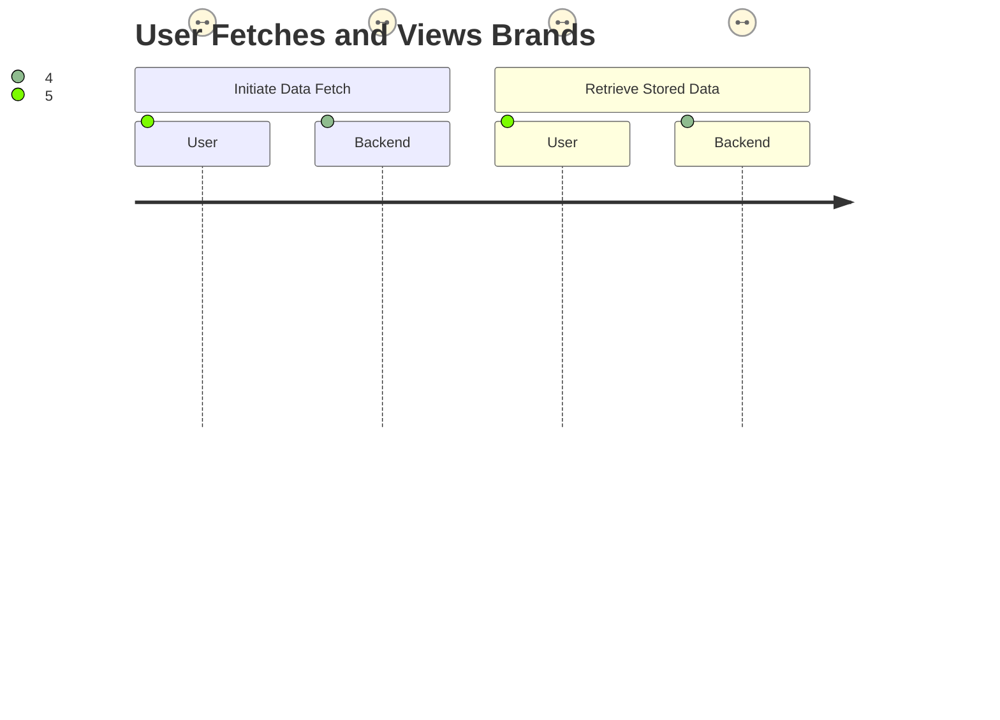
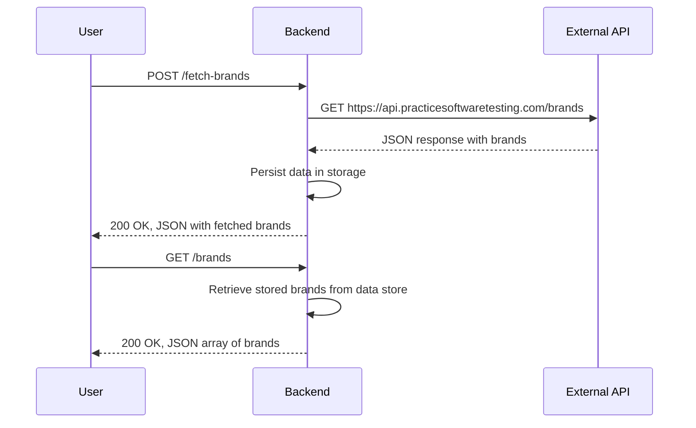

# Final Functional Requirements Document

## API Endpoints

### 1. POST /fetch-brands
- **Purpose:**  
  Invokes business logic to retrieve data from an external source and store the results for later retrieval.

- **Request Format:**  
  - **Content-Type:** application/json  
  - **Example Body:**  
    ```json
    {
      "fetchType": "all"  // Optional: can be used to define fetch mode if necessary
    }
    ```

- **Business Logic:**  
  - Trigger an HTTP request to the external API endpoint.  
  - Validate and parse the external JSON response.  
  - Persist the retrieved brand information (e.g., id, name, slug) in the application’s data store.

- **Response Format:**  
  - **On Success:**  
    - **HTTP Status:** 200 OK  
    - **Response Body:**  
      ```json
      {
        "message": "Brands fetched successfully.",
        "data": [
          {
            "id": "01JMWZK3N7PT3XMTMXMQTBACRV",
            "name": "ForgeFlex Tools",
            "slug": "forgeflex-tools"
          },
          {
            "id": "01JMWZK3N7PT3XMTMXMQTBACRW",
            "name": "MightyCraft Hardware",
            "slug": "mightycraft-hardware"
          }
        ]
      }
      ```

  - **On Error:**  
    - **HTTP Status:** 400 or 500  
    - **Response Body:**  
      ```json
      {
        "error": "Detailed error message"
      }
      ```

### 2. GET /brands
- **Purpose:**  
  Retrieves the list of brands previously stored as a result of the POST /fetch-brands operation.

- **Request Format:**  
  - No request body is needed.

- **Response Format:**  
  - **On Success:**  
    - **HTTP Status:** 200 OK  
    - **Response Body:**  
      ```json
      [
        {
          "id": "01JMWZK3N7PT3XMTMXMQTBACRV",
          "name": "ForgeFlex Tools",
          "slug": "forgeflex-tools"
        },
        {
          "id": "01JMWZK3N7PT3XMTMXMQTBACRW",
          "name": "MightyCraft Hardware",
          "slug": "mightycraft-hardware"
        }
      ]
      ```

  - **If No Data Found:**  
    - **Response Body:**  
      ```json
      {
        "message": "No brands found."
      }
      ```

## User-App Interaction Diagrams

### User Journey Diagram


```mermaid
journey
    title User Fetches and Views Brands
    section Initiate Data Fetch
      User: Trigger fetch brands (POST /fetch-brands): 5: User
      Backend: Calls external API & stores result: 4: Backend
    section Retrieve Stored Data
      User: Request brands list (GET /brands): 5: User
      Backend: Returns stored data: 4: Backend
```

### Sequence Diagram


```mermaid
sequenceDiagram
    participant U as User
    participant B as Backend
    participant E as External API

    U->>B: POST /fetch-brands
    B->>E: GET https://api.practicesoftwaretesting.com/brands
    E-->>B: JSON response with brands
    B->>B: Persist data in storage
    B-->>U: 200 OK, JSON with fetched brands

    U->>B: GET /brands
    B->>B: Retrieve stored brands from data store
    B-->>U: 200 OK, JSON array of brands
```