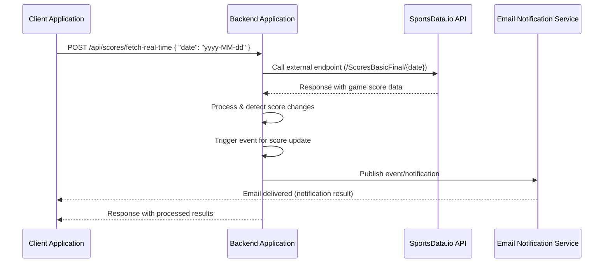
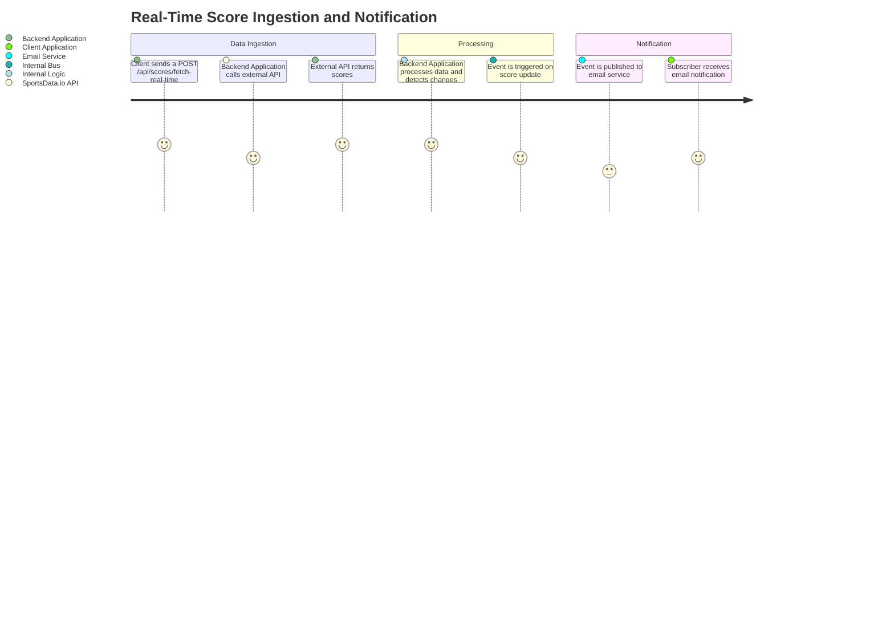

# Functional Requirements Document

## Overview

This document outlines the functional requirements for a real-time NBA game score ingestion system. The system fetches game scores from an external API, processes the data, detects changes, and notifies subscribers about significant updates.

## API Endpoints

### 1. POST /api/scores/fetch-real-time

- **Purpose:**  
  Invokes business logic to call the external sports data API to fetch real-time NBA game scores. This endpoint performs data ingestion, change detection, and event triggering based on score updates.

- **Request Format:**  
  **Content-Type:** application/json  
  ```json
  {
    "date": "yyyy-MM-dd"
  }
  ```

- **Response Format:**  
  **Content-Type:** application/json  
  ```json
  {
    "status": "success",
    "message": "Scores fetched and processed",
    "data": [
      {
        "gameId": "12345",
        "homeTeam": "Lakers",
        "awayTeam": "Warriors",
        "quarterScores": [25, 30, 27, 22],
        "finalScore": {"home": 104, "away": 110},
        "timestamp": "2023-10-01T14:00:00Z"
      }
    ]
  }
  ```

### 2. GET /api/scores

- **Purpose:**  
  Retrieve the latest or stored NBA game score results from the internal database.

- **Request Format:**  
  **Query Parameters:**  
  - `date` (optional): yyyy-MM-dd  
  - `gameId` (optional): Identifier for a specific game  

- **Response Format:**  
  **Content-Type:** application/json  
  ```json
  {
    "status": "success",
    "results": [
      {
        "gameId": "12345",
        "homeTeam": "Lakers",
        "awayTeam": "Warriors",
        "quarterScores": [25, 30, 27, 22],
        "finalScore": {"home": 104, "away": 110},
        "timestamp": "2023-10-01T14:00:00Z"
      }
    ]
  }
  ```

### 3. POST /api/subscriptions

- **Purpose:**  
  Allows external clients (subscribers) to register for score update notifications via email.

- **Request Format:**  
  **Content-Type:** application/json  
  ```json
  {
    "email": "subscriber@example.com",
    "filters": {
      "team": "Lakers", 
      "gameType": "regular"
    }
  }
  ```

- **Response Format:**  
  **Content-Type:** application/json  
  ```json
  {
    "status": "success",
    "message": "Subscription created successfully"
  }
  ```

### 4. GET /api/subscriptions

- **Purpose:**  
  Retrieve the list of current subscriptions from the system.

- **Request Format:**  
  No request body; optional query parameters may filter by email or status.

- **Response Format:**  
  **Content-Type:** application/json  
  ```json
  {
    "status": "success",
    "subscriptions": [
      {
        "subscriptionId": "sub123",
        "email": "subscriber@example.com",
        "filters": {
          "team": "Lakers"
        },
        "createdAt": "2023-10-01T12:00:00Z"
      }
    ]
  }
  ```

## Business Logic Overview

- The `POST /api/scores/fetch-real-time` endpoint will call the external NBA data source (SportsData.io API) to fetch game scores.
- It processes the data, detects changes, and triggers events accordingly.
- Upon detecting significant updates, events are published (e.g., to an internal message bus) for further processing, such as sending notifications.
- Subscribers registered via `POST /api/subscriptions` will be notified via email when an event occurs.

## User-App Interaction Diagrams

### Sequence Diagram


```mermaid
sequenceDiagram
    participant Client as Client Application
    participant App as Backend Application
    participant ExternalAPI as SportsData.io API
    participant EmailService as Email Notification Service

    Client->>App: POST /api/scores/fetch-real-time { "date": "yyyy-MM-dd" }
    App->>ExternalAPI: Call external endpoint (/ScoresBasicFinal/{date})
    ExternalAPI-->>App: Response with game score data
    App->>App: Process & detect score changes
    App->>App: Trigger event for score update
    App->>EmailService: Publish event/notification
    EmailService-->>Client: Email delivered (notification result)
    App-->>Client: Response with processed results
```

### Journey Diagram


```mermaid
journey
    title Real-Time Score Ingestion and Notification
    section Data Ingestion
      Client sends a POST /api/scores/fetch-real-time: 5: Backend Application
      Backend Application calls external API: 4: SportsData.io API
      External API returns scores: 5: Backend Application
    section Processing
      Backend Application processes data and detects changes: 5: Internal Logic
      Event is triggered on score update: 4: Internal Bus
    section Notification
      Event is published to email service: 3: Email Service
      Subscriber receives email notification: 4: Client Application
```

This document serves as a comprehensive guide for the development of the real-time NBA game score ingestion system, detailing the necessary API endpoints and interactions.