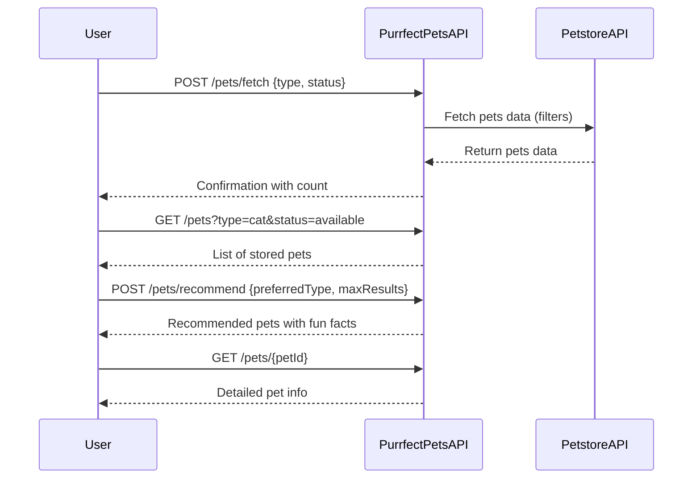
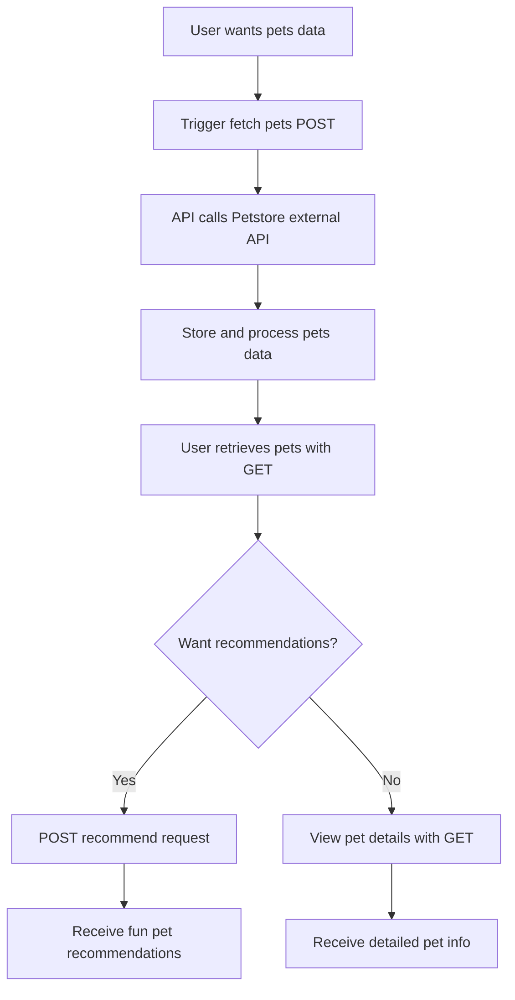

```markdown
# Purrfect Pets API - Functional Requirements

## API Endpoints

### 1. POST /pets/fetch
- **Description:** Fetch pets data from the external Petstore API, optionally filtered by type or status. Processes, stores, and prepares data for retrieval.
- **Request Body:**
```json
{
  "type": "string (optional, e.g. cat, dog, bird)",
  "status": "string (optional, e.g. available, sold)"
}
```
- **Response:**
```json
{
  "message": "Pets data fetched and processed successfully.",
  "count": "number of pets stored"
}
```

---

### 2. GET /pets
- **Description:** Retrieve the list of stored pets, optionally filtered by type or status.
- **Query Parameters:**
  - `type` (optional)
  - `status` (optional)
- **Response:**
```json
[
  {
    "id": "integer",
    "name": "string",
    "type": "string",
    "status": "string",
    "tags": ["string"],
    "photoUrls": ["string"]
  }
]
```

---

### 3. POST /pets/recommend
- **Description:** Provide fun pet recommendations based on user preferences or randomly.
- **Request Body:**
```json
{
  "preferredType": "string (optional)",
  "maxResults": "integer (optional, default 3)"
}
```
- **Response:**
```json
[
  {
    "id": "integer",
    "name": "string",
    "type": "string",
    "status": "string",
    "funFact": "string"
  }
]
```

---

### 4. GET /pets/{petId}
- **Description:** Retrieve detailed information about a single pet by its ID.
- **Response:**
```json
{
  "id": "integer",
  "name": "string",
  "type": "string",
  "status": "string",
  "tags": ["string"],
  "photoUrls": ["string"],
  "description": "string (optional)"
}
```

---

## User-App Interaction Sequence Diagram


```mermaid
sequenceDiagram
    participant User
    participant PurrfectPetsAPI
    participant PetstoreAPI

    User->>PurrfectPetsAPI: POST /pets/fetch {type, status}
    PurrfectPetsAPI->>PetstoreAPI: Fetch pets data (filters)
    PetstoreAPI-->>PurrfectPetsAPI: Return pets data
    PurrfectPetsAPI-->>User: Confirmation with count

    User->>PurrfectPetsAPI: GET /pets?type=cat&status=available
    PurrfectPetsAPI-->>User: List of stored pets

    User->>PurrfectPetsAPI: POST /pets/recommend {preferredType, maxResults}
    PurrfectPetsAPI-->>User: Recommended pets with fun facts

    User->>PurrfectPetsAPI: GET /pets/{petId}
    PurrfectPetsAPI-->>User: Detailed pet info
```

---

## User Journey Diagram


```mermaid
graph TD
    A[User wants pets data] --> B[Trigger fetch pets POST]
    B --> C[API calls Petstore external API]
    C --> D[Store and process pets data]
    D --> E[User retrieves pets with GET]
    E --> F{Want recommendations?}
    F -- Yes --> G[POST recommend request]
    F -- No --> H[View pet details with GET]
    G --> I[Receive fun pet recommendations]
    H --> J[Receive detailed pet info]
```
```