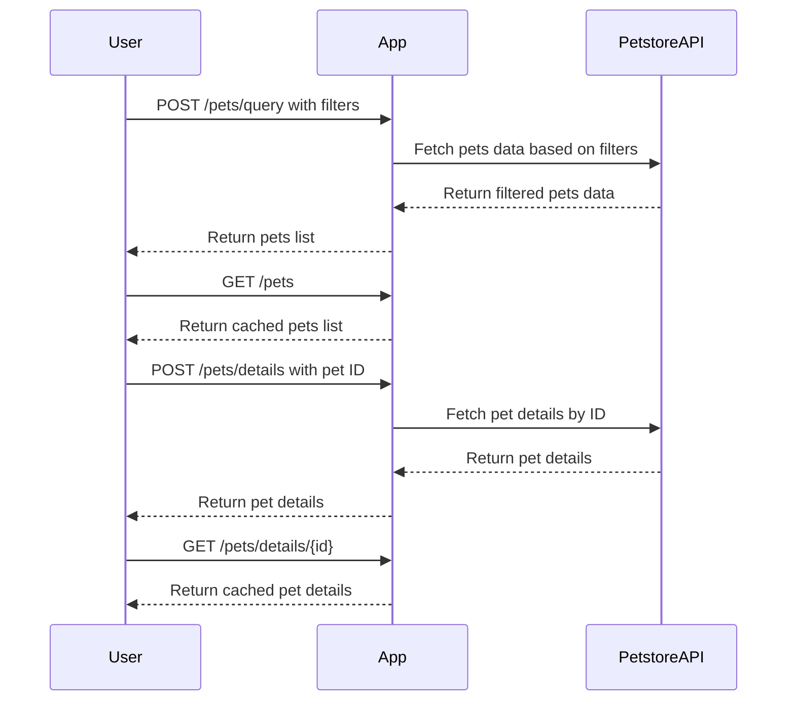

```markdown
# Purrfect Pets API - Functional Requirements

## API Endpoints

### 1. POST /pets/query  
**Purpose:** Retrieve pets data from external Petstore API based on filters or criteria.  
**Request Body:**  
```json
{
  "status": "available",          // optional, e.g. "available", "pending", "sold"
  "category": "cat",              // optional, e.g. "cat", "dog"
  "tags": ["cute", "small"]       // optional array of tags
}
```  
**Response:**  
```json
{
  "pets": [
    {
      "id": 1,
      "name": "Fluffy",
      "category": "cat",
      "status": "available",
      "photoUrls": ["http://..."],
      "tags": ["cute", "small"]
    }
  ]
}
```

---

### 2. GET /pets  
**Purpose:** Retrieve the last queried pet list results stored in the application (read-only).  
**Response:**  
```json
{
  "pets": [
    {
      "id": 1,
      "name": "Fluffy",
      "category": "cat",
      "status": "available",
      "photoUrls": ["http://..."],
      "tags": ["cute", "small"]
    }
  ]
}
```

---

### 3. POST /pets/details  
**Purpose:** Retrieve detailed pet data by ID from external Petstore API.  
**Request Body:**  
```json
{
  "id": 1
}
```  
**Response:**  
```json
{
  "id": 1,
  "name": "Fluffy",
  "category": "cat",
  "status": "available",
  "photoUrls": ["http://..."],
  "tags": ["cute", "small"],
  "description": "A very friendly cat",
  "additionalInfo": { }
}
```

---

### 4. GET /pets/details/{id}  
**Purpose:** Retrieve the last fetched pet details by ID stored in the application (read-only).  
**Response:**  
```json
{
  "id": 1,
  "name": "Fluffy",
  "category": "cat",
  "status": "available",
  "photoUrls": ["http://..."],
  "tags": ["cute", "small"],
  "description": "A very friendly cat",
  "additionalInfo": { }
}
```

---

## User-App Interaction Sequence Diagram


```mermaid
sequenceDiagram
    participant User
    participant App
    participant PetstoreAPI

    User->>App: POST /pets/query with filters
    App->>PetstoreAPI: Fetch pets data based on filters
    PetstoreAPI-->>App: Return filtered pets data
    App-->>User: Return pets list

    User->>App: GET /pets
    App-->>User: Return cached pets list

    User->>App: POST /pets/details with pet ID
    App->>PetstoreAPI: Fetch pet details by ID
    PetstoreAPI-->>App: Return pet details
    App-->>User: Return pet details

    User->>App: GET /pets/details/{id}
    App-->>User: Return cached pet details
```

---

## Summary

- POST endpoints invoke external Petstore API and cache results in-app.
- GET endpoints serve cached data only.
- JSON format for request/response.
- Query filters and pet ID passed in POST body.
- GET retrieves cached lists or details by ID.
```