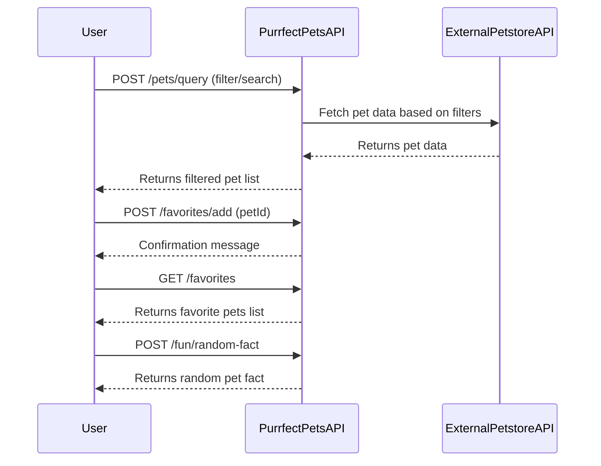
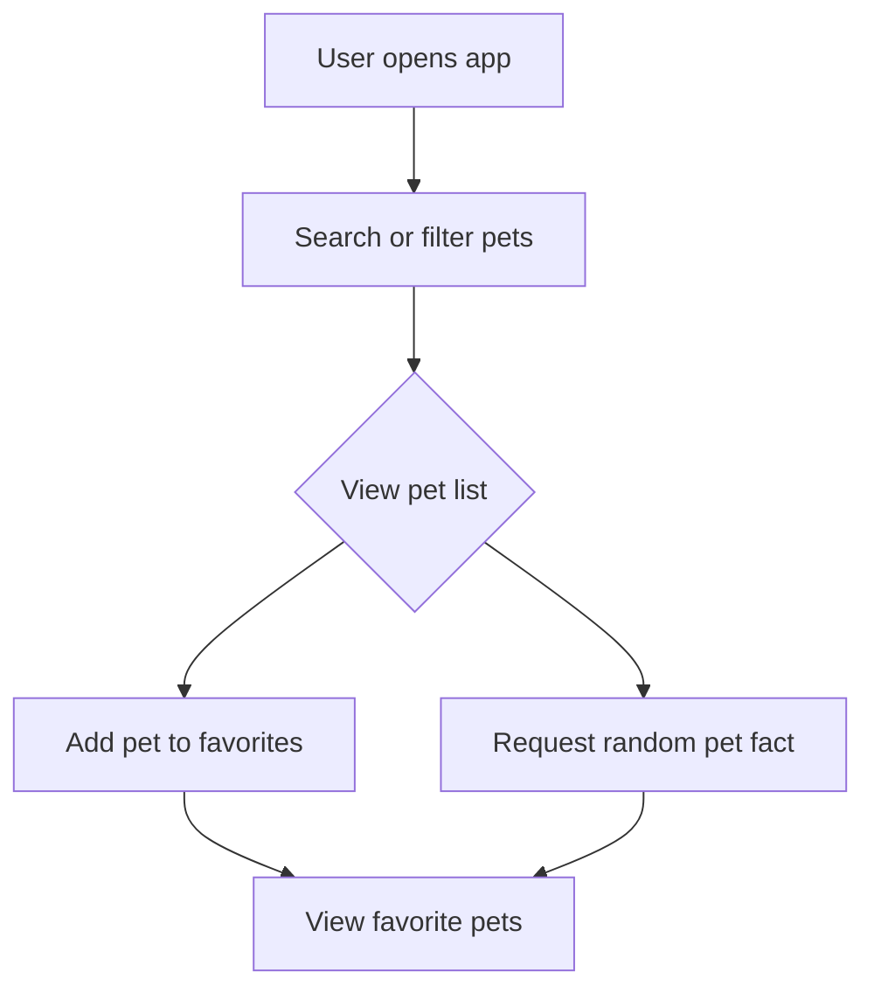

```markdown
# Purrfect Pets API - Functional Requirements

## API Endpoints

### 1. POST /pets/query  
**Description:** Query pet data from external Petstore API with filters or search criteria.  
**Request:**  
```json
{
  "type": "string",          // optional, e.g., "dog", "cat"
  "status": "string",        // optional, e.g., "available", "sold"
  "tags": ["string"],        // optional, list of tags
  "name": "string"           // optional, partial or full pet name
}
```  
**Response:**  
```json
{
  "pets": [
    {
      "id": "integer",
      "name": "string",
      "type": "string",
      "status": "string",
      "tags": ["string"],
      "photoUrls": ["string"]
    }
  ]
}
```

---

### 2. POST /favorites/add  
**Description:** Add a pet to user's favorites list by pet ID.  
**Request:**  
```json
{
  "petId": "integer"
}
```  
**Response:**  
```json
{
  "success": true,
  "message": "Pet added to favorites."
}
```

---

### 3. GET /favorites  
**Description:** Retrieve the list of favorite pets saved by the user.  
**Response:**  
```json
{
  "favorites": [
    {
      "id": "integer",
      "name": "string",
      "type": "string",
      "status": "string",
      "tags": ["string"],
      "photoUrls": ["string"]
    }
  ]
}
```

---

### 4. POST /fun/random-fact  
**Description:** Retrieve a random pet fact or trivia (fun feature).  
**Request:**  
```json
{}
```  
**Response:**  
```json
{
  "fact": "string"
}
```

---

## User-App Interaction Sequence


```mermaid
sequenceDiagram
    participant User
    participant PurrfectPetsAPI
    participant ExternalPetstoreAPI

    User->>PurrfectPetsAPI: POST /pets/query (filter/search)
    PurrfectPetsAPI->>ExternalPetstoreAPI: Fetch pet data based on filters
    ExternalPetstoreAPI-->>PurrfectPetsAPI: Returns pet data
    PurrfectPetsAPI-->>User: Returns filtered pet list

    User->>PurrfectPetsAPI: POST /favorites/add (petId)
    PurrfectPetsAPI-->>User: Confirmation message

    User->>PurrfectPetsAPI: GET /favorites
    PurrfectPetsAPI-->>User: Returns favorite pets list

    User->>PurrfectPetsAPI: POST /fun/random-fact
    PurrfectPetsAPI-->>User: Returns random pet fact
```

---

## User Journey Overview


```mermaid
graph TD
    A[User opens app] --> B[Search or filter pets]
    B --> C{View pet list}
    C --> D[Add pet to favorites]
    C --> E[Request random pet fact]
    D --> F[View favorite pets]
    E --> F
```
```