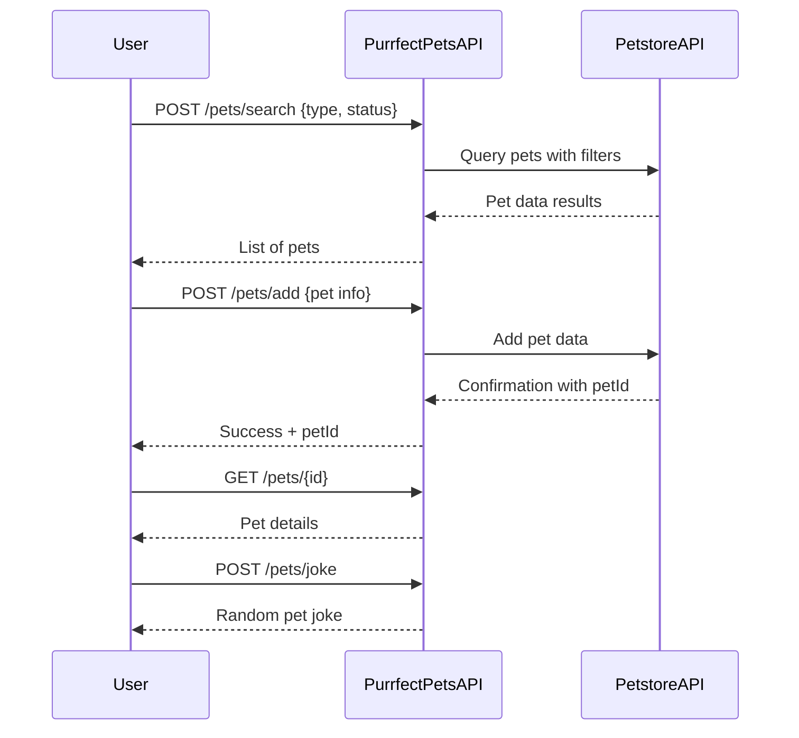
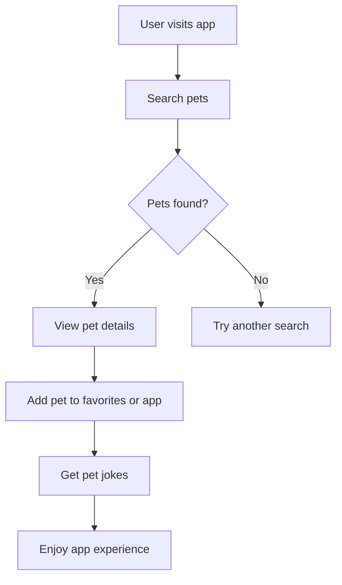

```markdown
# Functional Requirements for "Purrfect Pets" API App

## API Endpoints

### 1. POST /pets/search  
**Purpose:** Search pets using Petstore API data (external data retrieval)  
**Request:**  
```json
{
  "type": "string",      // optional, e.g. "dog", "cat"
  "status": "string"     // optional, e.g. "available", "sold"
}
```  
**Response:**  
```json
{
  "pets": [
    {
      "id": "integer",
      "name": "string",
      "type": "string",
      "status": "string",
      "photoUrls": ["string"]
    }
  ]
}
```  

---

### 2. POST /pets/add  
**Purpose:** Add a new pet to the app (business logic + external data integration)  
**Request:**  
```json
{
  "name": "string",
  "type": "string",
  "status": "string",
  "photoUrls": ["string"]
}
```  
**Response:**  
```json
{
  "success": true,
  "petId": "integer"
}
```  

---

### 3. GET /pets/{id}  
**Purpose:** Retrieve pet details from your app’s stored data (read-only)  
**Response:**  
```json
{
  "id": "integer",
  "name": "string",
  "type": "string",
  "status": "string",
  "photoUrls": ["string"]
}
```  

---

### 4. POST /pets/joke  
**Purpose:** Get a fun pet joke (business logic, no external data)  
**Request:**  
```json
{}
```  
**Response:**  
```json
{
  "joke": "string"
}
```  

---

# User-App Interaction Sequence Diagram


```mermaid
sequenceDiagram
  participant User
  participant PurrfectPetsAPI
  participant PetstoreAPI

  User->>PurrfectPetsAPI: POST /pets/search {type, status}
  PurrfectPetsAPI->>PetstoreAPI: Query pets with filters
  PetstoreAPI-->>PurrfectPetsAPI: Pet data results
  PurrfectPetsAPI-->>User: List of pets

  User->>PurrfectPetsAPI: POST /pets/add {pet info}
  PurrfectPetsAPI->>PetstoreAPI: Add pet data
  PetstoreAPI-->>PurrfectPetsAPI: Confirmation with petId
  PurrfectPetsAPI-->>User: Success + petId

  User->>PurrfectPetsAPI: GET /pets/{id}
  PurrfectPetsAPI-->>User: Pet details

  User->>PurrfectPetsAPI: POST /pets/joke
  PurrfectPetsAPI-->>User: Random pet joke
```

---

# User Journey Diagram


```mermaid
flowchart TD
  A[User visits app] --> B[Search pets]
  B --> C{Pets found?}
  C -->|Yes| D[View pet details]
  C -->|No| E[Try another search]
  D --> F[Add pet to favorites or app]
  F --> G[Get pet jokes]
  G --> H[Enjoy app experience]
```
```