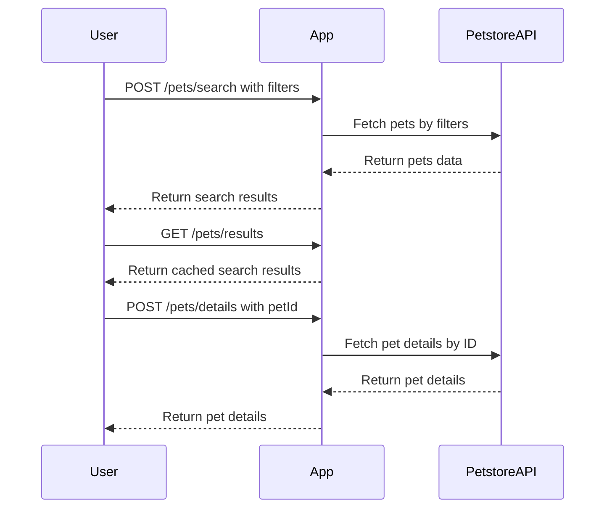
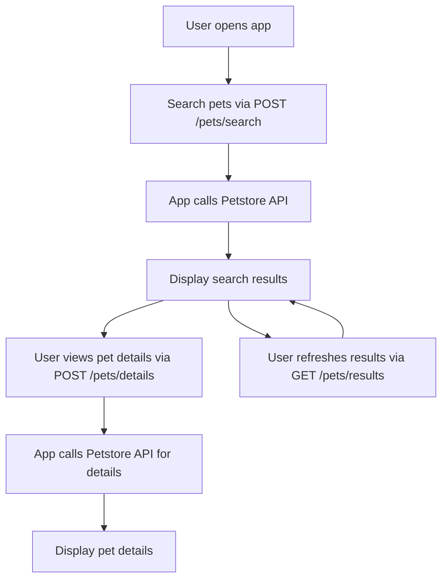

```markdown
# Purrfect Pets API - Functional Requirements

## API Endpoints

### 1. POST /pets/search
- **Description:** Search pets by criteria. This endpoint invokes external Petstore API to retrieve data.
- **Request Body:**
  ```json
  {
    "type": "string",          // Optional: e.g., "dog", "cat"
    "status": "string",        // Optional: e.g., "available", "sold", "pending"
    "breed": "string"          // Optional: breed filter
  }
  ```
- **Response:**
  ```json
  {
    "pets": [
      {
        "id": "integer",
        "name": "string",
        "type": "string",
        "breed": "string",
        "status": "string",
        "photoUrls": ["string"]
      }
    ]
  }
  ```

### 2. GET /pets/results
- **Description:** Retrieve the latest search results stored in the application.
- **Response:**
  ```json
  {
    "pets": [
      {
        "id": "integer",
        "name": "string",
        "type": "string",
        "breed": "string",
        "status": "string",
        "photoUrls": ["string"]
      }
    ]
  }
  ```

### 3. POST /pets/details
- **Description:** Retrieve detailed info about a pet by ID, may invoke external API.
- **Request Body:**
  ```json
  {
    "petId": "integer"
  }
  ```
- **Response:**
  ```json
  {
    "id": "integer",
    "name": "string",
    "type": "string",
    "breed": "string",
    "status": "string",
    "photoUrls": ["string"],
    "description": "string"        // Optional additional info
  }
  ```

---

## Business Logic Notes
- POST endpoints invoke external Petstore API and process data.
- GET endpoints serve cached or stored results from previous POST requests.
- No direct external API calls in GET requests to maintain RESTful principles.

---

## User-App Interaction Sequence Diagram


```mermaid
sequenceDiagram
    participant User
    participant App
    participant PetstoreAPI

    User->>App: POST /pets/search with filters
    App->>PetstoreAPI: Fetch pets by filters
    PetstoreAPI-->>App: Return pets data
    App-->>User: Return search results

    User->>App: GET /pets/results
    App-->>User: Return cached search results

    User->>App: POST /pets/details with petId
    App->>PetstoreAPI: Fetch pet details by ID
    PetstoreAPI-->>App: Return pet details
    App-->>User: Return pet details
```

---

## User Journey Diagram


```mermaid
graph TD
    A[User opens app] --> B[Search pets via POST /pets/search]
    B --> C[App calls Petstore API]
    C --> D[Display search results]
    D --> E[User views pet details via POST /pets/details]
    E --> F[App calls Petstore API for details]
    F --> G[Display pet details]
    D --> H[User refreshes results via GET /pets/results]
    H --> D
```
```