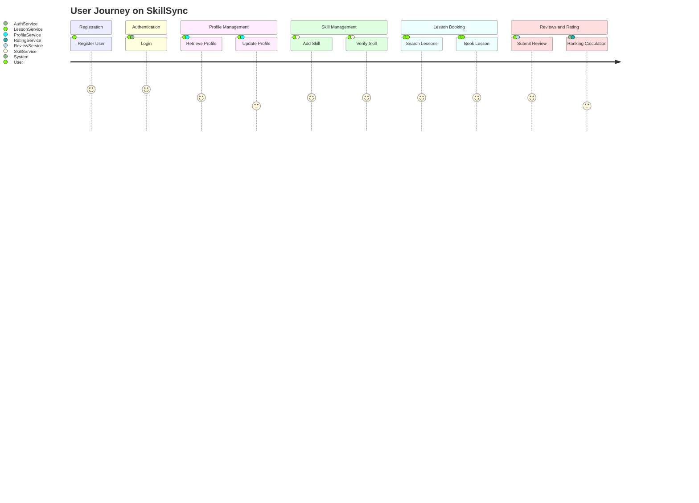
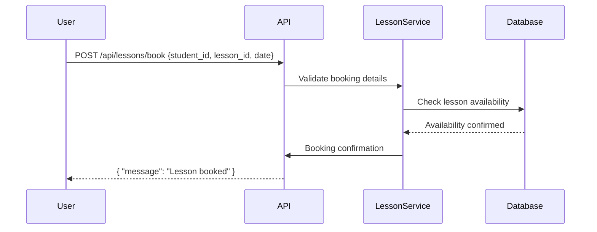

# SkillSync Functional Requirements

This document outlines the functional requirements for the SkillSync platform, including necessary API endpoints and detailed request/response formats following RESTful standards.

---

## API Endpoints

### 1. Authentication

#### User Registration
- **Endpoint:** `POST /api/auth/register`  
- **Request:**  
  ```json
  {
    "username": "user123",
    "email": "user@example.com",
    "password": "securepassword"
  }
  ```  
- **Response:**  
  ```json
  {
    "message": "User registered successfully",
    "user": {
      "id": 1,
      "username": "user123"
    }
  }
  ```

#### User Login
- **Endpoint:** `POST /api/auth/login`  
- **Request:**  
  ```json
  {
    "email": "user@example.com",
    "password": "securepassword"
  }
  ```  
- **Response:**  
  ```json
  {
    "token": "jwt-token",
    "user": {
      "id": 1,
      "username": "user123"
    }
  }
  ```

---

### 2. User Profile

#### Retrieve Profile
- **Endpoint:** `GET /api/users/{user_id}`  
- **Response:**  
  ```json
  {
    "id": 1,
    "username": "user123",
    "bio": "I love teaching Python and Guitar",
    "skills": [
      { "name": "Python", "experience_years": 3, "verified": true },
      { "name": "Guitar", "experience_years": 5, "verified": false }
    ],
    "rating": 4.8,
    "reviews": [
      {
        "from": "user456",
        "rating": 5,
        "comment": "Great teacher!"
      }
    ]
  }
  ```

#### Update Profile
- **Endpoint:** `PATCH /api/users/{user_id}`  
- **Request:**  
  ```json
  {
    "bio": "I love teaching Python and Guitar",
    "skills": [
      { "name": "Python", "experience_years": 3 },
      { "name": "Guitar", "experience_years": 5 }
    ]
  }
  ```  
- **Response:**  
  ```json
  {
    "message": "Profile updated"
  }
  ```

---

### 3. Skill Management and Verification

#### Add Skill
- **Endpoint:** `POST /api/skills/add`  
- **Request:**  
  ```json
  {
    "user_id": 1,
    "skill": "Guitar",
    "experience_years": 5
  }
  ```  
- **Response:**  
  ```json
  {
    "message": "Skill added"
  }
  ```

#### Verify Skill
- **Endpoint:** `POST /api/skills/verify`  
- **Request:**  
  ```json
  {
    "user_id": 1,
    "skill": "Python",
    "verification_method": "portfolio",  // or "test", "recommendation"
    "verification_data": "URL_or_document_data"
  }
  ```  
- **Response:**  
  ```json
  {
    "message": "Skill verified successfully"
  }
  ```

---

### 4. Lesson Booking

#### Search Lessons
- **Endpoint:** `GET /api/lessons/search`  
- **Query Parameters:**  
  - `skill` (string)
  - `location` (string)
- **Response:**  
  ```json
  [
    {
      "lesson_id": 12,
      "teacher": "user123",
      "skill": "Python",
      "price": 20,
      "rating": 4.9
    }
  ]
  ```

#### Book a Lesson
- **Endpoint:** `POST /api/lessons/book`  
- **Request:**  
  ```json
  {
    "student_id": 2,
    "lesson_id": 12,
    "date": "2025-03-10T15:00:00Z"
  }
  ```  
- **Response:**  
  ```json
  {
    "message": "Lesson booked"
  }
  ```

---

### 5. Reviews and Rating

#### Submit Review
- **Endpoint:** `POST /api/reviews`  
- **Request:**  
  ```json
  {
    "from_user": 2,
    "to_user": 1,
    "lesson_id": 12,
    "rating": 5,
    "comment": "Very useful lesson!"
  }
  ```  
- **Response:**  
  ```json
  {
    "message": "Review submitted"
  }
  ```

#### Calculate Ranking (External Calculation)
- **Endpoint:** `POST /api/rating/calculate`  
- **Request:**  
  ```json
  {
    "user_id": 1,
    "reviews": [
      { "rating": 5 },
      { "rating": 4 }
    ],
    "verified_skills": [
      { "skill": "Python", "verified": true },
      { "skill": "Guitar", "verified": false }
    ]
  }
  ```  
- **Response:**  
  ```json
  {
    "message": "Ranking updated",
    "new_rating": 4.8
  }
  ```

---

## Mermaid Diagrams

### User Journey Diagram

```mermaid
journey
  title User Journey on SkillSync
  section Registration
    Register User: 5: User
  section Authentication
    Login: 5: User, AuthService
  section Profile Management
    Retrieve Profile: 4: User, ProfileService
    Update Profile: 3: User, ProfileService
  section Skill Management
    Add Skill: 4: User, SkillService
    Verify Skill: 4: User, SkillService
  section Lesson Booking
    Search Lessons: 4: User, LessonService
    Book Lesson: 4: User, LessonService
  section Reviews and Rating
    Submit Review: 4: User, ReviewService
    Ranking Calculation: 3: System, RatingService
```

### Sequence Diagram for Booking a Lesson

```mermaid
sequenceDiagram
  participant User
  participant API
  participant LessonService
  participant Database

  User->>API: POST /api/lessons/book {student_id, lesson_id, date}
  API->>LessonService: Validate booking details
  LessonService->>Database: Check lesson availability
  Database-->>LessonService: Availability confirmed
  LessonService->>API: Booking confirmation
  API-->>User: { "message": "Lesson booked" }
```