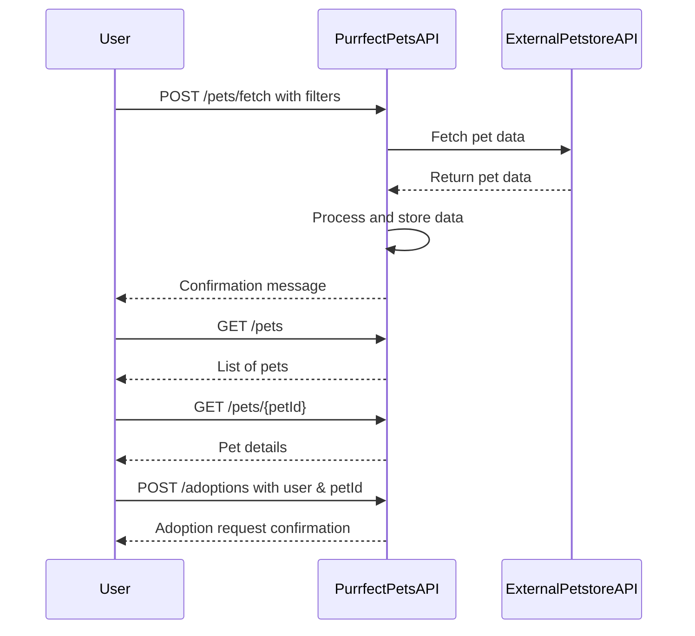

```markdown
# Purrfect Pets API - Functional Requirements

## Overview
The "Purrfect Pets" API app provides pet data management and interaction based on Petstore API data. It follows RESTful principles with:

- **POST** endpoints for any business logic involving external data fetching, processing, or calculations.
- **GET** endpoints for retrieving results already processed or stored within the app.

---

## API Endpoints

### 1. Fetch & Process Pets Data  
**POST** `/pets/fetch`

- **Description:**  
  Fetches pet data from the external Petstore API, processes it (e.g., filtering, sorting), and stores or caches the results for retrieval.

- **Request Body:**  
  ```json
  {
    "filters": {
      "status": "available|pending|sold",
      "type": "dog|cat|other"
    },
    "sortBy": "name|dateAdded",
    "limit": 50
  }
  ```

- **Response:**  
  ```json
  {
    "message": "Pets data fetched and processed successfully",
    "count": 45
  }
  ```

---

### 2. Get Pets List  
**GET** `/pets`

- **Description:**  
  Retrieves the list of processed pets stored in the app.

- **Response:**  
  ```json
  [
    {
      "id": 1,
      "name": "Fluffy",
      "type": "cat",
      "status": "available",
      "age": 3
    },
    ...
  ]
  ```

---

### 3. Get Pet Details  
**GET** `/pets/{petId}`

- **Description:**  
  Retrieves detailed info for a specific pet by ID.

- **Response:**  
  ```json
  {
    "id": 1,
    "name": "Fluffy",
    "type": "cat",
    "status": "available",
    "age": 3,
    "description": "A playful kitten",
    "photos": ["url1", "url2"]
  }
  ```

---

### 4. Create Adoption Request  
**POST** `/adoptions`

- **Description:**  
  Submits an adoption request for a pet.

- **Request Body:**  
  ```json
  {
    "petId": 1,
    "user": {
      "name": "John Doe",
      "email": "john@example.com"
    }
  }
  ```

- **Response:**  
  ```json
  {
    "message": "Adoption request submitted successfully",
    "requestId": "abc123"
  }
  ```

---

## User-App Interaction Sequence Diagram


```mermaid
sequenceDiagram
    participant User
    participant PurrfectPetsAPI
    participant ExternalPetstoreAPI

    User->>PurrfectPetsAPI: POST /pets/fetch with filters
    PurrfectPetsAPI->>ExternalPetstoreAPI: Fetch pet data
    ExternalPetstoreAPI-->>PurrfectPetsAPI: Return pet data
    PurrfectPetsAPI->>PurrfectPetsAPI: Process and store data
    PurrfectPetsAPI-->>User: Confirmation message

    User->>PurrfectPetsAPI: GET /pets
    PurrfectPetsAPI-->>User: List of pets

    User->>PurrfectPetsAPI: GET /pets/{petId}
    PurrfectPetsAPI-->>User: Pet details

    User->>PurrfectPetsAPI: POST /adoptions with user & petId
    PurrfectPetsAPI-->>User: Adoption request confirmation
```
```