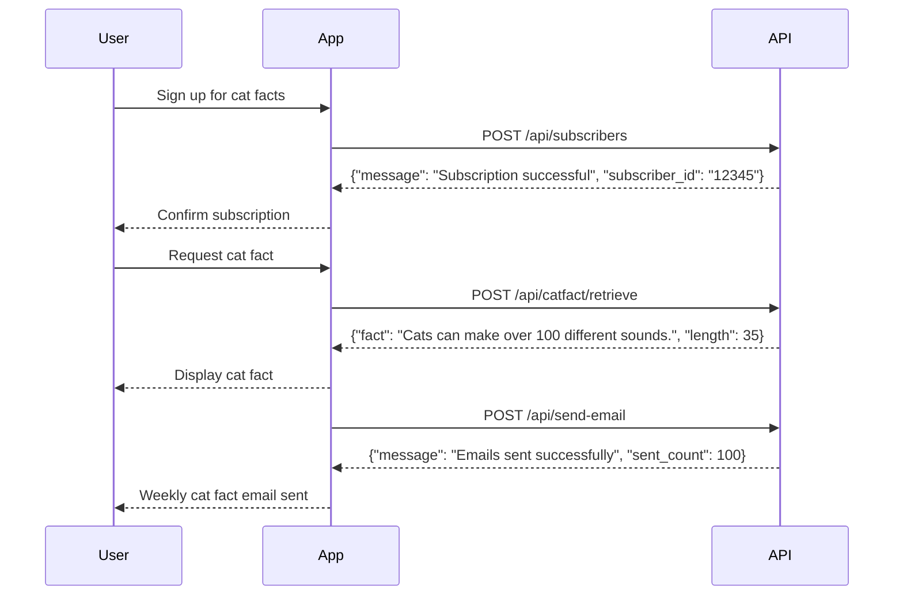

```markdown
# Functional Requirements for Cat Fact Subscription Application

## API Endpoints

### 1. User Sign-Up

- **Endpoint**: `POST /api/subscribers`
- **Description**: Allows users to sign up for weekly cat facts.
- **Request Format**:
    ```json
    {
        "name": "John Doe",
        "email": "john.doe@example.com"
    }
    ```
- **Response Format**:
    ```json
    {
        "message": "Subscription successful",
        "subscriber_id": "12345"
    }
    ```

### 2. Unsubscribe User

- **Endpoint**: `POST /api/subscribers/unsubscribe`
- **Description**: Allows users to unsubscribe from weekly cat facts.
- **Request Format**:
    ```json
    {
        "email": "john.doe@example.com"
    }
    ```
- **Response Format**:
    ```json
    {
        "message": "Unsubscription successful"
    }
    ```

### 3. Retrieve Cat Fact

- **Endpoint**: `POST /api/catfact/retrieve`
- **Description**: Retrieves a new cat fact from the external Cat Fact API.
- **Request Format**:
    ```json
    {}
    ```
- **Response Format**:
    ```json
    {
        "fact": "Cats can make over 100 different sounds.",
        "length": 35
    }
    ```

### 4. Send Weekly Email

- **Endpoint**: `POST /api/send-email`
- **Description**: Sends the retrieved cat fact to all subscribers.
- **Request Format**:
    ```json
    {
        "fact": "Cats have five toes on their front paws, but only four toes on their back paws."
    }
    ```
- **Response Format**:
    ```json
    {
        "message": "Emails sent successfully",
        "sent_count": 100
    }
    ```

### 5. Get Subscriber Report

- **Endpoint**: `GET /api/subscribers/report`
- **Description**: Retrieves the report of subscribers and interactions.
- **Response Format**:
    ```json
    {
        "total_subscribers": 150,
        "interactions": {
            "opens": 120,
            "clicks": 45
        }
    }
    ```

## User-App Interaction Diagram


```mermaid
sequenceDiagram
    participant User
    participant App
    participant API

    User->>App: Sign up for cat facts
    App->>API: POST /api/subscribers
    API-->>App: {"message": "Subscription successful", "subscriber_id": "12345"}
    App-->>User: Confirm subscription

    User->>App: Request cat fact
    App->>API: POST /api/catfact/retrieve
    API-->>App: {"fact": "Cats can make over 100 different sounds.", "length": 35}
    App-->>User: Display cat fact

    App->>API: POST /api/send-email
    API-->>App: {"message": "Emails sent successfully", "sent_count": 100}
    App-->>User: Weekly cat fact email sent
```
```