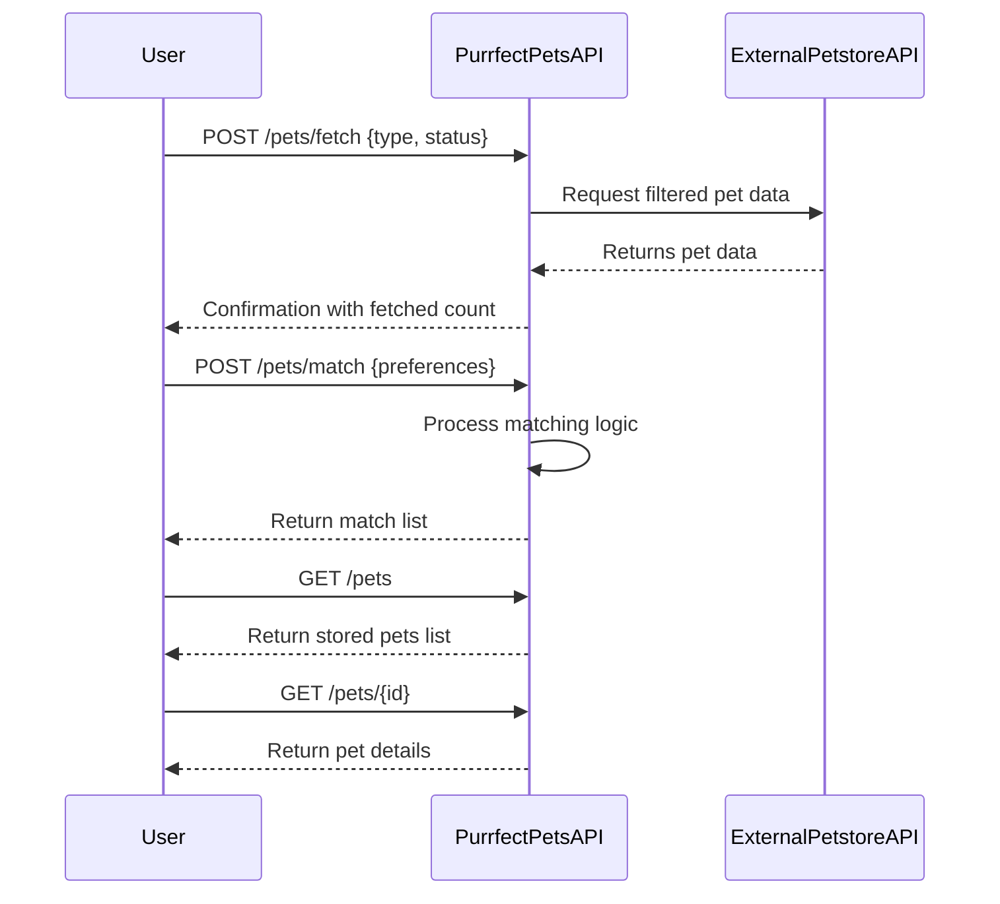

```markdown
# Purrfect Pets API - Functional Requirements

## Overview
The "Purrfect Pets" API app integrates with the external Petstore API data. It follows RESTful design with the principle that any business logic invoking external data or calculations happens in POST endpoints. GET endpoints only retrieve results stored or processed by the app.

---

## API Endpoints

### 1. POST /pets/fetch
- **Description**: Fetch pets data from the external Petstore API with optional filters.
- **Request Body** (JSON):
  ```json
  {
    "type": "cat" | "dog" | "other",  // optional
    "status": "available" | "sold" | "pending"  // optional
  }
  ```
- **Response** (JSON):
  ```json
  {
    "message": "Pets data fetched successfully",
    "fetchedCount": 10
  }
  ```
- **Business Logic**: Calls external Petstore API, filters data, stores results internally for retrieval.

---

### 2. POST /pets/match
- **Description**: Find pet matches based on user preferences.
- **Request Body** (JSON):
  ```json
  {
    "preferredType": "cat" | "dog" | "other",
    "ageRange": { "min": 1, "max": 5 },
    "status": "available"
  }
  ```
- **Response** (JSON):
  ```json
  {
    "matches": [
      {
        "id": 123,
        "name": "Whiskers",
        "type": "cat",
        "age": 3,
        "status": "available"
      }
    ]
  }
  ```
- **Business Logic**: Uses stored pet data to find matching pets.

---

### 3. GET /pets
- **Description**: Retrieve all stored pets.
- **Response** (JSON):
  ```json
  [
    {
      "id": 123,
      "name": "Whiskers",
      "type": "cat",
      "age": 3,
      "status": "available"
    }
  ]
  ```

---

### 4. GET /pets/{id}
- **Description**: Retrieve detailed info about a specific pet by ID.
- **Response** (JSON):
  ```json
  {
    "id": 123,
    "name": "Whiskers",
    "type": "cat",
    "age": 3,
    "status": "available",
    "description": "Playful cat who loves naps."
  }
  ```

---

## User-App Interaction Diagram


```mermaid
sequenceDiagram
  participant User
  participant PurrfectPetsAPI
  participant ExternalPetstoreAPI

  User->>PurrfectPetsAPI: POST /pets/fetch {type, status}
  PurrfectPetsAPI->>ExternalPetstoreAPI: Request filtered pet data
  ExternalPetstoreAPI-->>PurrfectPetsAPI: Returns pet data
  PurrfectPetsAPI-->>User: Confirmation with fetched count

  User->>PurrfectPetsAPI: POST /pets/match {preferences}
  PurrfectPetsAPI->>PurrfectPetsAPI: Process matching logic
  PurrfectPetsAPI-->>User: Return match list

  User->>PurrfectPetsAPI: GET /pets
  PurrfectPetsAPI-->>User: Return stored pets list

  User->>PurrfectPetsAPI: GET /pets/{id}
  PurrfectPetsAPI-->>User: Return pet details
```
```