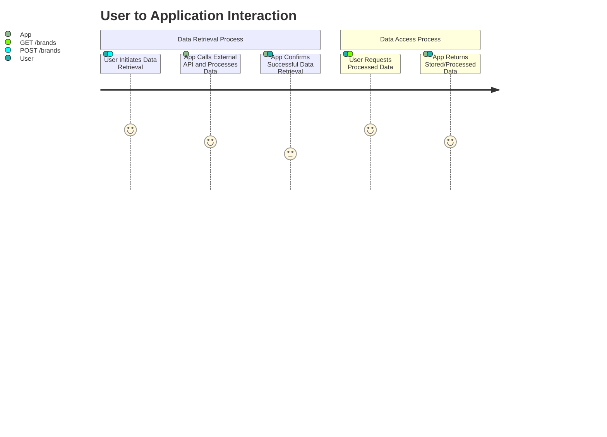
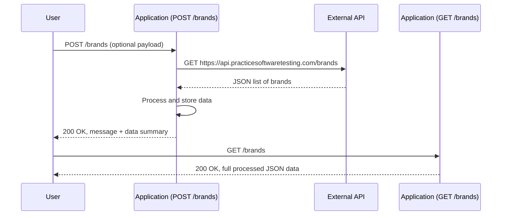

# Functional Requirements Document

## Overview
This document outlines the functional requirements for a backend application that retrieves and displays data from an external API (https://api.practicesoftwaretesting.com/brands).

## API Endpoints

### 1. POST /brands
- **Purpose**:  
  This endpoint triggers the business logic to invoke the external API, retrieves the JSON data, and processes the result.

- **Request Format**:  
  - **Method**: POST  
  - **URL**: /brands  
  - **Headers**:  
    - `Content-Type: application/json`  
  - **Body**:  
    Optional JSON payload for future enhancements (currently can be empty).

- **Response Format**:  
  - **Success Response**:  
    - **HTTP Code**: 200  
    - **Body**:  
      ```json
      {
        "message": "Data retrieved successfully",
        "data": [
          { "id": "<id>", "name": "<name>", "slug": "<slug>" },
          ...
        ]
      }
      ```
  - **Error Response**:  
    - Appropriate HTTP status codes (e.g., 400 for bad requests, 500 for internal errors) with JSON error details.

- **Business Logic**:  
  - Validate the request.
  - Invoke the external API to fetch the brands.
  - Handle exceptions or errors from the external API.
  - Process or transform the data as necessary.
  - Optionally store the processed data for future retrieval.

### 2. GET /brands
- **Purpose**:  
  This endpoint provides access to the processed results previously obtained via the POST endpoint.

- **Request Format**:  
  - **Method**: GET  
  - **URL**: /brands  
  - **Headers**:  
    - `Accept: application/json`  

- **Response Format**:  
  - **Success Response**:  
    - **HTTP Code**: 200  
    - **Body**:  
      ```json
      [
        { "id": "<id>", "name": "<name>", "slug": "<slug>" },
        ...
      ]
      ```
  - **Error Response**:  
    - Appropriate HTTP status codes (e.g., 404 if no data found, 500 for internal errors) with JSON error details.

## User-App Interaction Journey


```mermaid
journey
    title User to Application Interaction
    section Data Retrieval Process
      User Initiates Data Retrieval: 5: User, POST /brands
      App Calls External API and Processes Data: 4: App
      App Confirms Successful Data Retrieval: 3: App, User
    section Data Access Process
      User Requests Processed Data: 5: User, GET /brands
      App Returns Stored/Processed Data: 4: App, User
```

## Sequence Diagram


```mermaid
sequenceDiagram
    participant U as User
    participant A as Application (POST /brands)
    participant E as External API
    participant G as Application (GET /brands)
    
    U->>A: POST /brands (optional payload)
    A->>E: GET https://api.practicesoftwaretesting.com/brands
    E-->>A: JSON list of brands
    A->>A: Process and store data
    A-->>U: 200 OK, message + data summary
    
    U->>G: GET /brands
    G-->>U: 200 OK, full processed JSON data
```

This document provides a clear outline of the functional requirements and expected interactions for the backend application.