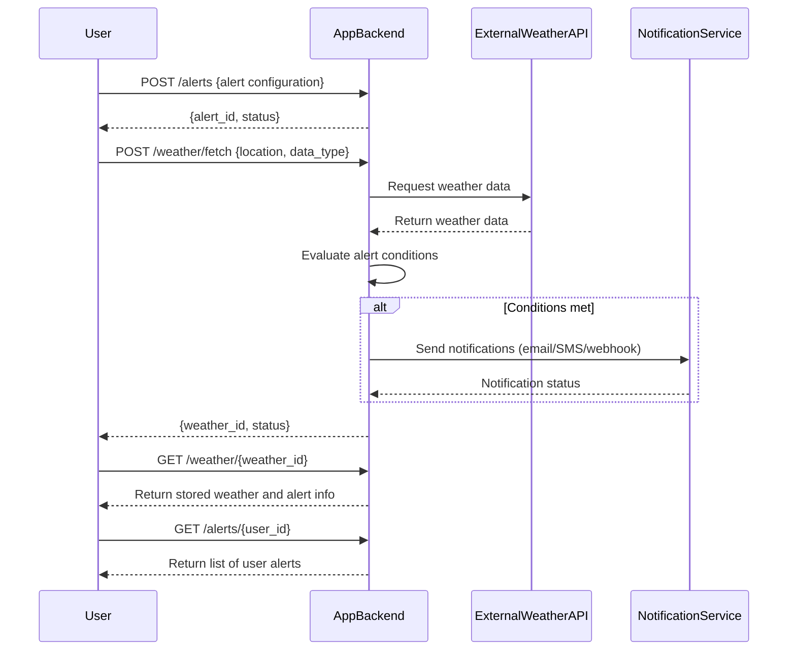

# Functional Requirements for Weather Alerts Backend

## API Endpoints

### 1. Create or Update Weather Alert
- **Endpoint:** `POST /alerts`
- **Description:** Create a new alert or update an existing one with user-defined conditions and notification preferences.
- **Request Format (JSON):**
  ```json
  {
    "alert_id": "string (optional, for update)",
    "user_id": "string",
    "location": {
      "city": "string",
      "latitude": "float",
      "longitude": "float"
    },
    "conditions": [
      {
        "condition_type": "string",        // e.g., "temperature", "rain"
        "operator": "string",              // e.g., "greater_than", "less_than", "equals"
        "threshold": "float or boolean"   // threshold value or boolean for rain
      }
    ],
    "notification_channels": [ "email", "sms", "webhook" ],
    "notification_details": {
      "email": "string (optional)",
      "sms": "string (optional)",
      "webhook_url": "string (optional)"
    },
    "message_template": "string (optional)"
  }
  ```
- **Response Format (JSON):**
  ```json
  {
    "status": "success",
    "alert_id": "string",
    "message": "Alert created/updated successfully"
  }
  ```

### 2. Trigger Weather Data Fetch and Alert Evaluation
- **Endpoint:** `POST /weather/fetch`
- **Description:** Triggers fetching weather data for given location and evaluates alert conditions.
- **Request Format (JSON):**
  ```json
  {
    "location": {
      "city": "string",
      "latitude": "float",
      "longitude": "float"
    },
    "data_type": "string"  // e.g., "current", "forecast"
  }
  ```
- **Response Format (JSON):**
  ```json
  {
    "status": "success",
    "weather_id": "string",
    "message": "Weather data fetch started and alerts evaluation triggered"
  }
  ```

### 3. Retrieve Weather Data or Alert Status
- **Endpoint:** `GET /weather/{weather_id}`
- **Description:** Retrieve stored weather data by id.
- **Response Format (JSON):**
  ```json
  {
    "weather_id": "string",
    "location": { /* location info */ },
    "data_type": "string",
    "weather_data": { /* weather details */ },
    "fetched_at": "ISO8601 timestamp",
    "alerts_triggered": [
      {
        "alert_id": "string",
        "triggered_conditions": [ /* list of conditions met */ ],
        "notification_status": "sent" | "failed" | "pending"
      }
    ]
  }
  ```

### 4. Retrieve User Alerts
- **Endpoint:** `GET /alerts/{user_id}`
- **Description:** Retrieve all alerts configured by a user.
- **Response Format (JSON):**
  ```json
  [
    {
      "alert_id": "string",
      "location": { /* location info */ },
      "conditions": [ /* condition list */ ],
      "notification_channels": [ "email", "sms" ],
      "status": "active" | "inactive"
    }
  ]
  ```

---

## User-App Interaction Sequence Diagram


```mermaid
sequenceDiagram
    participant User
    participant AppBackend
    participant ExternalWeatherAPI
    participant NotificationService

    User->>AppBackend: POST /alerts {alert configuration}
    AppBackend-->>User: {alert_id, status}

    User->>AppBackend: POST /weather/fetch {location, data_type}
    AppBackend->>ExternalWeatherAPI: Request weather data
    ExternalWeatherAPI-->>AppBackend: Return weather data
    AppBackend->>AppBackend: Evaluate alert conditions
    alt Conditions met
        AppBackend->>NotificationService: Send notifications (email/SMS/webhook)
        NotificationService-->>AppBackend: Notification status
    end
    AppBackend-->>User: {weather_id, status}

    User->>AppBackend: GET /weather/{weather_id}
    AppBackend-->>User: Return stored weather and alert info

    User->>AppBackend: GET /alerts/{user_id}
    AppBackend-->>User: Return list of user alerts
```
