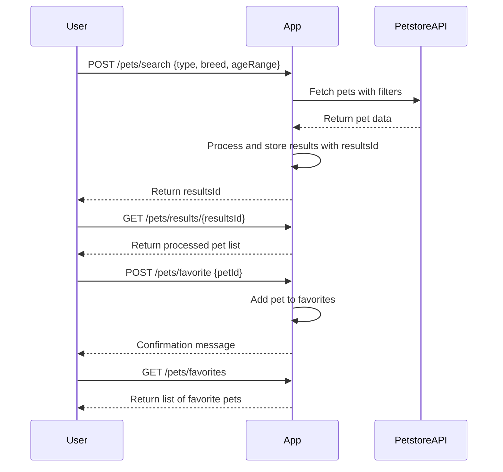

```markdown
# Purrfect Pets API - Functional Requirements

## Overview  
The API provides pet data by integrating with the external Petstore API. All external data interactions and business logic are handled via POST endpoints. GET endpoints serve cached or processed results for client retrieval.

---

## API Endpoints

### 1. POST /pets/search  
**Description:** Search pets by type, breed, or other filters; fetches data from external Petstore API and processes it.  
**Request:**  
```json
{
  "type": "string",       // optional, e.g. "cat", "dog"
  "breed": "string",      // optional
  "ageRange": {           // optional
    "min": "integer",
    "max": "integer"
  }
}
```  
**Response:**  
```json
{
  "resultsId": "string"   // ID to retrieve results via GET /pets/results
}
```

---

### 2. GET /pets/results/{resultsId}  
**Description:** Retrieve processed search results for a previous POST search request.  
**Response:**  
```json
{
  "resultsId": "string",
  "pets": [
    {
      "id": "string",
      "name": "string",
      "type": "string",
      "breed": "string",
      "age": "integer",
      "description": "string",
      "imageUrl": "string"
    }
  ]
}
```

---

### 3. POST /pets/favorite  
**Description:** Mark a pet as favorite (business logic handled here).  
**Request:**  
```json
{
  "petId": "string"
}
```  
**Response:**  
```json
{
  "success": true,
  "message": "Pet added to favorites."
}
```

---

### 4. GET /pets/favorites  
**Description:** Retrieve list of favorite pets.  
**Response:**  
```json
{
  "favorites": [
    {
      "id": "string",
      "name": "string",
      "type": "string",
      "breed": "string",
      "age": "integer",
      "imageUrl": "string"
    }
  ]
}
```

---

## User-App Interaction Sequence


```mermaid
sequenceDiagram
    participant User
    participant App
    participant PetstoreAPI

    User->>App: POST /pets/search {type, breed, ageRange}
    App->>PetstoreAPI: Fetch pets with filters
    PetstoreAPI-->>App: Return pet data
    App->>App: Process and store results with resultsId
    App-->>User: Return resultsId

    User->>App: GET /pets/results/{resultsId}
    App-->>User: Return processed pet list

    User->>App: POST /pets/favorite {petId}
    App->>App: Add pet to favorites
    App-->>User: Confirmation message

    User->>App: GET /pets/favorites
    App-->>User: Return list of favorite pets
```

---

## Summary  
- POST endpoints handle all external data calls and business logic.  
- GET endpoints serve cached or user-specific data (search results, favorites).  
- All data exchanged in JSON format for consistency and easy client integration.
```