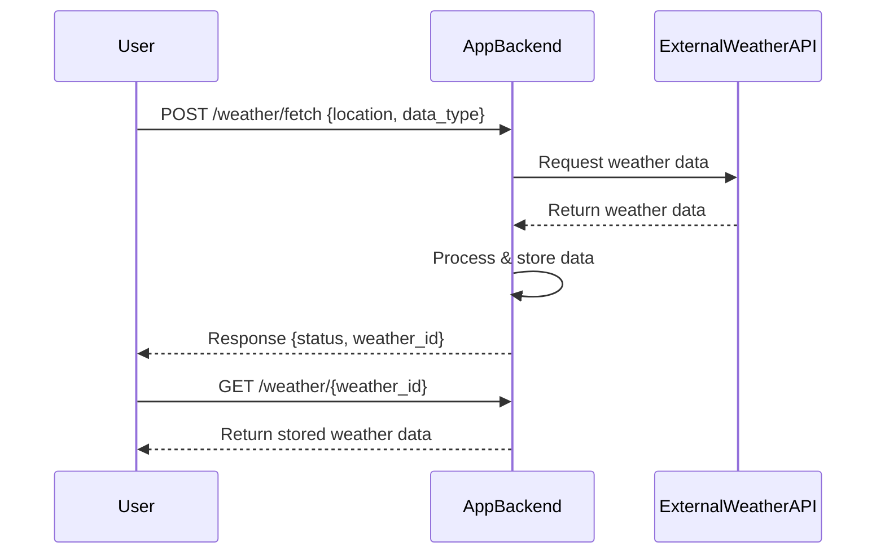

```markdown
# Functional Requirements for Weather Data Fetching Backend

## API Endpoints

### 1. Fetch Weather Data
- **Endpoint:** `POST /weather/fetch`
- **Description:** Accepts parameters for location and weather data type, invokes external weather API, processes the response, and stores the result.
- **Request Format (JSON):**
  ```json
  {
    "location": {
      "city": "string",          // e.g. "London"
      "latitude": "float",       // optional if city is provided
      "longitude": "float"       // optional if city is provided
    },
    "data_type": "string"        // e.g. "current", "forecast"
  }
  ```
- **Response Format (JSON):**
  ```json
  {
    "status": "success",
    "weather_id": "string",     // unique identifier for the stored weather data
    "message": "Data fetched and stored successfully"
  }
  ```

### 2. Retrieve Weather Data
- **Endpoint:** `GET /weather/{weather_id}`
- **Description:** Retrieves previously fetched weather data by its unique identifier.
- **Response Format (JSON):**
  ```json
  {
    "weather_id": "string",
    "location": {
      "city": "string",
      "latitude": "float",
      "longitude": "float"
    },
    "data_type": "string",
    "weather_data": {
      // weather details like temperature, humidity, wind speed, etc.
    },
    "fetched_at": "ISO8601 timestamp"
  }
  ```

---

## Business Logic Notes
- The `POST /weather/fetch` endpoint is responsible for:
  - Validating input parameters.
  - Calling the external weather API.
  - Processing and storing the response.
  - Returning a unique ID for later retrieval.
- The `GET /weather/{weather_id}` endpoint only returns stored data and does not trigger external API calls.

---

## User-App Interaction Sequence Diagram


```mermaid
sequenceDiagram
    participant User
    participant AppBackend
    participant ExternalWeatherAPI

    User->>AppBackend: POST /weather/fetch {location, data_type}
    AppBackend->>ExternalWeatherAPI: Request weather data
    ExternalWeatherAPI-->>AppBackend: Return weather data
    AppBackend->>AppBackend: Process & store data
    AppBackend-->>User: Response {status, weather_id}

    User->>AppBackend: GET /weather/{weather_id}
    AppBackend-->>User: Return stored weather data
```
```