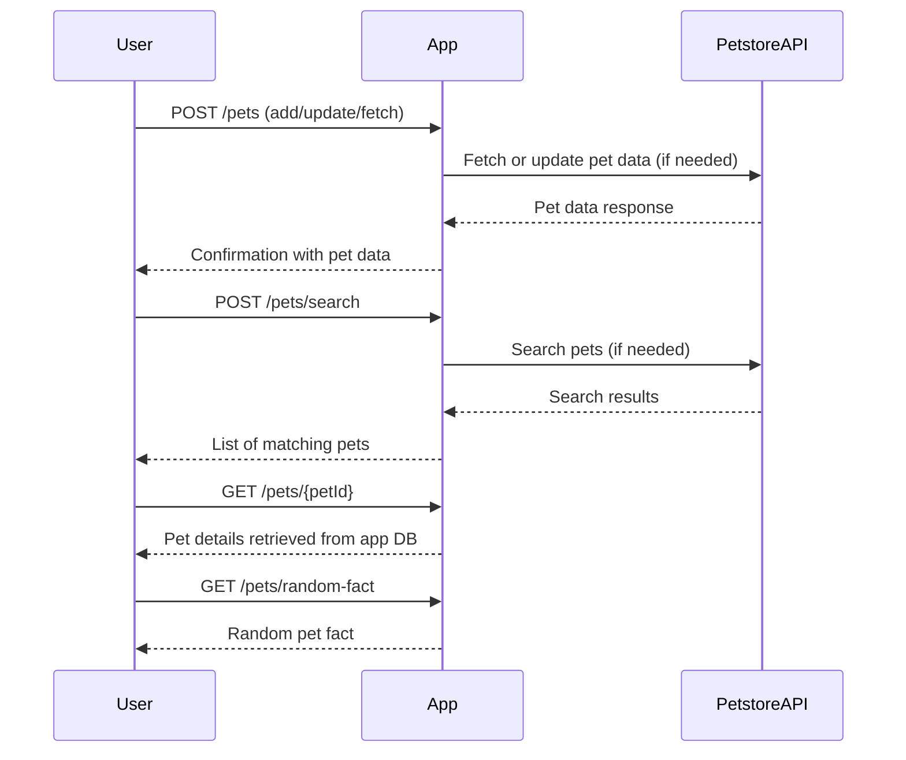
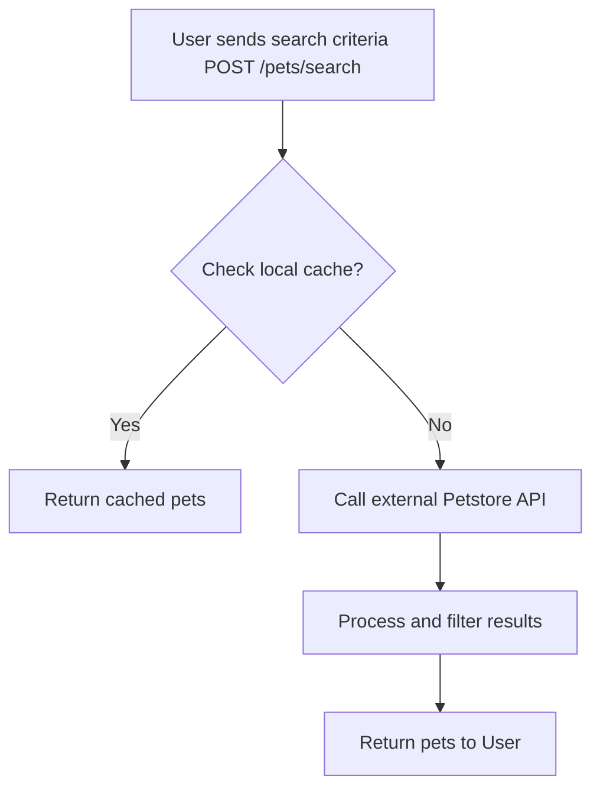

```markdown
# Functional Requirements for "Purrfect Pets" API App

## API Endpoints

### 1. Add or Update Pet Data (POST `/pets`)
- **Description:** Accepts pet data or commands to fetch/update pet information from the Petstore API, performs any business logic or calculations.
- **Request:**
```json
{
  "action": "add" | "update" | "fetch",
  "pet": {
    "id": "optional, for update",
    "name": "string",
    "category": "string",
    "photoUrls": ["string"],
    "tags": ["string"],
    "status": "available" | "pending" | "sold"
  }
}
```
- **Response:**
```json
{
  "success": true,
  "message": "Pet added/updated/fetched successfully",
  "pet": {
    "id": "string",
    "name": "string",
    "category": "string",
    "photoUrls": ["string"],
    "tags": ["string"],
    "status": "available" | "pending" | "sold"
  }
}
```

### 2. Get Pet Details (GET `/pets/{petId}`)
- **Description:** Retrieves stored pet information by pet ID from the app's database.
- **Response:**
```json
{
  "id": "string",
  "name": "string",
  "category": "string",
  "photoUrls": ["string"],
  "tags": ["string"],
  "status": "available" | "pending" | "sold"
}
```

### 3. Search Pets (POST `/pets/search`)
- **Description:** Accepts search criteria, fetches matching pets, possibly from external data source, and applies business logic.
- **Request:**
```json
{
  "category": "optional string",
  "status": "optional string",
  "tags": ["optional strings"]
}
```
- **Response:**
```json
{
  "pets": [
    {
      "id": "string",
      "name": "string",
      "category": "string",
      "photoUrls": ["string"],
      "tags": ["string"],
      "status": "available" | "pending" | "sold"
    }
  ]
}
```

### 4. Fun Feature - Random Pet Fact (GET `/pets/random-fact`)
- **Description:** Returns a random fun fact about pets.
- **Response:**
```json
{
  "fact": "string"
}
```

---

## Mermaid Diagrams

### User-App Interaction Sequence


```mermaid
sequenceDiagram
    participant User
    participant App
    participant PetstoreAPI

    User->>App: POST /pets (add/update/fetch)
    App->>PetstoreAPI: Fetch or update pet data (if needed)
    PetstoreAPI-->>App: Pet data response
    App-->>User: Confirmation with pet data

    User->>App: POST /pets/search
    App->>PetstoreAPI: Search pets (if needed)
    PetstoreAPI-->>App: Search results
    App-->>User: List of matching pets

    User->>App: GET /pets/{petId}
    App-->>User: Pet details retrieved from app DB

    User->>App: GET /pets/random-fact
    App-->>User: Random pet fact
```

### Pet Search Flow


```mermaid
flowchart TD
    A[User sends search criteria POST /pets/search] --> B{Check local cache?}
    B -- Yes --> C[Return cached pets]
    B -- No --> D[Call external Petstore API]
    D --> E[Process and filter results]
    E --> F[Return pets to User]
```
```