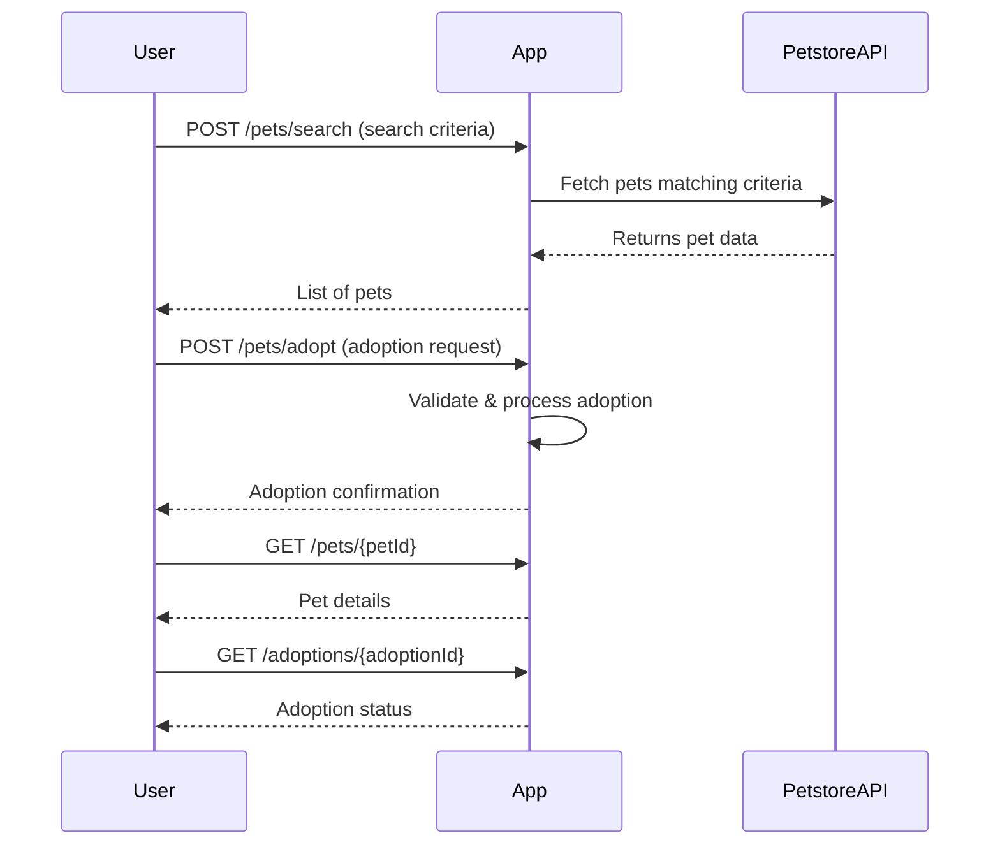

```markdown
# Purrfect Pets API - Functional Requirements

## API Endpoints

### 1. POST /pets/search
- **Purpose:** Search pets using Petstore API data (external data retrieval and filtering).
- **Request Body:**
```json
{
  "type": "string",            // e.g. "cat", "dog", or "all"
  "status": "string",          // e.g. "available", "sold", "all"
  "name": "string (optional)"  // partial or full pet name filter
}
```
- **Response:**
```json
{
  "pets": [
    {
      "id": "string",
      "name": "string",
      "type": "string",
      "status": "string",
      "description": "string",
      "imageUrl": "string"
    }
  ]
}
```

---

### 2. POST /pets/adopt
- **Purpose:** Submit an adoption request for a pet (business logic to validate and process adoption).
- **Request Body:**
```json
{
  "petId": "string",
  "adopterName": "string",
  "contactInfo": "string"
}
```
- **Response:**
```json
{
  "message": "string",           // e.g. "Adoption request submitted successfully"
  "adoptionId": "string"
}
```

---

### 3. GET /pets/{petId}
- **Purpose:** Retrieve stored details of a specific pet.
- **Response:**
```json
{
  "id": "string",
  "name": "string",
  "type": "string",
  "status": "string",
  "description": "string",
  "imageUrl": "string"
}
```

---

### 4. GET /adoptions/{adoptionId}
- **Purpose:** Retrieve the status/details of an adoption request.
- **Response:**
```json
{
  "adoptionId": "string",
  "petId": "string",
  "adopterName": "string",
  "contactInfo": "string",
  "status": "string"           // e.g. "pending", "approved", "rejected"
}
```

---

## User-App Interaction Sequence Diagram


```mermaid
sequenceDiagram
    participant User
    participant App
    participant PetstoreAPI

    User->>App: POST /pets/search (search criteria)
    App->>PetstoreAPI: Fetch pets matching criteria
    PetstoreAPI-->>App: Returns pet data
    App-->>User: List of pets

    User->>App: POST /pets/adopt (adoption request)
    App->>App: Validate & process adoption
    App-->>User: Adoption confirmation

    User->>App: GET /pets/{petId}
    App-->>User: Pet details

    User->>App: GET /adoptions/{adoptionId}
    App-->>User: Adoption status
```

---

## Summary

- Use **POST** endpoints for all external data fetching or processing.
- Use **GET** endpoints for retrieving stored results.
- JSON is used for request and response bodies.
- Adoption requests include validation and tracking.
```
