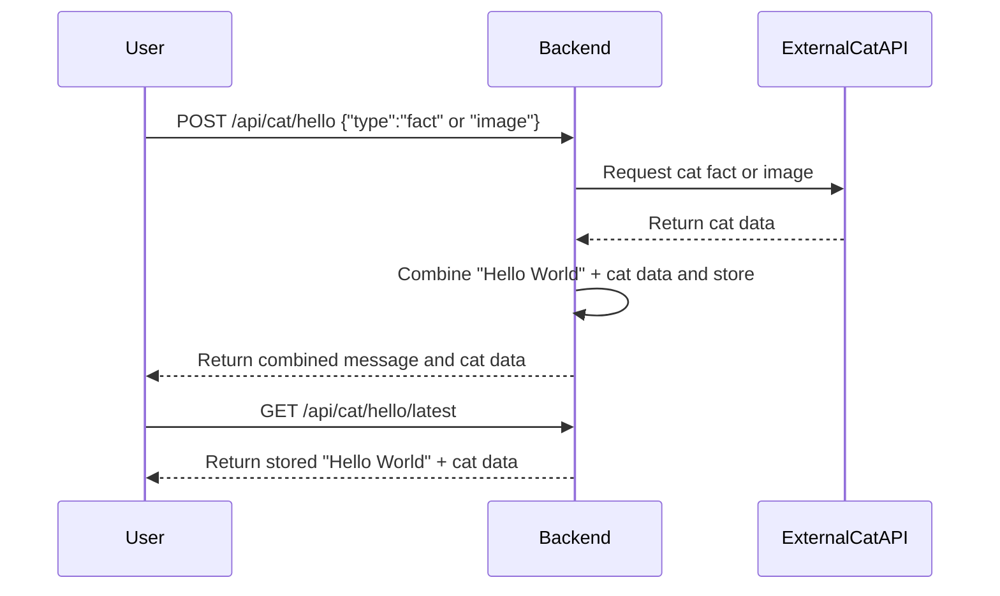
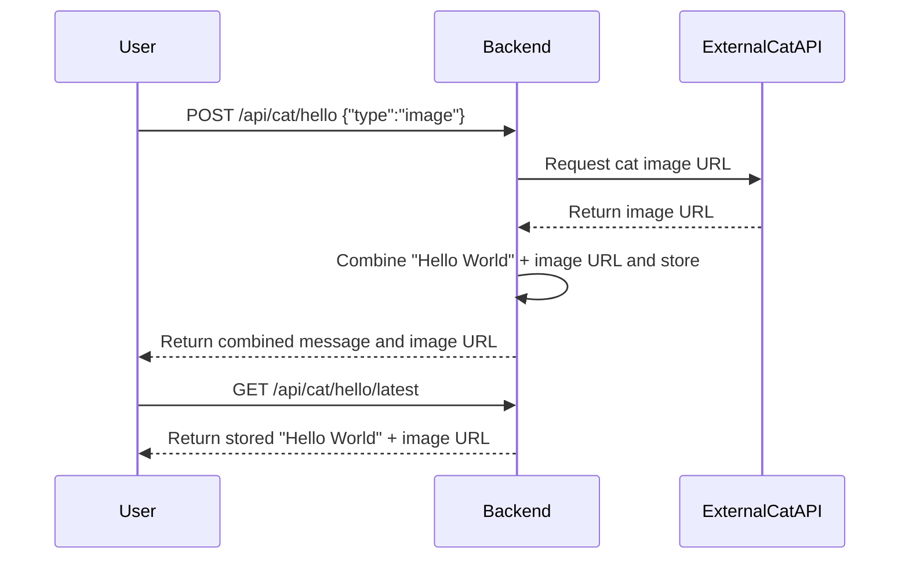

```markdown
# Functional Requirements for Cats API Hello World Backend

## Overview
This backend application provides a simple "Hello World" functionality integrated with an external Cats API. The design follows RESTful principles where:
- **POST** endpoints handle business logic involving external data retrieval or calculations.
- **GET** endpoints serve application results stored or computed previously.

---

## API Endpoints

### 1. POST /api/cat/hello
- **Purpose**: Fetch a "Hello World" message combined with a cat fact or cat image from an external Cats API.
- **Request Body** (JSON):
  ```json
  {
    "type": "fact" | "image"  // Optional, defaults to "fact"
  }
  ```
- **Response Body** (JSON):
  ```json
  {
    "message": "Hello World",
    "catData": "A random cat fact or image URL"
  }
  ```
- **Behavior**:  
  - Calls the external Cats API based on the requested type.  
  - Combines "Hello World" with the fetched cat data.  
  - Stores the result internally for retrieval.  

---

### 2. GET /api/cat/hello/latest
- **Purpose**: Retrieve the most recent "Hello World" message combined with cat data.
- **Response Body** (JSON):
  ```json
  {
    "message": "Hello World",
    "catData": "Previously fetched cat fact or image URL"
  }
  ```
- **Behavior**:  
  - Returns the last stored result from the POST `/api/cat/hello` call.

---

## Notes on Business Logic
- External API calls and any processing happen only in the POST endpoint.
- GET endpoint serves cached or stored results without triggering external calls.
- The app supports two types of cat data: facts (text) and images (URLs).

---

## User-App Interaction Sequence


```mermaid
sequenceDiagram
    participant User
    participant Backend
    participant ExternalCatAPI

    User->>Backend: POST /api/cat/hello {"type":"fact" or "image"}
    Backend->>ExternalCatAPI: Request cat fact or image
    ExternalCatAPI-->>Backend: Return cat data
    Backend->>Backend: Combine "Hello World" + cat data and store
    Backend-->>User: Return combined message and cat data

    User->>Backend: GET /api/cat/hello/latest
    Backend-->>User: Return stored "Hello World" + cat data
```

---

## Alternative User Journey (Fetching Image)


```mermaid
sequenceDiagram
    participant User
    participant Backend
    participant ExternalCatAPI

    User->>Backend: POST /api/cat/hello {"type":"image"}
    Backend->>ExternalCatAPI: Request cat image URL
    ExternalCatAPI-->>Backend: Return image URL
    Backend->>Backend: Combine "Hello World" + image URL and store
    Backend-->>User: Return combined message and image URL

    User->>Backend: GET /api/cat/hello/latest
    Backend-->>User: Return stored "Hello World" + image URL
```
```