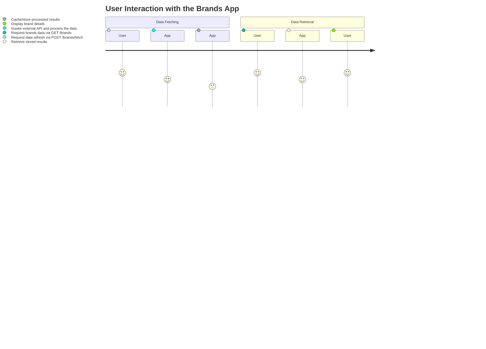
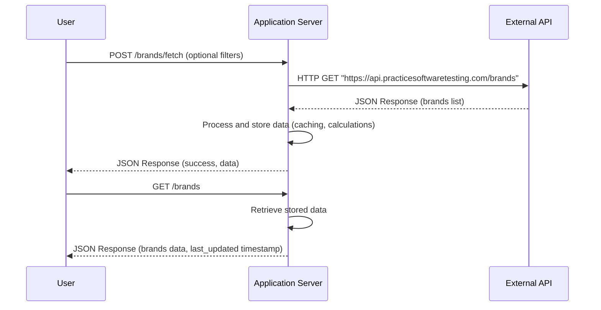

# Final Functional Requirements

## Overview
The application will provide an interface to fetch and display brand data from an external API, adhering to RESTful principles. The application will implement two primary endpoints for data fetching and retrieval.

## API Endpoints

### 1. POST /brands/fetch
This endpoint triggers the server to fetch data from the external API and processes the results.

- **Request:**
  - **Method:** POST
  - **URL:** `/brands/fetch`
  - **Headers:**
    - `Content-Type: application/json`
  - **Body:** (optional)
    ```json
    {}
    ```

- **Business Logic:**
  - Make a GET request to the external API: `https://api.practicesoftwaretesting.com/brands`.
  - Process the JSON response from the external API.
  - Perform any necessary calculations or transformations.
  - Store or cache the processed results for later retrieval.

- **Response:**
  - **Success Response:**
    ```json
    {
      "success": true,
      "data": [
        {
          "id": "01JMWZK3N7PT3XMTMXMQTBACRV",
          "name": "ForgeFlex Tools",
          "slug": "forgeflex-tools"
        },
        {
          "id": "01JMWZK3N7PT3XMTMXMQTBACRW",
          "name": "MightyCraft Hardware",
          "slug": "mightycraft-hardware"
        }
      ],
      "message": "External source data fetched and processed successfully"
    }
    ```
  - **Error Response:** Appropriate error status and message.

### 2. GET /brands
This endpoint retrieves the stored brand data from the application.

- **Request:**
  - **Method:** GET
  - **URL:** `/brands`

- **Response:**
  - **Success Response:**
    ```json
    {
      "data": [
        {
          "id": "01JMWZK3N7PT3XMTMXMQTBACRV",
          "name": "ForgeFlex Tools",
          "slug": "forgeflex-tools"
        },
        {
          "id": "01JMWZK3N7PT3XMTMXMQTBACRW",
          "name": "MightyCraft Hardware",
          "slug": "mightycraft-hardware"
        }
      ],
      "last_updated": "2023-10-04T12:00:00Z"
    }
    ```
  - **Error Response:** Appropriate error status and message.

## User Interaction

### User Journey Diagram


```mermaid
journey
    title User Interaction with the Brands App
    section Data Fetching
      User: 5: Request data refresh via POST /brands/fetch
      App: 4: Invoke external API and process the data
      App: 3: Cache/store processed results
    section Data Retrieval
      User: 5: Request brands data via GET /brands
      App: 4: Retrieve stored results
      User: 5: Display brand details
```

### Sequence Diagram


```mermaid
sequenceDiagram
    participant U as User
    participant A as Application Server
    participant E as External API

    U->>A: POST /brands/fetch (optional filters)
    A->>E: HTTP GET "https://api.practicesoftwaretesting.com/brands"
    E-->>A: JSON Response (brands list)
    A->>A: Process and store data (caching, calculations)
    A-->>U: JSON Response (success, data)

    U->>A: GET /brands
    A->>A: Retrieve stored data
    A-->>U: JSON Response (brands data, last_updated timestamp)
```

This document outlines the functional requirements for the application, including API endpoints, request/response formats, and user interactions.