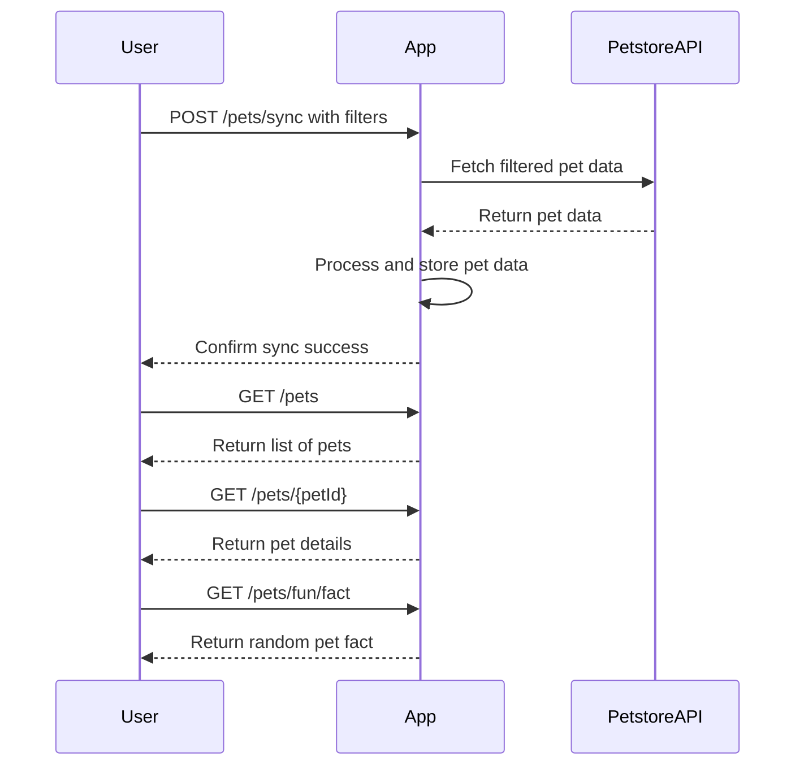

```markdown
# Purrfect Pets API - Functional Requirements

## API Endpoints

### 1. Synchronize Pet Data from Petstore API
- **Endpoint:** `POST /pets/sync`
- **Description:** Fetches and updates pet data from the external Petstore API according to optional filters. All external API calls and business logic happen here.
- **Request Body:**
  ```json
  {
    "filter": {
      "type": "string",        // Optional, e.g., "cat", "dog"
      "status": "string"       // Optional, e.g., "available", "sold"
    }
  }
  ```
- **Response:**
  ```json
  {
    "message": "Pets synchronized successfully",
    "count": 42
  }
  ```

---

### 2. Retrieve List of Pets
- **Endpoint:** `GET /pets`
- **Description:** Retrieves the list of pets currently stored in the application.
- **Response:**
  ```json
  [
    {
      "id": 1,
      "name": "Fluffy",
      "type": "cat",
      "status": "available"
    }
  ]
  ```

---

### 3. Retrieve Details for a Specific Pet
- **Endpoint:** `GET /pets/{petId}`
- **Description:** Retrieves detailed information about a specific pet by its ID.
- **Response:**
  ```json
  {
    "id": 1,
    "name": "Fluffy",
    "type": "cat",
    "status": "available",
    "description": "A playful kitten",
    "age": 2
  }
  ```

---

### 4. Get a Random Pet Fact (Fun Feature)
- **Endpoint:** `GET /pets/fun/fact`
- **Description:** Returns a random fun fact about pets.
- **Response:**
  ```json
  {
    "fact": "Cats sleep for 70% of their lives."
  }
  ```

---

## User-App Interaction Sequence


```mermaid
sequenceDiagram
    participant User
    participant App
    participant PetstoreAPI

    User->>App: POST /pets/sync with filters
    App->>PetstoreAPI: Fetch filtered pet data
    PetstoreAPI-->>App: Return pet data
    App->>App: Process and store pet data
    App-->>User: Confirm sync success

    User->>App: GET /pets
    App-->>User: Return list of pets

    User->>App: GET /pets/{petId}
    App-->>User: Return pet details

    User->>App: GET /pets/fun/fact
    App-->>User: Return random pet fact
```

---

## Summary
- Use **POST /pets/sync** for external data retrieval and processing.
- Use **GET** endpoints for retrieving stored data.
- Optional filters in the sync endpoint allow targeted data fetching.
- Includes a fun endpoint for random pet facts.

---

If you want to extend or adjust anything later, just ask!
```