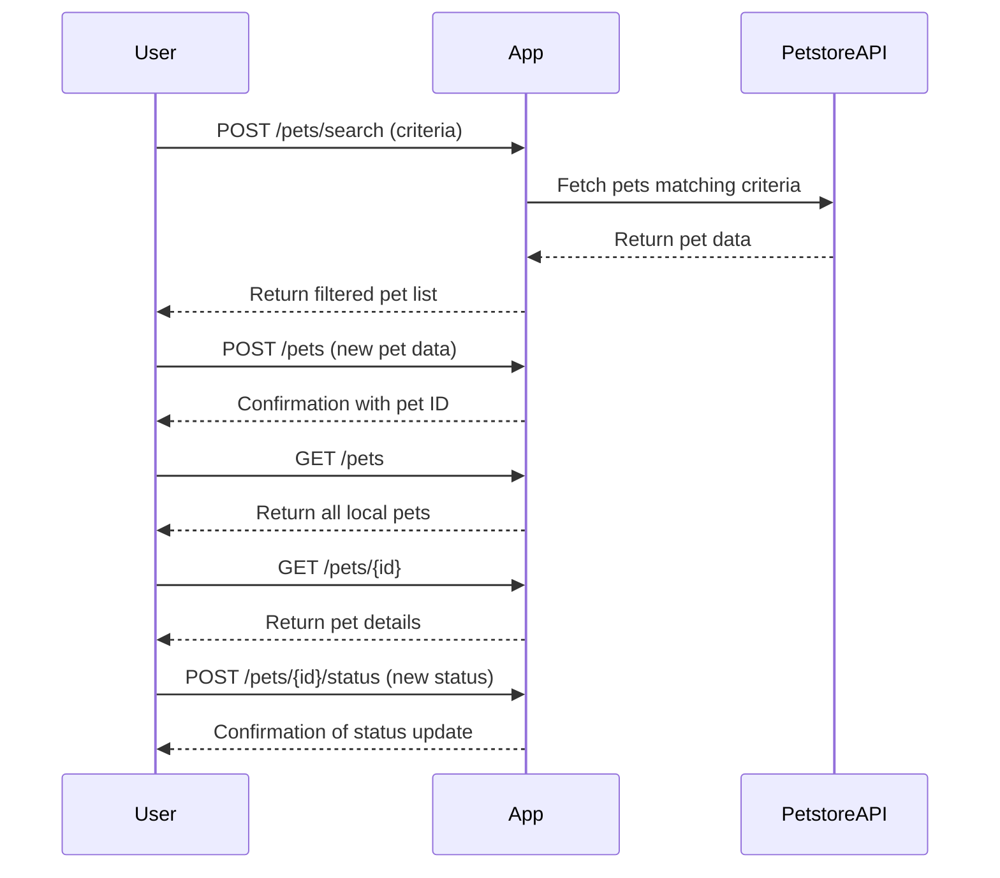
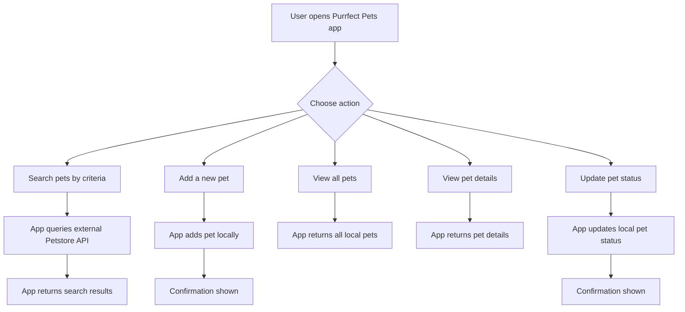

```markdown
# Purrfect Pets API - Functional Requirements

## API Endpoints Overview

### 1. Search Pets (POST)
- **URL:** `/pets/search`
- **Description:** Search pets by criteria (type, status, name, etc.) by querying the external Petstore API.
- **Request Body:**
```json
{
  "type": "string",         // optional
  "status": "string",       // optional
  "name": "string"          // optional, partial match
}
```
- **Response Body:**
```json
{
  "pets": [
    {
      "id": "integer",
      "name": "string",
      "type": "string",
      "status": "string",
      "photoUrls": ["string"]
    }
  ]
}
```

---

### 2. Add New Pet (POST)
- **URL:** `/pets`
- **Description:** Add a new pet to the local store (simulated or persisted).
- **Request Body:**
```json
{
  "name": "string",
  "type": "string",
  "status": "string",
  "photoUrls": ["string"]
}
```
- **Response Body:**
```json
{
  "id": "integer",
  "message": "Pet added successfully"
}
```

---

### 3. Get All Pets (GET)
- **URL:** `/pets`
- **Description:** Retrieve all pets stored locally.
- **Response Body:**
```json
{
  "pets": [
    {
      "id": "integer",
      "name": "string",
      "type": "string",
      "status": "string",
      "photoUrls": ["string"]
    }
  ]
}
```

---

### 4. Get Pet By ID (GET)
- **URL:** `/pets/{id}`
- **Description:** Retrieve details of a single pet by its ID.
- **Response Body:**
```json
{
  "id": "integer",
  "name": "string",
  "type": "string",
  "status": "string",
  "photoUrls": ["string"]
}
```

---

### 5. Update Pet Status (POST)
- **URL:** `/pets/{id}/status`
- **Description:** Update pet status (e.g., available, sold) locally.
- **Request Body:**
```json
{
  "status": "string"
}
```
- **Response Body:**
```json
{
  "id": "integer",
  "message": "Status updated successfully"
}
```

---

## Business Logic Notes:
- All external Petstore API calls happen in POST endpoints (e.g., `/pets/search`) to comply with the functional rule.
- GET endpoints serve only local data retrieval.
- IDs are managed locally (e.g., auto-increment or UUID).
- The app maintains a local pet store synced or supplemented with external data on demand.

---

## User-App Interaction Sequence Diagram


```mermaid
sequenceDiagram
  participant User
  participant App
  participant PetstoreAPI

  User->>App: POST /pets/search (criteria)
  App->>PetstoreAPI: Fetch pets matching criteria
  PetstoreAPI-->>App: Return pet data
  App-->>User: Return filtered pet list

  User->>App: POST /pets (new pet data)
  App-->>User: Confirmation with pet ID

  User->>App: GET /pets
  App-->>User: Return all local pets

  User->>App: GET /pets/{id}
  App-->>User: Return pet details

  User->>App: POST /pets/{id}/status (new status)
  App-->>User: Confirmation of status update
```

---

## User Journey Diagram


```mermaid
flowchart TD
  A[User opens Purrfect Pets app] --> B{Choose action}
  B --> C[Search pets by criteria]
  B --> D[Add a new pet]
  B --> E[View all pets]
  B --> F[View pet details]
  B --> G[Update pet status]

  C --> H[App queries external Petstore API]
  H --> I[App returns search results]

  D --> J[App adds pet locally]
  J --> K[Confirmation shown]

  E --> L[App returns all local pets]

  F --> M[App returns pet details]

  G --> N[App updates local pet status]
  N --> O[Confirmation shown]
```
```