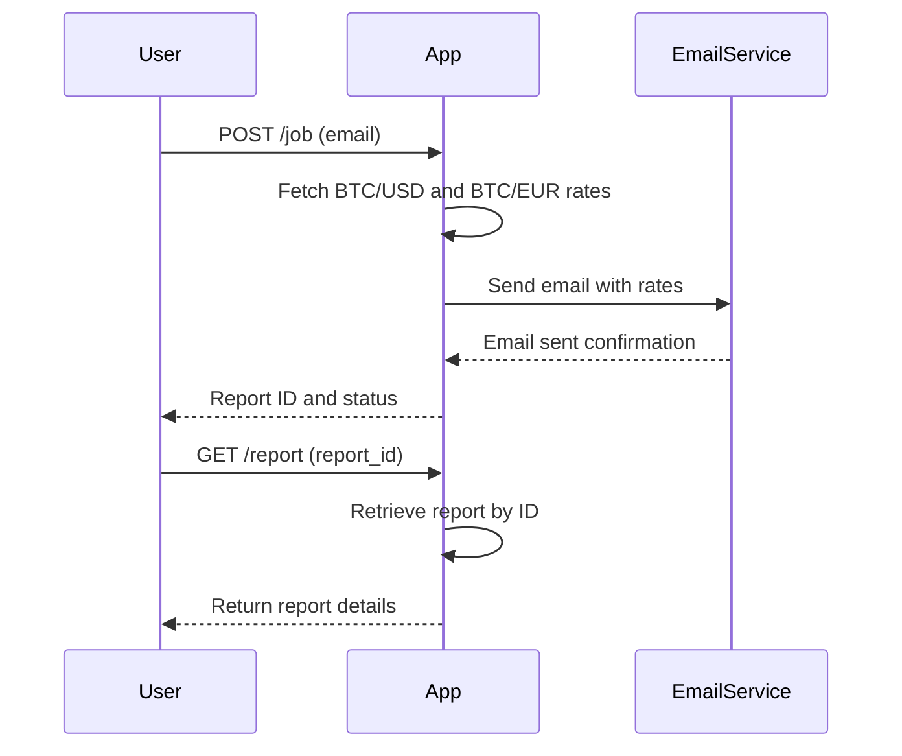

Here are the well-formatted final functional requirements for your application:

### Functional Requirements

#### User Stories

1. **Report Creation**
   - **As a user, I want to initiate the report creation process so that I can receive the latest Bitcoin conversion rates.**
     - **Endpoint**: `POST /job`
     - **Request Format**:
       ```json
       {
         "email": "user@example.com"
       }
       ```
     - **Response Format**:
       - **Success**:
       ```json
       {
         "report_id": "12345",
         "status": "Report is being generated."
       }
       ```
       - **Error**:
       ```json
       {
         "error": "Failed to initiate report."
       }
       ```

2. **Retrieve Report**
   - **As a user, I want to retrieve my report by its ID so that I can view the conversion rates.**
     - **Endpoint**: `GET /report`
     - **Request Format**:
       - URL Parameter: `report_id=12345`
     - **Response Format**:
       - **Success**:
       ```json
       {
         "report_id": "12345",
         "btc_usd_rate": "XXXX.XX",
         "btc_eur_rate": "XXXX.XX",
         "timestamp": "2023-10-01T12:00:00Z"
       }
       ```
       - **Error**:
       ```json
       {
         "error": "Report not found."
       }
       ```

#### API Endpoints Summary

| Method | Endpoint     | Description                                |
|--------|--------------|--------------------------------------------|
| POST   | /job         | Initiates report creation and sends email.|
| GET    | /report      | Retrieves the stored report by its ID.    |

#### User-App Interaction Sequence Diagram


```mermaid
sequenceDiagram
    participant User
    participant App
    participant EmailService

    User->>App: POST /job (email)
    App->>App: Fetch BTC/USD and BTC/EUR rates
    App->>EmailService: Send email with rates
    EmailService-->>App: Email sent confirmation
    App-->>User: Report ID and status

    User->>App: GET /report (report_id)
    App->>App: Retrieve report by ID
    App-->>User: Return report details
```

These functional requirements provide a comprehensive view of the application’s capabilities and the interactions required to fulfill user needs. If you need any further details or modifications, let me know!