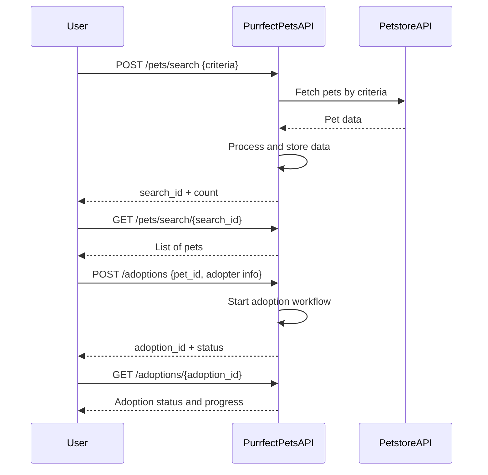

```markdown
# Purrfect Pets API - Functional Requirements

## Overview
The 'Purrfect Pets' API app integrates with the Petstore API data to provide pet-related features. Following RESTful conventions:
- **POST endpoints** invoke business logic, external data retrieval, or calculations.
- **GET endpoints** retrieve stored results or processed data within our app.

---

## API Endpoints

### 1. Retrieve Pets by Criteria (POST)
- **URL:** `/pets/search`
- **Description:** Accepts criteria to search/filter pets via Petstore API, fetches data externally, processes it, and stores results for retrieval.
- **Request JSON:**
  ```json
  {
    "type": "string (optional, e.g. cat, dog)",
    "status": "string (optional, e.g. available, sold)",
    "tags": ["string", "..."] (optional)
  }
  ```
- **Response JSON:**
  ```json
  {
    "search_id": "string (unique identifier for this search result)",
    "count": "integer (number of pets found)"
  }
  ```

---

### 2. Get Search Results (GET)
- **URL:** `/pets/search/{search_id}`
- **Description:** Retrieves previously fetched and processed pet data by search ID.
- **Response JSON:**
  ```json
  {
    "search_id": "string",
    "pets": [
      {
        "id": "integer",
        "name": "string",
        "type": "string",
        "status": "string",
        "tags": ["string", "..."]
      },
      ...
    ]
  }
  ```

---

### 3. Create Pet Adoption Workflow (POST)
- **URL:** `/adoptions`
- **Description:** Initiates an adoption workflow for a selected pet.
- **Request JSON:**
  ```json
  {
    "pet_id": "integer",
    "adopter_name": "string",
    "contact_info": "string"
  }
  ```
- **Response JSON:**
  ```json
  {
    "adoption_id": "string",
    "status": "string (e.g. initiated, pending)"
  }
  ```

---

### 4. Get Adoption Status (GET)
- **URL:** `/adoptions/{adoption_id}`
- **Description:** Retrieves the current status of an adoption workflow.
- **Response JSON:**
  ```json
  {
    "adoption_id": "string",
    "pet_id": "integer",
    "adopter_name": "string",
    "status": "string",
    "steps_completed": ["string", "..."]
  }
  ```

---

## User-App Interaction Sequence


```mermaid
sequenceDiagram
    participant User
    participant PurrfectPetsAPI
    participant PetstoreAPI

    User->>PurrfectPetsAPI: POST /pets/search {criteria}
    PurrfectPetsAPI->>PetstoreAPI: Fetch pets by criteria
    PetstoreAPI-->>PurrfectPetsAPI: Pet data
    PurrfectPetsAPI->>PurrfectPetsAPI: Process and store data
    PurrfectPetsAPI-->>User: search_id + count

    User->>PurrfectPetsAPI: GET /pets/search/{search_id}
    PurrfectPetsAPI-->>User: List of pets

    User->>PurrfectPetsAPI: POST /adoptions {pet_id, adopter info}
    PurrfectPetsAPI->>PurrfectPetsAPI: Start adoption workflow
    PurrfectPetsAPI-->>User: adoption_id + status

    User->>PurrfectPetsAPI: GET /adoptions/{adoption_id}
    PurrfectPetsAPI-->>User: Adoption status and progress
```
```