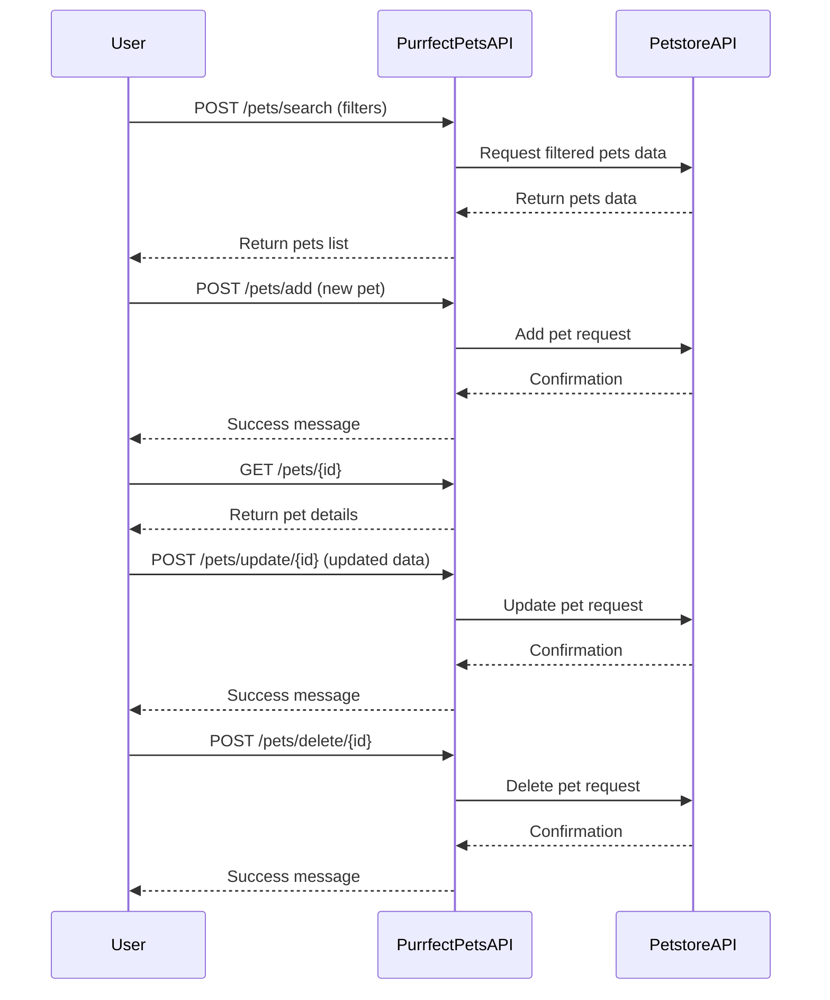

```markdown
# Purrfect Pets API - Functional Requirements

## API Endpoints

### 1. POST /pets/search  
**Description:** Search pets using filters (type, status, name). Retrieves and filters data from the Petstore API.  
**Request:**  
```json
{
  "type": "cat" | "dog" | "all",
  "status": "available" | "pending" | "sold" | null,
  "name": "optional pet name filter"
}
```  
**Response:**  
```json
{
  "pets": [
    {
      "id": 123,
      "name": "Fluffy",
      "type": "cat",
      "status": "available",
      "photoUrls": ["url1", "url2"]
    }
  ]
}
```

---

### 2. POST /pets/add  
**Description:** Add a new pet. Sends data to Petstore API to create a pet.  
**Request:**  
```json
{
  "name": "Pet Name",
  "type": "cat" | "dog",
  "status": "available" | "pending" | "sold",
  "photoUrls": ["url1", "url2"]
}
```  
**Response:**  
```json
{
  "message": "Pet added successfully",
  "petId": 456
}
```

---

### 3. GET /pets/{id}  
**Description:** Retrieve pet details by ID from internal cache or database.  
**Response:**  
```json
{
  "id": 123,
  "name": "Fluffy",
  "type": "cat",
  "status": "available",
  "photoUrls": ["url1", "url2"]
}
```

---

### 4. POST /pets/update/{id}  
**Description:** Update pet details by ID and send updates to Petstore API.  
**Request:**  
```json
{
  "name": "Updated Name",
  "status": "available" | "pending" | "sold",
  "photoUrls": ["newUrl1"]
}
```  
**Response:**  
```json
{
  "message": "Pet updated successfully"
}
```

---

### 5. POST /pets/delete/{id}  
**Description:** Delete pet by ID via Petstore API.  
**Response:**  
```json
{
  "message": "Pet deleted successfully"
}
```

---

## User-App Interaction Sequence


```mermaid
sequenceDiagram
    participant User
    participant PurrfectPetsAPI
    participant PetstoreAPI

    User->>PurrfectPetsAPI: POST /pets/search (filters)
    PurrfectPetsAPI->>PetstoreAPI: Request filtered pets data
    PetstoreAPI-->>PurrfectPetsAPI: Return pets data
    PurrfectPetsAPI-->>User: Return pets list

    User->>PurrfectPetsAPI: POST /pets/add (new pet)
    PurrfectPetsAPI->>PetstoreAPI: Add pet request
    PetstoreAPI-->>PurrfectPetsAPI: Confirmation
    PurrfectPetsAPI-->>User: Success message

    User->>PurrfectPetsAPI: GET /pets/{id}
    PurrfectPetsAPI-->>User: Return pet details

    User->>PurrfectPetsAPI: POST /pets/update/{id} (updated data)
    PurrfectPetsAPI->>PetstoreAPI: Update pet request
    PetstoreAPI-->>PurrfectPetsAPI: Confirmation
    PurrfectPetsAPI-->>User: Success message

    User->>PurrfectPetsAPI: POST /pets/delete/{id}
    PurrfectPetsAPI->>PetstoreAPI: Delete pet request
    PetstoreAPI-->>PurrfectPetsAPI: Confirmation
    PurrfectPetsAPI-->>User: Success message
```
```