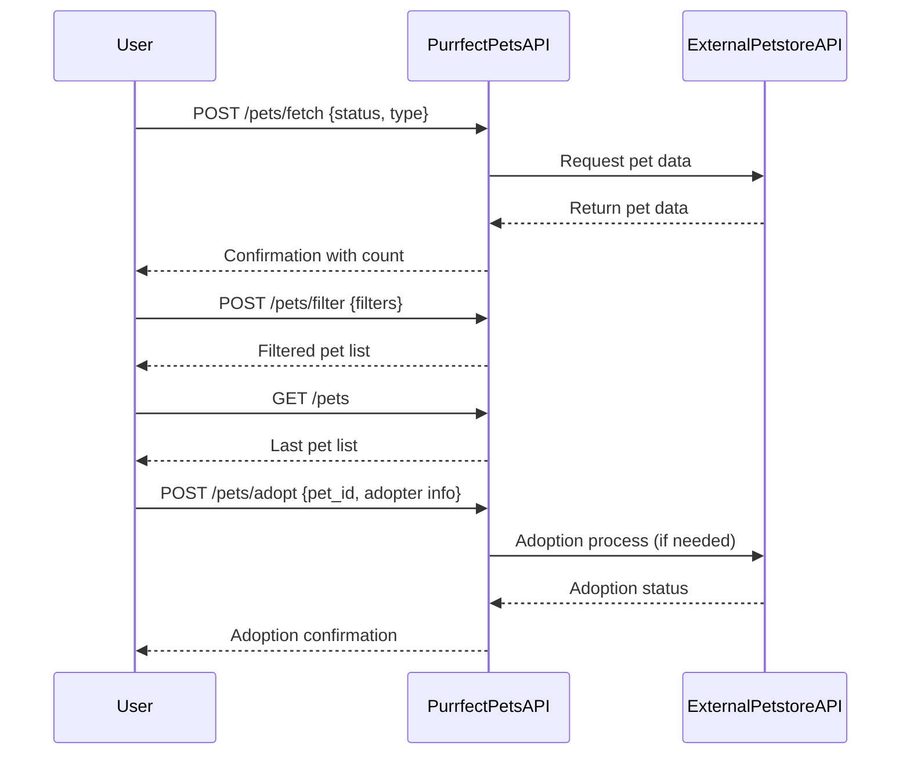
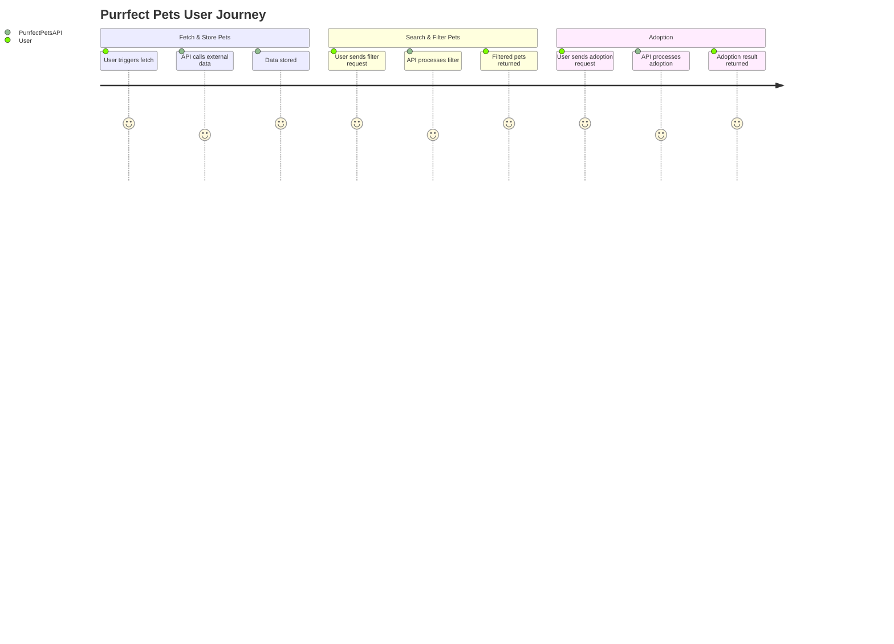

```markdown
# Purrfect Pets API - Functional Requirements

## Overview  
The API app manages pet data by integrating with the external Petstore API. Business logic such as fetching external data or calculations happens via POST endpoints, while GET endpoints serve client retrieval of processed or cached data.

---

## API Endpoints

### 1. POST /pets/fetch  
**Description:** Fetch pet data from the external Petstore API and cache/store it for app use.  
**Request:**  
```json
{
  "status": "available|pending|sold",
  "type": "string (optional)"
}
```  
**Response:**  
```json
{
  "message": "Pets data fetched and stored",
  "count": "number of pets fetched"
}
```

---

### 2. POST /pets/filter  
**Description:** Apply business logic filters/search on stored pet data (e.g., by type, status, age).  
**Request:**  
```json
{
  "type": "string (optional)",
  "status": "available|pending|sold (optional)",
  "min_age": "integer (optional)",
  "max_age": "integer (optional)"
}
```  
**Response:**  
```json
{
  "pets": [
    {
      "id": "integer",
      "name": "string",
      "type": "string",
      "status": "string",
      "age": "integer"
    },
    ...
  ]
}
```

---

### 3. GET /pets  
**Description:** Retrieve the last filtered or fetched pet list (cached result).  
**Response:**  
```json
{
  "pets": [
    {
      "id": "integer",
      "name": "string",
      "type": "string",
      "status": "string",
      "age": "integer"
    },
    ...
  ]
}
```

---

### 4. POST /pets/adopt  
**Description:** Process a pet adoption request (business logic + external API call if needed).  
**Request:**  
```json
{
  "pet_id": "integer",
  "adopter_name": "string",
  "adopter_contact": "string"
}
```  
**Response:**  
```json
{
  "message": "Adoption request processed",
  "pet_id": "integer",
  "status": "adopted/pending"
}
```

---

## Mermaid Sequence Diagram


```mermaid
sequenceDiagram
    participant User
    participant PurrfectPetsAPI
    participant ExternalPetstoreAPI

    User->>PurrfectPetsAPI: POST /pets/fetch {status, type}
    PurrfectPetsAPI->>ExternalPetstoreAPI: Request pet data
    ExternalPetstoreAPI-->>PurrfectPetsAPI: Return pet data
    PurrfectPetsAPI-->>User: Confirmation with count

    User->>PurrfectPetsAPI: POST /pets/filter {filters}
    PurrfectPetsAPI-->>User: Filtered pet list

    User->>PurrfectPetsAPI: GET /pets
    PurrfectPetsAPI-->>User: Last pet list

    User->>PurrfectPetsAPI: POST /pets/adopt {pet_id, adopter info}
    PurrfectPetsAPI->>ExternalPetstoreAPI: Adoption process (if needed)
    ExternalPetstoreAPI-->>PurrfectPetsAPI: Adoption status
    PurrfectPetsAPI-->>User: Adoption confirmation
```

---

## Mermaid User Journey Diagram


```mermaid
journey
    title Purrfect Pets User Journey
    section Fetch & Store Pets
      User triggers fetch: 5: User
      API calls external data: 4: PurrfectPetsAPI
      Data stored: 5: PurrfectPetsAPI
    section Search & Filter Pets
      User sends filter request: 5: User
      API processes filter: 4: PurrfectPetsAPI
      Filtered pets returned: 5: User
    section Adoption
      User sends adoption request: 5: User
      API processes adoption: 4: PurrfectPetsAPI
      Adoption result returned: 5: User
```
```