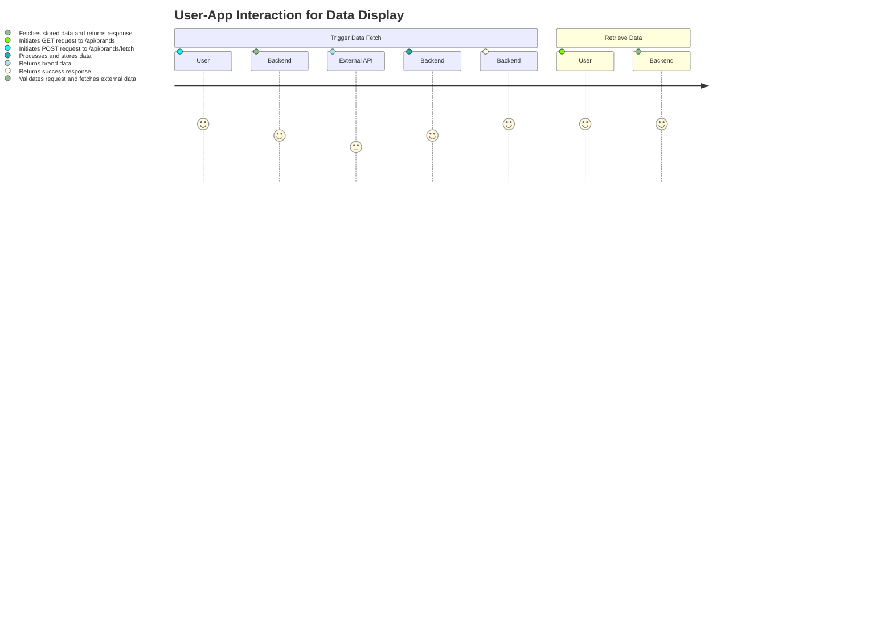
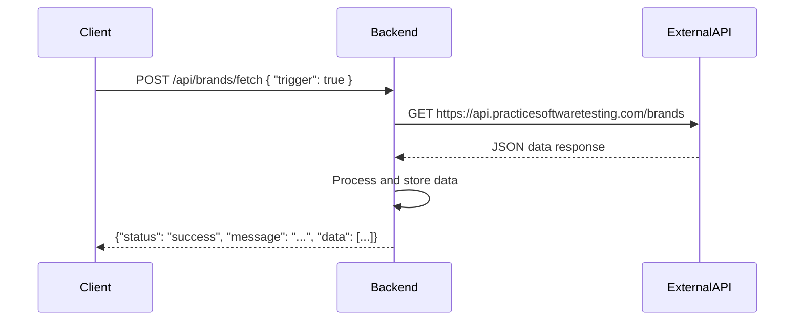
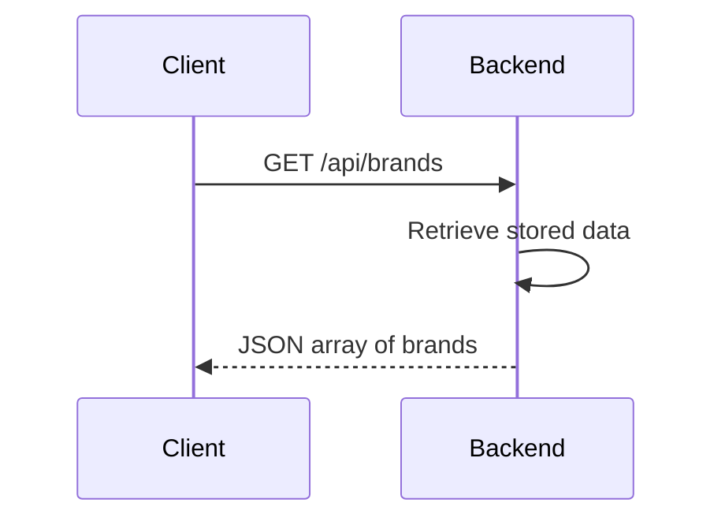

# Functional Requirements

## Overview
The application is designed to display company details fetched from a specified open-source API. It will allow users to trigger data retrieval and present the results in a structured format. The application will adhere to RESTful principles to ensure clarity and consistency in API design.

## API Endpoints

### 1. POST /api/brands/fetch
- **Purpose:**  
  Trigger the fetching of brand data from the external API (https://api.practicesoftwaretesting.com/brands) and process the data for internal storage.

- **Request Format:**  
  - **Content-Type:** application/json  
  - **Body:**  
    ```json
    {
      "trigger": true
    }
    ```

- **Response Format:**  
  - **Content-Type:** application/json  
  - **Body:**  
    ```json
    {
      "status": "success",
      "message": "Data fetched and stored successfully.",
      "data": [
        {
          "id": "01JMWZK3N7PT3XMTMXMQTBACRV",
          "name": "ForgeFlex Tools",
          "slug": "forgeflex-tools"
        },
        {
          "id": "01JMWZK3N7PT3XMTMXMQTBACRW",
          "name": "MightyCraft Hardware",
          "slug": "mightycraft-hardware"
        }
      ]
    }
    ```

- **Business Logic:**  
  - Validate the incoming request.  
  - Make an external GET request to the specified API to retrieve brand data.  
  - Process and transform the fetched data as necessary.  
  - Store the processed data in the internal datastore.  
  - Return a response indicating success, including the fetched data.

### 2. GET /api/brands
- **Purpose:**  
  Retrieve the stored brand data from the internal datastore and present it to the user.

- **Request Format:**  
  - **Method:** GET  
  - No body required.  
  - Optionally, query parameters for pagination or filtering can be added in future iterations.

- **Response Format:**  
  - **Content-Type:** application/json  
  - **Body:**  
    ```json
    [
      {
        "id": "01JMWZK3N7PT3XMTMXMQTBACRV",
        "name": "ForgeFlex Tools",
        "slug": "forgeflex-tools"
      },
      {
        "id": "01JMWZK3N7PT3XMTMXMQTBACRW",
        "name": "MightyCraft Hardware",
        "slug": "mightycraft-hardware"
      }
    ]
    ```

### 3. Error Handling
- The application should handle errors gracefully, returning appropriate status codes and messages for different failure scenarios, including:
  - **400 Bad Request:** Invalid request format or parameters.
  - **404 Not Found:** Data not found in the datastore.
  - **500 Internal Server Error:** Unexpected errors during processing.

## User Interface
- The application will provide an interface to trigger data fetch and display the retrieved company details. The specific UI framework will be decided in later iterations.

## Mermaid Diagrams

### User-App Interaction Journey

```mermaid
journey
    title User-App Interaction for Data Display
    section Trigger Data Fetch
      User: 5: Initiates POST request to /api/brands/fetch
      Backend: 4: Validates request and fetches external data
      External API: 3: Returns brand data
      Backend: 4: Processes and stores data
      Backend: 5: Returns success response
    section Retrieve Data
      User: 5: Initiates GET request to /api/brands
      Backend: 5: Fetches stored data and returns response
```

### Sequence Diagram for Data Fetch Process

```mermaid
sequenceDiagram
    participant Client
    participant Backend
    participant ExternalAPI
    Client->>Backend: POST /api/brands/fetch { "trigger": true }
    Backend->>ExternalAPI: GET https://api.practicesoftwaretesting.com/brands
    ExternalAPI-->>Backend: JSON data response
    Backend->>Backend: Process and store data
    Backend-->>Client: {"status": "success", "message": "...", "data": [...]}
```

### Sequence Diagram for Data Retrieval Process

```mermaid
sequenceDiagram
    participant Client
    participant Backend
    Client->>Backend: GET /api/brands
    Backend->>Backend: Retrieve stored data
    Backend-->>Client: JSON array of brands
```