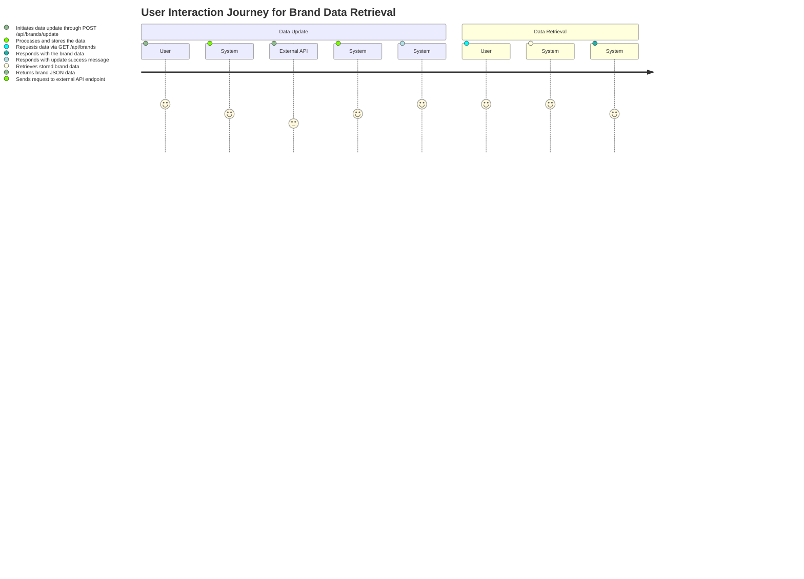
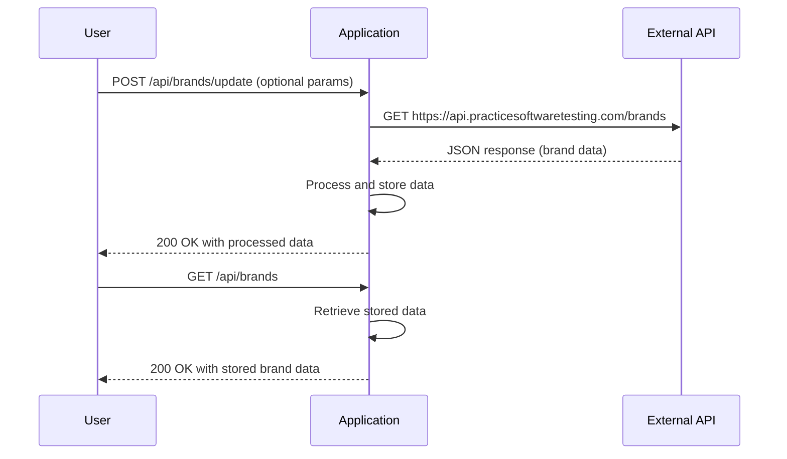

# Functional Requirements Document

## Overview
This document outlines the functional requirements for a backend application that retrieves and displays brand data from an external API.

## Functional Requirements

### 1. API Endpoints

#### 1.1 POST /api/brands/update

- **Description**: Initiates the process to fetch data from the external API (`https://api.practicesoftwaretesting.com/brands`), processes the retrieved JSON data, and stores/updates it within the application.
  
- **Request**:
  - **Method**: POST
  - **URL**: `/api/brands/update`
  - **Headers**: 
    - `Content-Type: application/json`
  - **Body (optional)**:
    ```json
    {
      "fetchTimeout": 5000,       // Optional: Custom timeout in milliseconds for the external API request.
      "forceUpdate": false        // Optional: If true, ignore cached data and re-fetch external data.
    }
    ```

- **Response**:
  - **Success**:
    - **Status Code**: 200 OK
    - **Body**:
      ```json
      {
        "status": "success",
        "data": [
          {
            "id": "01JMWZK3N7PT3XMTMXMQTBACRV",
            "name": "ForgeFlex Tools",
            "slug": "forgeflex-tools"
          },
          {
            "id": "01JMWZK3N7PT3XMTMXMQTBACRW",
            "name": "MightyCraft Hardware",
            "slug": "mightycraft-hardware"
          }
        ],
        "message": "Brand data successfully updated from external source."
      }
      ```

  - **Failure**:
    - **Status Code**: 500 Internal Server Error (or appropriate error code)
    - **Body**:
      ```json
      {
        "status": "error",
        "message": "Failed to fetch/update brand data.",
        "details": "Error details if available"
      }
      ```

---

#### 1.2 GET /api/brands

- **Description**: Retrieves the current application results, i.e., the brand details that were previously fetched and processed.

- **Request**:
  - **Method**: GET
  - **URL**: `/api/brands`

- **Response**:
  - **Success**:
    - **Status Code**: 200 OK
    - **Body**:
      ```json
      {
        "status": "success",
        "data": [
          {
            "id": "01JMWZK3N7PT3XMTMXMQTBACRV",
            "name": "ForgeFlex Tools",
            "slug": "forgeflex-tools"
          },
          {
            "id": "01JMWZK3N7PT3XMTMXMQTBACRW",
            "name": "MightyCraft Hardware",
            "slug": "mightycraft-hardware"
          }
        ]
      }
      ```

  - **Failure**:
    - **Status Code**: 404 Not Found (or appropriate error code)
    - **Body**:
      ```json
      {
        "status": "error",
        "message": "No brand data available. Please update the data by sending a POST request."
      }
      ```

---

## User Interaction Journey


```mermaid
journey
    title User Interaction Journey for Brand Data Retrieval
    section Data Update
      User: 5: Initiates data update through POST /api/brands/update
      System: 4: Sends request to external API endpoint
      External API: 3: Returns brand JSON data
      System: 4: Processes and stores the data
      System: 5: Responds with update success message
    section Data Retrieval
      User: 5: Requests data via GET /api/brands
      System: 5: Retrieves stored brand data
      System: 4: Responds with the brand data
```

---

## Sequence Diagram


```mermaid
sequenceDiagram
    participant U as User
    participant A as Application
    participant E as External API
    U->>A: POST /api/brands/update (optional params)
    A->>E: GET https://api.practicesoftwaretesting.com/brands
    E-->>A: JSON response (brand data)
    A->>A: Process and store data
    A-->>U: 200 OK with processed data

    U->>A: GET /api/brands
    A->>A: Retrieve stored data
    A-->>U: 200 OK with stored brand data
```

---

This document provides a clear and structured outline of the functional requirements for the application, including the necessary API endpoints, request/response formats, and user interaction flows.