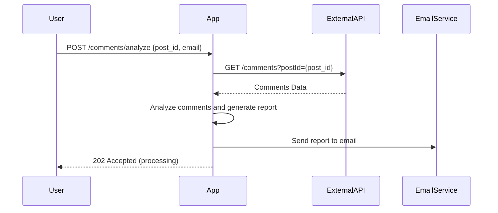
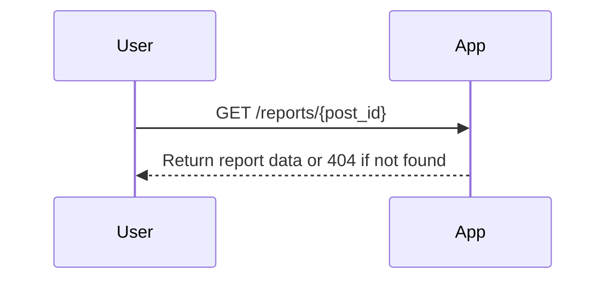

```markdown
# Functional Requirements and API Design

## API Endpoints

### 1. POST /comments/analyze
- **Description**: Ingest comments data from the external API by `post_id`, analyze comments, generate a report, and send it via email.
- **Request Body** (JSON):
  ```json
  {
    "post_id": 1,
    "email": "user@example.com"
  }
  ```
- **Response** (JSON):
  ```json
  {
    "status": "processing",
    "message": "Analysis started and report will be sent to user@example.com"
  }
  ```
- **Business Logic**:
  - Fetch comments from `https://jsonplaceholder.typicode.com/comments?postId={post_id}`
  - Analyze comments (e.g., sentiment analysis, keyword extraction)
  - Generate report
  - Send report to provided email
  - Return immediate acknowledgment

---

### 2. GET /reports/{post_id}
- **Description**: Retrieve the latest analysis report for a given `post_id`.
- **Response** (JSON):
  ```json
  {
    "post_id": 1,
    "summary": {
      "total_comments": 5,
      "positive": 3,
      "negative": 1,
      "neutral": 1
    },
    "detailed_report_url": "https://some-storage/report_post_1.pdf"
  }
  ```
- **Notes**:
  - Returns a cached or stored report if available
  - If no report exists, return 404 with message

---

## User-App Interaction Sequence Diagram


```mermaid
sequenceDiagram
    participant User
    participant App
    participant ExternalAPI
    participant EmailService

    User->>App: POST /comments/analyze {post_id, email}
    App->>ExternalAPI: GET /comments?postId={post_id}
    ExternalAPI-->>App: Comments Data
    App->>App: Analyze comments and generate report
    App->>EmailService: Send report to email
    App-->>User: 202 Accepted (processing)
```

---

## User Report Retrieval Sequence Diagram


```mermaid
sequenceDiagram
    participant User
    participant App

    User->>App: GET /reports/{post_id}
    App-->>User: Return report data or 404 if not found
```

---

# Summary
- `POST /comments/analyze` performs data ingestion, analysis, and triggers email sending.
- `GET /reports/{post_id}` retrieves stored reports.
- POST endpoint handles all external calls and processing.
- GET endpoint is read-only for app data retrieval.
```
