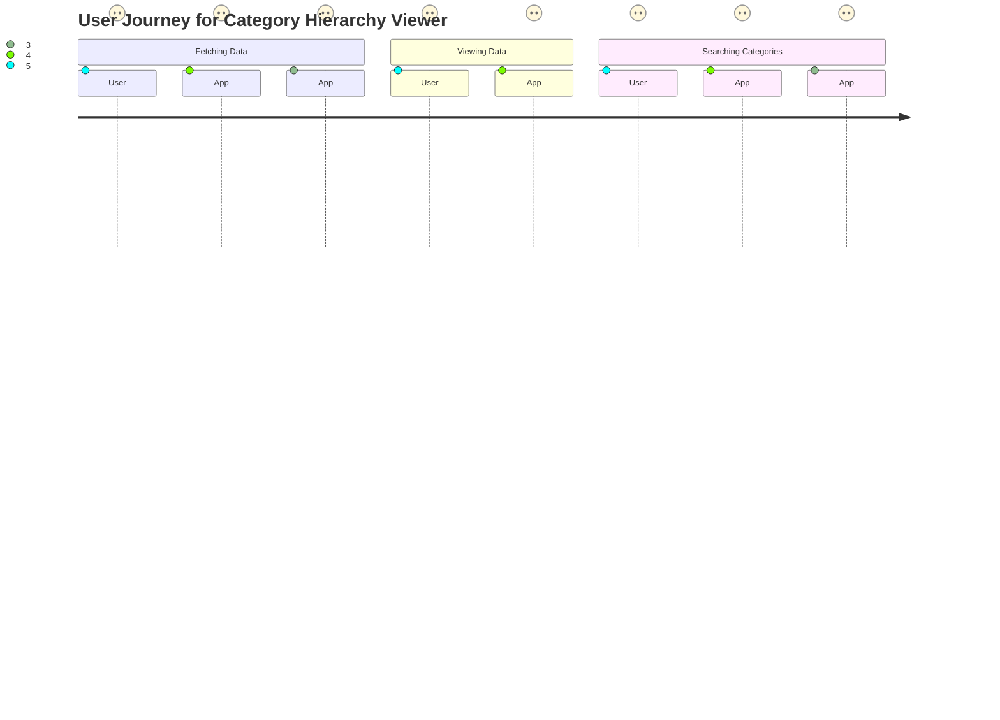
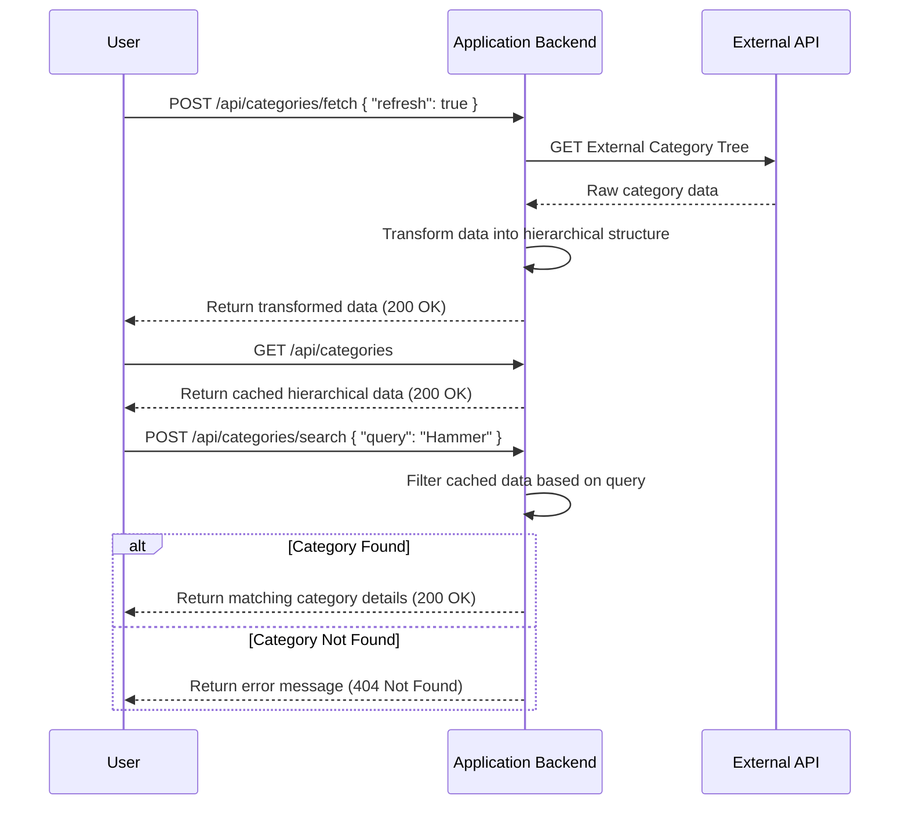

# Functional Requirements for Category Hierarchy Viewer Application

## API Endpoints

### 1. POST /api/categories/fetch
- **Purpose:**  
  Retrieve the complete category tree from the external API, transform it into a hierarchical structure, and cache the result for later retrieval.

- **Request:**  
  - **Content-Type:** application/json  
  - **Body (optional):**
    ```json
    {
      "refresh": true  // boolean flag to force refresh of data; default behavior may cache data for performance
    }
    ```

- **Response:**  
  - **HTTP 200 OK (on success):**
    ```json
    {
      "status": "success",
      "data": [
        {
          "id": "01JN6A98DXNPRMWXTXN8C1BEHN",
          "name": "Hand Tools",
          "slug": "hand-tools",
          "parent_id": null,
          "sub_categories": [ ... ]
        },
        ...
      ]
    }
    ```
  - **HTTP 500 Internal Server Error (on failure):**  
    - Triggered by external API failure or transformation error.

### 2. GET /api/categories
- **Purpose:**  
  Retrieve the cached hierarchical category tree that was transformed from the external API data.

- **Request:**  
  - No request body needed.

- **Response:**  
  - **HTTP 200 OK (on success):**
    ```json
    {
      "status": "success",
      "data": [
        {
          "id": "01JN6A98DXNPRMWXTXN8C1BEHN",
          "name": "Hand Tools",
          "slug": "hand-tools",
          "parent_id": null,
          "sub_categories": [ ... ]
        },
        ...
      ]
    }
    ```

### 3. POST /api/categories/search
- **Purpose:**  
  Search for a specific category by name or category ID within the already processed (cached) data.

- **Request:**  
  - **Content-Type:** application/json  
  - **Body:**
    ```json
    {
      "query": "Hammer" // Can be a category name or category ID
    }
    ```

- **Response:**  
  - **HTTP 200 OK (if category is found):**
    ```json
    {
      "status": "success",
      "data": {
        "id": "01JN6A98E770ZNR1W2RAPCZGFE",
        "name": "Hammer",
        "slug": "hammer",
        "parent_id": "01JN6A98DXNPRMWXTXN8C1BEHN",
        "sub_categories": []
      }
    }
    ```
  - **HTTP 404 Not Found (if no matching category is found):**
    ```json
    {
      "status": "error",
      "message": "Category not found"
    }
    ```

## Business Logic Notes
- All operations that involve external data retrieval or computations (e.g., fetching the external category tree, data transformation, search filtering) are encapsulated within POST endpoints.
- GET endpoints are exclusively used for fetching the results that have been processed or cached by previous POST operations.
- Error handling should capture both external API failures and any issues during data transformation.

## User-App Interaction Diagrams

### User Journey Diagram

```mermaid
journey
  title User Journey for Category Hierarchy Viewer
  section Fetching Data
    User: Initiates category data fetch (POST /api/categories/fetch): 5: Request
    App: Retrieves and transforms data, caches result: 4: Process data
    App: Returns transformed category tree: 3: Display result
  section Viewing Data
    User: Navigates to view category tree (GET /api/categories): 5: Retrieve cached data
    App: Returns cached hierarchical category tree: 4: Display tree
  section Searching Categories
    User: Enters search query and submits (POST /api/categories/search): 5: Request search
    App: Applies search logic on cached data: 4: Process search
    App: Returns matching category or error notification: 3: Display result/not found message
```

### Sequence Diagram

```mermaid
sequenceDiagram
  participant U as User
  participant A as Application Backend
  participant E as External API

  U->>A: POST /api/categories/fetch { "refresh": true }
  A->>E: GET External Category Tree
  E-->>A: Raw category data
  A->>A: Transform data into hierarchical structure
  A-->>U: Return transformed data (200 OK)

  U->>A: GET /api/categories
  A-->>U: Return cached hierarchical data (200 OK)

  U->>A: POST /api/categories/search { "query": "Hammer" }
  A->>A: Filter cached data based on query
  alt Category Found
    A-->>U: Return matching category details (200 OK)
  else Category Not Found
    A-->>U: Return error message (404 Not Found)
  end
```