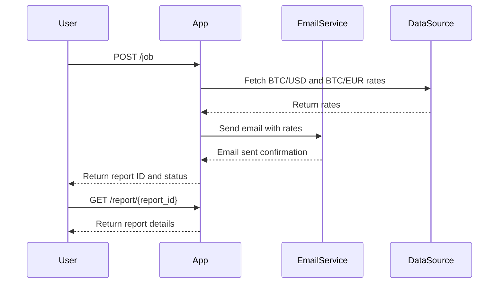

Here are the well-formatted final functional requirements for your application:

---

## Functional Requirements

### User Stories

1. **Report Creation**
   - **User Story**: As a user, I want to initiate the report creation process so that I can receive the latest Bitcoin conversion rates.
   - **Endpoint**: `POST /job`
   - **Request Format**: 
     ```json
     {
       "email": "user@example.com"
     }
     ```
   - **Response Format**: 
     ```json
     {
       "report_id": "12345",
       "status": "processing"
     }
     ```

2. **Retrieve Report**
   - **User Story**: As a user, I want to retrieve the stored report by its ID so that I can view the conversion rates.
   - **Endpoint**: `GET /report/{report_id}`
   - **Request Format**: 
     - URL: `/report/12345`
   - **Response Format**: 
     ```json
     {
       "report_id": "12345",
       "btc_usd": "50000",
       "btc_eur": "42000",
       "timestamp": "2023-10-01T12:00:00Z"
     }
     ```

### API Endpoints Summary

| Method | Endpoint       | Request Body                     | Response Body                              |
|--------|----------------|----------------------------------|--------------------------------------------|
| POST   | /job           | `{ "email": "user@example.com" }` | `{ "report_id": "12345", "status": "processing" }` |
| GET    | /report/{id}   | N/A                              | `{ "report_id": "12345", "btc_usd": "50000", "btc_eur": "42000", "timestamp": "2023-10-01T12:00:00Z" }` |

### User-App Interaction Flow


```mermaid
sequenceDiagram
    participant User
    participant App
    participant EmailService
    participant DataSource

    User->>App: POST /job
    App->>DataSource: Fetch BTC/USD and BTC/EUR rates
    DataSource-->>App: Return rates
    App->>EmailService: Send email with rates
    EmailService-->>App: Email sent confirmation
    App-->>User: Return report ID and status

    User->>App: GET /report/{report_id}
    App-->>User: Return report details
```

### Additional Considerations
- Implement asynchronous email sending to avoid blocking report generation.
- Include error handling for API call failures and email sending issues.
- Add logging for report generation and email sending status.

---

These requirements provide a clear and structured overview of the functional specifications for your application.