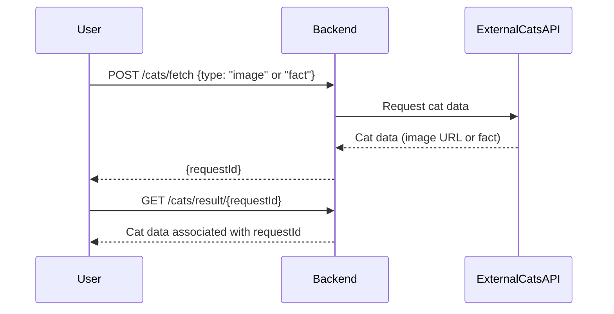

```markdown
# Functional Requirements for Cats API Hello World Application

## Overview
The application will provide a simple backend interface interacting with a Cats API. The API will expose RESTful endpoints adhering to these rules:
- **POST** endpoints handle any business logic, including invoking external data sources, data retrieval, or calculations.
- **GET** endpoints are used only for retrieving results previously generated by the application.

---

## API Endpoints

### 1. POST `/cats/fetch`
- **Purpose**: Fetch cat data (e.g., image or fact) from an external Cats API and store the result internally.
- **Request Body** (JSON):
  ```json
  {
    "type": "image" | "fact"
  }
  ```
- **Response** (JSON):
  ```json
  {
    "requestId": "string"
  }
  ```
- **Behavior**: 
  - Fetches data from the external Cats API based on `type`.
  - Stores the fetched data internally with a unique `requestId`.
  - Returns the `requestId` for later retrieval.

---

### 2. GET `/cats/result/{requestId}`
- **Purpose**: Retrieve previously fetched cat data by `requestId`.
- **Response** (JSON):
  ```json
  {
    "requestId": "string",
    "type": "image" | "fact",
    "data": "string"  // URL for image or text for fact
  }
  ```
- **Behavior**:
  - Returns the stored cat data corresponding to the provided `requestId`.
  - Returns 404 if `requestId` not found.

---

## User-App Interaction Sequence


```mermaid
sequenceDiagram
    participant User
    participant Backend
    participant ExternalCatsAPI

    User->>Backend: POST /cats/fetch {type: "image" or "fact"}
    Backend->>ExternalCatsAPI: Request cat data
    ExternalCatsAPI-->>Backend: Cat data (image URL or fact)
    Backend-->>User: {requestId}
    User->>Backend: GET /cats/result/{requestId}
    Backend-->>User: Cat data associated with requestId
```

---

## Summary
- POST endpoint `/cats/fetch` performs external data retrieval and triggers business logic.
- GET endpoint `/cats/result/{requestId}` retrieves stored results.
- Interaction ensures separation of data fetching/calculation (POST) from data retrieval (GET).
```