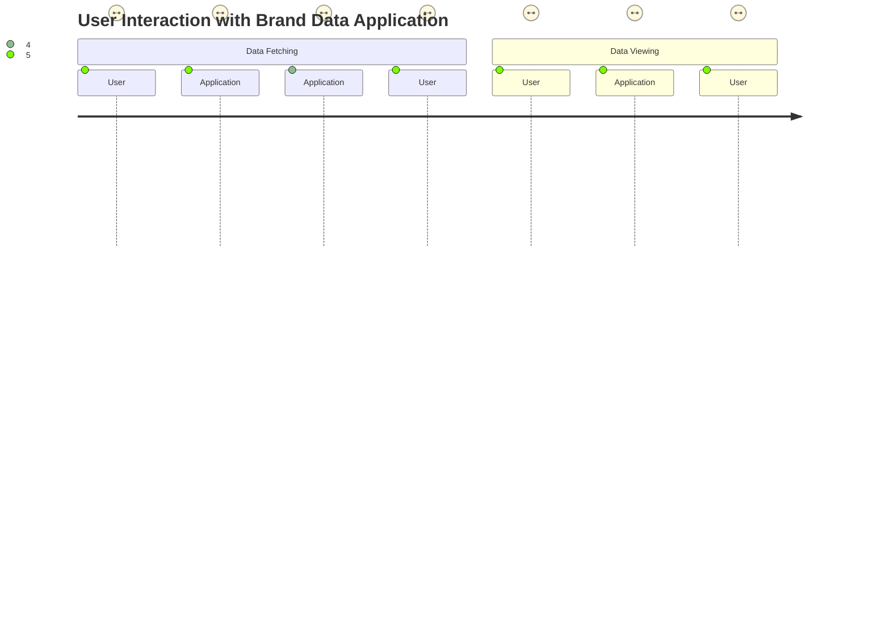
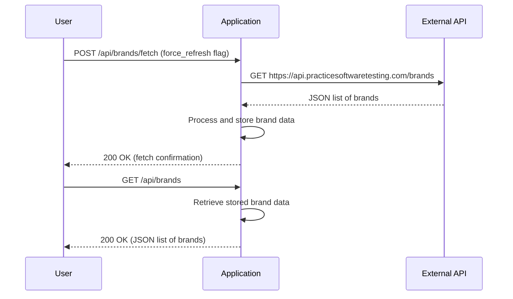

# Final Functional Requirements

## Overview
The application will allow users to fetch and display brand data from an external API. It will adhere to RESTful principles, ensuring that data retrieval and processing are handled appropriately.

## API Endpoints

### 1. POST /api/brands/fetch

- **Purpose:**  
  Retrieve brand data from the external API and process/store the results internally.

- **Request Format:**  
  - **URL:** `/api/brands/fetch`  
  - **Method:** POST  
  - **Headers:**  
    - `Content-Type: application/json`
  - **Body (optional):**  
    ```json
    {
      "force_refresh": true  // optional flag indicating whether to force data retrieval from the external source
    }
    ```

- **Processing:**  
  - Invoke an external call to `GET https://api.practicesoftwaretesting.com/brands`.
  - Process and validate the response.
  - Store or update the internal data repository with the retrieved data.

- **Response Format:**  
  - **HTTP Status:** 200 OK (if successful)
  - **Body:**  
    ```json
    {
      "status": "success",
      "message": "Brand data fetched and processed successfully",
      "data_count": 2  // number of brands processed
    }
    ```
  - **Error Responses:** Should include appropriate HTTP status codes and error messages.

### 2. GET /api/brands

- **Purpose:**  
  Retrieve the stored or processed brand data for user display without making any external calls.

- **Request Format:**  
  - **URL:** `/api/brands`  
  - **Method:** GET  

- **Response Format:**  
  - **HTTP Status:** 200 OK (if successful)
  - **Body:**  
    ```json
    [
      {
        "id": "01JMWZK3N7PT3XMTMXMQTBACRV",
        "name": "ForgeFlex Tools",
        "slug": "forgeflex-tools"
      },
      {
        "id": "01JMWZK3N7PT3XMTMXMQTBACRW",
        "name": "MightyCraft Hardware",
        "slug": "mightycraft-hardware"
      }
    ]
    ```

## User-App Interaction Diagrams

### Journey Diagram


```mermaid
journey
    title User Interaction with Brand Data Application
    section Data Fetching
      User: Request Data Fetch via POST /api/brands/fetch: 5: Trigger
      Application: Retrieve and Process Data: 5: Execute external API call
      Application: Store Data: 4: Process and save results
      User: Receive Success Response: 5: Confirmation
    section Data Viewing
      User: Request Data Viewing via GET /api/brands: 5: Trigger
      Application: Return Stored Brand Data: 5: Display data
      User: View Brand Data: 5: Consume data
```

### Sequence Diagram


```mermaid
sequenceDiagram
    participant U as User
    participant A as Application
    participant E as External API

    U->>A: POST /api/brands/fetch (force_refresh flag)
    A->>E: GET https://api.practicesoftwaretesting.com/brands
    E-->>A: JSON list of brands
    A->>A: Process and store brand data
    A-->>U: 200 OK (fetch confirmation)

    U->>A: GET /api/brands
    A->>A: Retrieve stored brand data
    A-->>U: 200 OK (JSON list of brands)
```