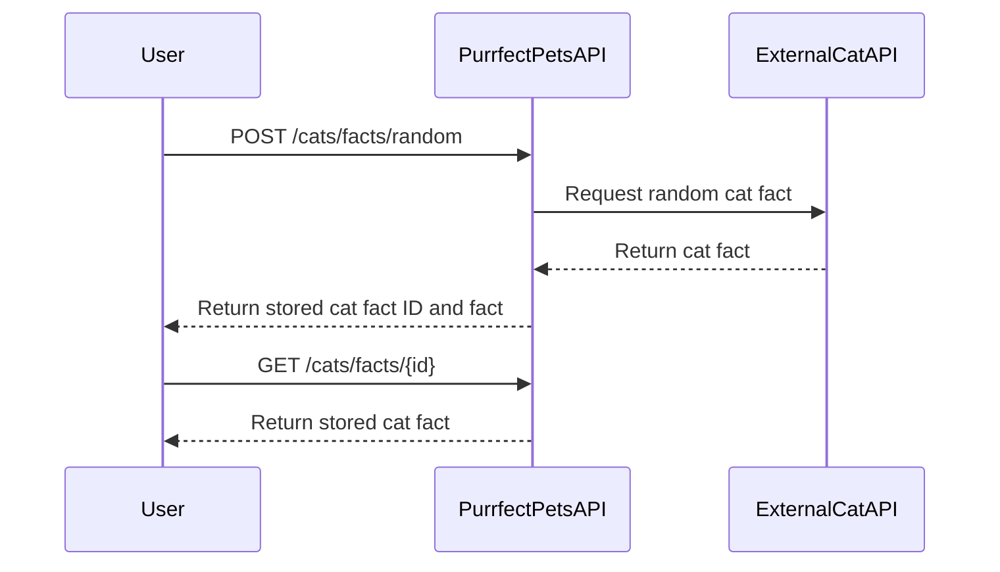
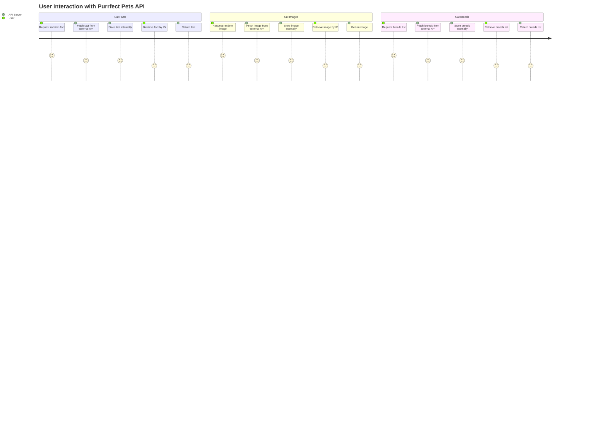

```markdown
# Purrfect Pets API Functional Requirements

## API Endpoints

### 1. POST /cats/facts/random  
- **Description:** Fetch a random cat fact from an external public API and store it internally.  
- **Request:**  
```json
{}
```  
- **Response:**  
```json
{
  "id": "fact123",
  "fact": "Cats sleep for 70% of their lives."
}
```

### 2. GET /cats/facts/{id}  
- **Description:** Retrieve a stored cat fact by its ID.  
- **Response:**  
```json
{
  "id": "fact123",
  "fact": "Cats sleep for 70% of their lives."
}
```

---

### 3. POST /cats/images/random  
- **Description:** Fetch a random cat image URL from an external public API and store it internally.  
- **Request:**  
```json
{}
```  
- **Response:**  
```json
{
  "id": "image456",
  "url": "https://cdn2.thecatapi.com/images/abc.jpg"
}
```

### 4. GET /cats/images/{id}  
- **Description:** Retrieve a stored cat image by its ID.  
- **Response:**  
```json
{
  "id": "image456",
  "url": "https://cdn2.thecatapi.com/images/abc.jpg"
}
```

---

### 5. POST /cats/breeds/list  
- **Description:** Fetch the list of cat breeds from an external public API and store it internally.  
- **Request:**  
```json
{}
```  
- **Response:**  
```json
{
  "breeds": [
    {"id": "beng", "name": "Bengal"},
    {"id": "siam", "name": "Siamese"}
  ]
}
```

### 6. GET /cats/breeds  
- **Description:** Retrieve the stored list of cat breeds.  
- **Response:**  
```json
{
  "breeds": [
    {"id": "beng", "name": "Bengal"},
    {"id": "siam", "name": "Siamese"}
  ]
}
```

---

## Mermaid Sequence Diagram


```mermaid
sequenceDiagram
    participant User
    participant PurrfectPetsAPI
    participant ExternalCatAPI

    User->>PurrfectPetsAPI: POST /cats/facts/random
    PurrfectPetsAPI->>ExternalCatAPI: Request random cat fact
    ExternalCatAPI-->>PurrfectPetsAPI: Return cat fact
    PurrfectPetsAPI-->>User: Return stored cat fact ID and fact

    User->>PurrfectPetsAPI: GET /cats/facts/{id}
    PurrfectPetsAPI-->>User: Return stored cat fact
```

---

## Mermaid Journey Diagram


```mermaid
journey
    title User Interaction with Purrfect Pets API
    section Cat Facts
      Request random fact: 5: User
      Fetch fact from external API: 4: API Server
      Store fact internally: 4: API Server
      Retrieve fact by ID: 3: User
      Return fact: 3: API Server
    section Cat Images
      Request random image: 5: User
      Fetch image from external API: 4: API Server
      Store image internally: 4: API Server
      Retrieve image by ID: 3: User
      Return image: 3: API Server
    section Cat Breeds
      Request breeds list: 5: User
      Fetch breeds from external API: 4: API Server
      Store breeds internally: 4: API Server
      Retrieve breeds list: 3: User
      Return breeds list: 3: API Server
```
```