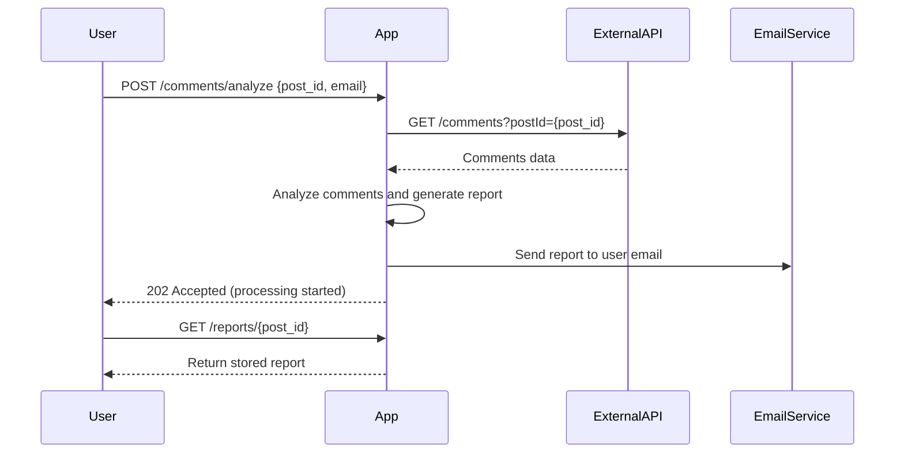

```markdown
# Functional Requirements and API Design

## API Endpoints

### 1. POST /comments/analyze
- **Description:** Ingest comments data from external API by `post_id`, analyze comments, and generate a report.
- **Request Body:**
```json
{
  "post_id": 1,
  "email": "user@example.com"
}
```
- **Response:**
```json
{
  "status": "processing",
  "message": "Analysis started and report will be sent to the provided email."
}
```
- **Business Logic:**  
  - Fetch comments from `https://jsonplaceholder.typicode.com/comments?postId={post_id}`
  - Perform sentiment analysis on the comments
  - Generate a report based on analysis
  - Send the report to the specified email address

---

### 2. GET /reports/{post_id}
- **Description:** Retrieve the analysis report for a specific `post_id`.
- **Response:**
```json
{
  "post_id": 1,
  "report": {
    "summary": "Sentiment analysis indicates mostly positive comments.",
    "details": {
      "positive": 3,
      "negative": 1,
      "neutral": 1
    }
  }
}
```
- **Note:** This endpoint only retrieves stored/generated reports. No external API calls are made here.

---

## User-App Interaction Sequence


```mermaid
sequenceDiagram
    participant User
    participant App
    participant ExternalAPI
    participant EmailService

    User->>App: POST /comments/analyze {post_id, email}
    App->>ExternalAPI: GET /comments?postId={post_id}
    ExternalAPI-->>App: Comments data
    App->>App: Analyze comments and generate report
    App->>EmailService: Send report to user email
    App-->>User: 202 Accepted (processing started)
    
    User->>App: GET /reports/{post_id}
    App-->>User: Return stored report
```
```