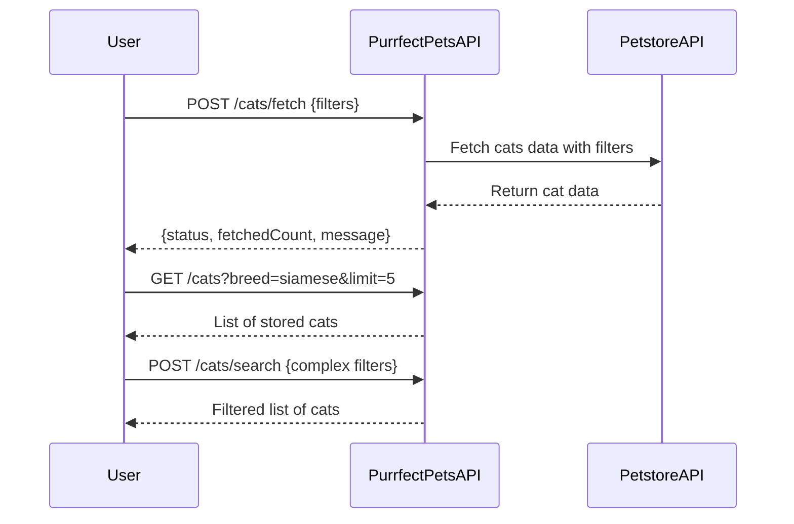

```markdown
# Purrfect Pets API - Functional Requirements

## Overview
The API provides live cat data by integrating with the external Petstore API. Business logic that involves fetching or calculating data from the external source happens in POST endpoints. GET endpoints serve only to retrieve results stored or processed by the app.

---

## API Endpoints

### 1. POST /cats/fetch
**Purpose:** Fetch live cat data from the Petstore API based on filters and store/process results.

- **Request Body (JSON):**
```json
{
  "breed": "string (optional)",
  "ageRange": { "min": "int", "max": "int" } (optional),
  "limit": "int (optional, default 10)"
}
```

- **Response (JSON):**
```json
{
  "status": "success",
  "fetchedCount": "int",
  "message": "string"
}
```

---

### 2. GET /cats
**Purpose:** Retrieve stored cat data previously fetched.

- **Query Parameters (optional):**
  - `breed` (string)
  - `ageMin` (int)
  - `ageMax` (int)
  - `limit` (int, default 10)

- **Response (JSON):**
```json
[
  {
    "id": "string",
    "breed": "string",
    "age": "int",
    "name": "string",
    "description": "string",
    "imageUrl": "string"
  },
  ...
]
```

---

### 3. POST /cats/search
**Purpose:** Search cats with complex filters and business logic.

- **Request Body (JSON):**
```json
{
  "filters": {
    "breed": "string (optional)",
    "ageRange": { "min": "int", "max": "int" } (optional),
    "nameContains": "string (optional)"
  },
  "sortBy": "string (optional, e.g., age, breed)",
  "limit": "int (optional, default 10)"
}
```

- **Response (JSON):**
```json
[
  {
    "id": "string",
    "breed": "string",
    "age": "int",
    "name": "string",
    "description": "string",
    "imageUrl": "string"
  },
  ...
]
```

---

## Mermaid Sequence Diagram: User Interaction with Purrfect Pets API


```mermaid
sequenceDiagram
    participant User
    participant PurrfectPetsAPI
    participant PetstoreAPI

    User->>PurrfectPetsAPI: POST /cats/fetch {filters}
    PurrfectPetsAPI->>PetstoreAPI: Fetch cats data with filters
    PetstoreAPI-->>PurrfectPetsAPI: Return cat data
    PurrfectPetsAPI-->>User: {status, fetchedCount, message}

    User->>PurrfectPetsAPI: GET /cats?breed=siamese&limit=5
    PurrfectPetsAPI-->>User: List of stored cats

    User->>PurrfectPetsAPI: POST /cats/search {complex filters}
    PurrfectPetsAPI-->>User: Filtered list of cats
```

---

## Mermaid Journey Diagram: High-Level User Flow


```mermaid
journey
    title Purrfect Pets User Journey
    section Fetch Cats Data
      User requests live cat data from Petstore API: 5: User
      API fetches and stores cat data: 4: PurrfectPetsAPI
    section View Cats
      User views stored cat list: 5: User
      API returns stored cats: 4: PurrfectPetsAPI
    section Search Cats
      User performs filtered search: 5: User
      API processes search and returns results: 4: PurrfectPetsAPI
```
```