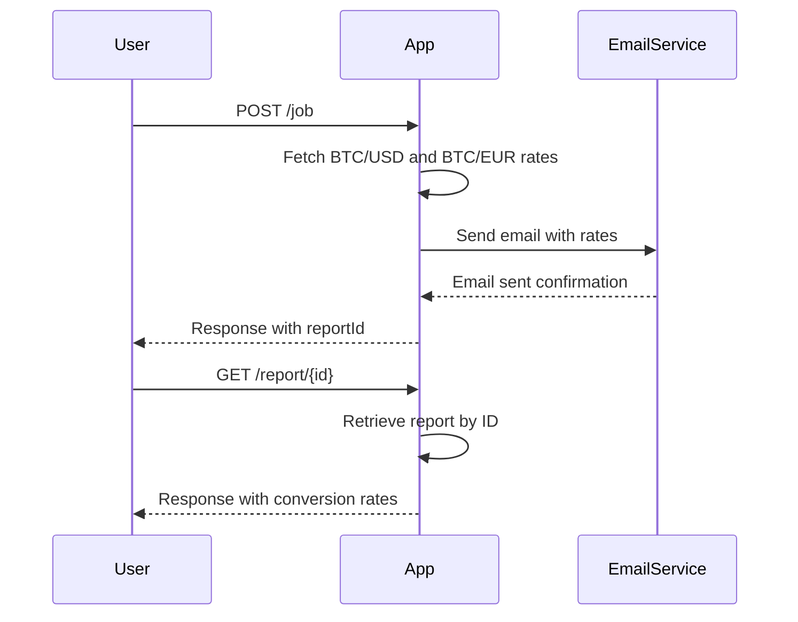

Here are the finalized functional requirements for your Bitcoin conversion rate application, formatted for clarity and completeness:

### Functional Requirements

#### User Stories

1. **Initiate Report Creation**
   - **As a user**, I want to initiate the report creation process so that I can receive the latest Bitcoin conversion rates.
   - **Endpoint**: `POST /job`
   - **Request Format**: 
     ```json
     {
       "email": "user@example.com"
     }
     ```
   - **Response Format**: 
     ```json
     {
       "status": "success",
       "message": "Report creation initiated.",
       "reportId": "12345"
     }
     ```

2. **Retrieve Report by ID**
   - **As a user**, I want to retrieve my report by its ID so that I can view the conversion rates.
   - **Endpoint**: `GET /report/{id}`
   - **Response Format**: 
     ```json
     {
       "reportId": "12345",
       "btcToUsd": "50000",
       "btcToEur": "42000",
       "timestamp": "2023-10-01T12:00:00Z"
     }
     ```

#### API Endpoints Summary

| Method | Endpoint       | Request Body                     | Response Body                                     |
|--------|----------------|----------------------------------|---------------------------------------------------|
| POST   | /job           | `{ "email": "user@example.com" }` | `{ "status": "success", "message": "...", "reportId": "12345" }` |
| GET    | /report/{id}   | N/A                              | `{ "reportId": "12345", "btcToUsd": "...", "btcToEur": "...", "timestamp": "..." }` |

#### User-App Interaction Diagram


```mermaid
sequenceDiagram
    participant User
    participant App
    participant EmailService

    User->>App: POST /job
    App->>App: Fetch BTC/USD and BTC/EUR rates
    App->>EmailService: Send email with rates
    EmailService-->>App: Email sent confirmation
    App-->>User: Response with reportId

    User->>App: GET /report/{id}
    App->>App: Retrieve report by ID
    App-->>User: Response with conversion rates
```

### Additional Notes
- **Data Sources**: The application will need to pull Bitcoin conversion rates from a reliable API.
- **Email Service**: The application will utilize an email service for sending reports.
- **Storage**: Reports will be stored in a database or another suitable method.
- **Error Handling**: The application should gracefully handle errors and provide relevant feedback.

These functional requirements provide a comprehensive foundation for your application development. If you have any further modifications or additional features to add, please let me know!