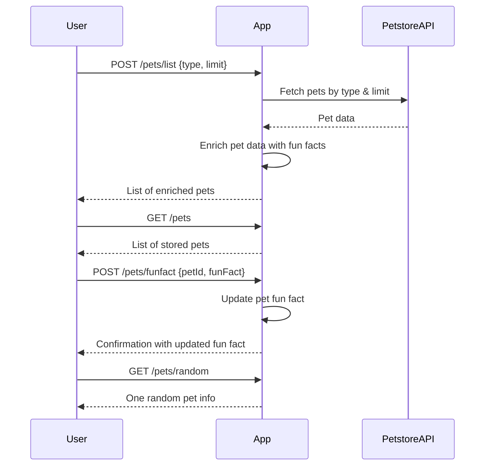

```markdown
# Purrfect Pets API - Functional Requirements

## Overview
The app provides pet data based on Petstore API, enriched with fun features.  
POST endpoints perform external data retrieval or business logic.  
GET endpoints retrieve stored or computed results.

---

## API Endpoints

### 1. Retrieve Pets List (POST)
- **URL:** `/pets/list`
- **Description:** Fetches pet data from Petstore API and stores/enriches it.
- **Request Body:**
```json
{
  "type": "cat" | "dog" | "all",
  "limit": 10
}
```
- **Response:**
```json
{
  "pets": [
    {
      "id": "string",
      "name": "string",
      "type": "string",
      "status": "string",
      "funFact": "string"
    }
  ]
}
```

---

### 2. Get Stored Pets (GET)
- **URL:** `/pets`
- **Description:** Returns the list of stored/enriched pets.
- **Response:**
```json
{
  "pets": [
    {
      "id": "string",
      "name": "string",
      "type": "string",
      "status": "string",
      "funFact": "string"
    }
  ]
}
```

---

### 3. Add a Fun Fact to a Pet (POST)
- **URL:** `/pets/funfact`
- **Description:** Adds or updates a fun fact for a specific pet.
- **Request Body:**
```json
{
  "petId": "string",
  "funFact": "string"
}
```
- **Response:**
```json
{
  "success": true,
  "petId": "string",
  "funFact": "string"
}
```

---

### 4. Get a Random Pet (GET)
- **URL:** `/pets/random`
- **Description:** Retrieves a random pet from stored pets.
- **Response:**
```json
{
  "pet": {
    "id": "string",
    "name": "string",
    "type": "string",
    "status": "string",
    "funFact": "string"
  }
}
```

---

## User-App Interaction Sequence


```mermaid
sequenceDiagram
    participant User
    participant App
    participant PetstoreAPI

    User->>App: POST /pets/list {type, limit}
    App->>PetstoreAPI: Fetch pets by type & limit
    PetstoreAPI-->>App: Pet data
    App->>App: Enrich pet data with fun facts
    App-->>User: List of enriched pets

    User->>App: GET /pets
    App-->>User: List of stored pets

    User->>App: POST /pets/funfact {petId, funFact}
    App->>App: Update pet fun fact
    App-->>User: Confirmation with updated fun fact

    User->>App: GET /pets/random
    App-->>User: One random pet info
```

---

## Summary
- POST endpoints trigger external Petstore API calls and data enrichment.
- GET endpoints retrieve data stored or processed by the app.
- Fun facts add personality to pets.
- Random pet endpoint adds a playful feature.
```
