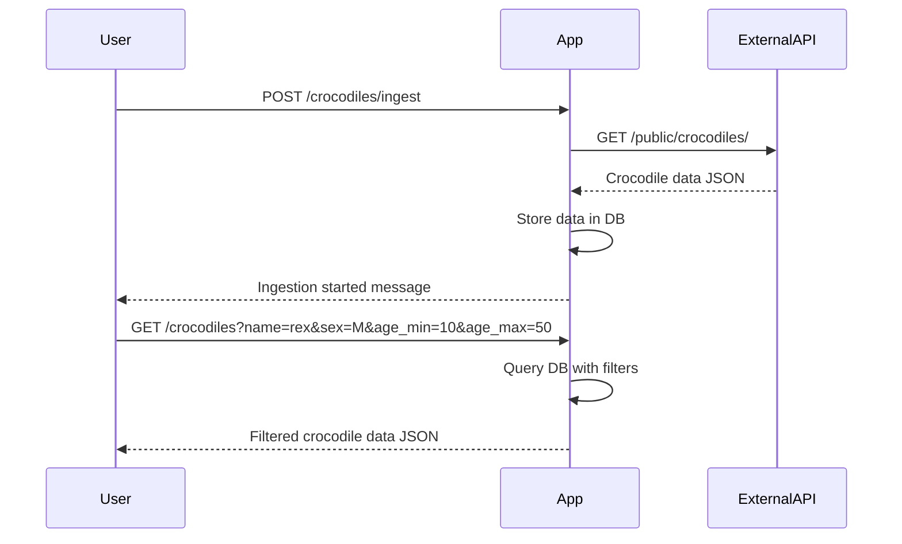

```markdown
# Functional Requirements for Crocodile Data Application

## API Endpoints

### 1. POST /crocodiles/ingest
- **Description:** Trigger ingestion of crocodile data from external API (https://test-api.k6.io/public/crocodiles/)
- **Request:**
  ```json
  {}
  ```
- **Response:**
  ```json
  {
    "message": "Data ingestion started",
    "ingested_count": 123
  }
  ```
- **Business Logic:** Fetch data from external API, store/update in the database.

---

### 2. GET /crocodiles
- **Description:** Retrieve crocodile data filtered by query parameters
- **Query Parameters (all optional):**
  - `name` (string): filter by crocodile name (case-insensitive, partial match)
  - `sex` (string): filter by sex, allowed values: `M` or `F`
  - `age_min` (integer): minimum age filter (inclusive)
  - `age_max` (integer): maximum age filter (inclusive)
- **Request Example:**
  ```
  GET /crocodiles?name=rex&sex=M&age_min=10&age_max=50
  ```
- **Response:**
  ```json
  [
    {
      "id": "uuid-string",
      "name": "Rex",
      "sex": "M",
      "age": 25,
      "other_fields": "..."
    }
  ]
  ```

---

## User-App Interaction Sequence


```mermaid
sequenceDiagram
    participant User
    participant App
    participant ExternalAPI

    User->>App: POST /crocodiles/ingest
    App->>ExternalAPI: GET /public/crocodiles/
    ExternalAPI-->>App: Crocodile data JSON
    App->>App: Store data in DB
    App-->>User: Ingestion started message

    User->>App: GET /crocodiles?name=rex&sex=M&age_min=10&age_max=50
    App->>App: Query DB with filters
    App-->>User: Filtered crocodile data JSON
```
```