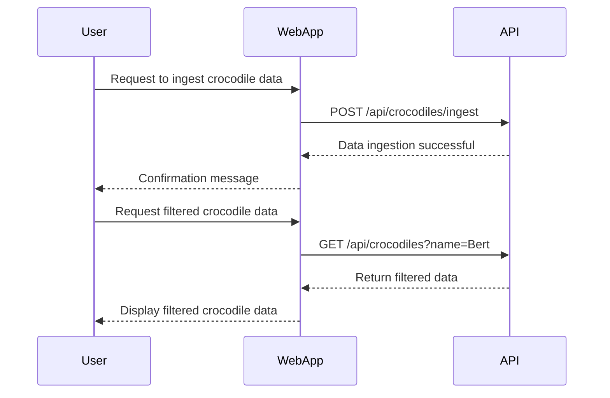

```markdown
# Final Functional Requirements for Crocodile Data Application

## Overview
This application will ingest crocodile data from a specified API, store it in a database, and provide a web interface for users to filter and retrieve the data based on specific criteria.

## API Endpoints

### 1. Ingest Crocodile Data
- **Endpoint**: `/api/crocodiles/ingest`
- **Method**: POST
- **Description**: This endpoint will fetch crocodile data from the external API and store it in the database.
- **Request Format**: 
  ```json
  {
    "source": "https://test-api.k6.io/public/crocodiles/"
  }
  ```
- **Response Format**: 
  ```json
  {
    "message": "Data ingestion successful",
    "count": 8
  }
  ```

### 2. Get Filtered Crocodile Data
- **Endpoint**: `/api/crocodiles`
- **Method**: GET
- **Description**: This endpoint retrieves crocodile data from the database based on specified filtering criteria.
- **Query Parameters**:
  - `name` (optional, string): The name of the crocodile to filter by.
  - `sex` (optional, string): The sex of the crocodile to filter by. Values can be 'M' or 'F'.
  - `age_min` (optional, integer): The minimum age of the crocodile to filter by.
  - `age_max` (optional, integer): The maximum age of the crocodile to filter by.
- **Response Format**: 
  ```json
  [
    {
      "id": 1,
      "name": "Bert",
      "sex": "M",
      "date_of_birth": "2010-06-27",
      "age": 14
    },
    ...
  ]
  ```

## User-App Interaction Diagram


```mermaid
sequenceDiagram
    participant User
    participant WebApp
    participant API
    
    User->>WebApp: Request to ingest crocodile data
    WebApp->>API: POST /api/crocodiles/ingest
    API-->>WebApp: Data ingestion successful
    WebApp-->>User: Confirmation message
    
    User->>WebApp: Request filtered crocodile data
    WebApp->>API: GET /api/crocodiles?name=Bert
    API-->>WebApp: Return filtered data
    WebApp-->>User: Display filtered crocodile data
```
```