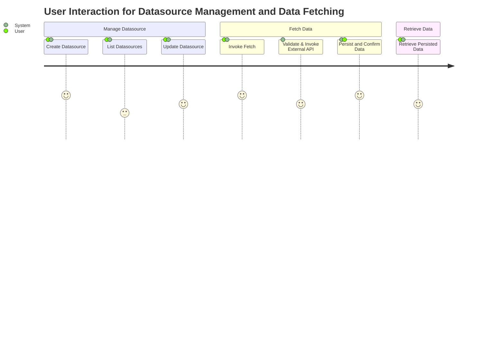
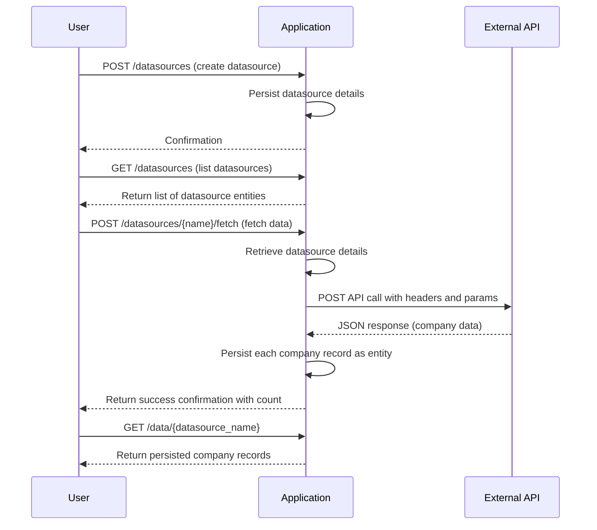

# Functional Requirements Document

## Title: Backend Application for Managing External Data Sources

### Overview

The application allows users to manage external data sources, fetch data from them, and persist the retrieved data for further use. The functional requirements outlined below adhere to RESTful principles.

### 1. Datasource Management

#### 1.1 Create Datasource
- **Endpoint:** `POST /datasources`
- **Description:** Creates a new datasource entity.
- **Request Body (JSON):**
  ```json
  {
    "datasource_name": "string",
    "url": "string",
    "uri_params": { "param1": "value1", "param2": "value2" },
    "authorization_header": "string"
  }
  ```
- **Response (JSON):**
  ```json
  {
    "message": "Datasource created successfully",
    "datasource_id": "string_or_number"
  }
  ```

#### 1.2 Update Datasource
- **Endpoint:** `PUT /datasources/{id}`
- **Description:** Updates an existing datasource entity.
- **Request Body (JSON):**
  ```json
  {
    "datasource_name": "string",
    "url": "string",
    "uri_params": { "param1": "value1", "param2": "value2" },
    "authorization_header": "string"
  }
  ```
- **Response (JSON):**
  ```json
  {
    "message": "Datasource updated successfully"
  }
  ```

#### 1.3 Get All Datasources
- **Endpoint:** `GET /datasources`
- **Description:** Retrieves all persisted datasource entities for viewing and selection.
- **Response (JSON):**
  ```json
  [
    {
      "datasource_id": "string_or_number",
      "datasource_name": "string",
      "url": "string",
      "uri_params": { "param1": "value1" },
      "authorization_header": "string"
    }
  ]
  ```

### 2. API Call Execution

#### 2.1 Fetch Data from External API
- **Endpoint:** `POST /datasources/{datasource_name}/fetch`
- **Description:** Invokes business logic to perform an API call to the external data source using the selected datasource entity.
- **Request Body (JSON):**
  ```json
  {
    "additional_params": { "key": "value" }
  }
  ```
- **Response (JSON):**
  ```json
  {
    "message": "Data fetched and persisted successfully",
    "fetched_count": 10
  }
  ```
- **Business Logic:**
  - Validate datasource_name existence.
  - Build HTTP request using datasource details.
  - Ensure "Content-Type: application/json" header.
  - Fetch data from external API.
  - Parse and persist the JSON response as separate entities.

### 3. Retrieve Persisted Data

#### 3.1 Get Persisted Data for a Datasource
- **Endpoint:** `GET /data/{datasource_name}`
- **Description:** Retrieves the set of entities that have been persisted from the external API call for the given datasource_name.
- **Response (JSON):**
  ```json
  [
    {
      "company_num": 117738,
      "company_bus_ind": "C",
      "company_name": "RYANAIR CARGO LIMITED",
      "company_addr_1": "3 DAWSON STREET",
      "company_addr_2": "DUBLIN 2.",
      "company_addr_3": "DUBLIN, DUBLIN, Ireland",
      "company_addr_4": "",
      "company_reg_date": "1986-10-28T00:00:00Z",
      "company_status_desc": "Dissolved",
      "company_status_date": "1993-11-19T00:00:00Z"
      // ... additional fields
    }
  ]
  ```

### User Interaction Diagrams


```mermaid
journey
    title User Interaction for Datasource Management and Data Fetching
    section Manage Datasource
      Create Datasource: 5: User, System
      List Datasources: 3: User, System
      Update Datasource: 4: User, System
    section Fetch Data
      Invoke Fetch: 5: User, System
      Validate & Invoke External API: 4: System
      Persist and Confirm Data: 5: System, User
    section Retrieve Data
      Retrieve Persisted Data: 4: User, System
```


```mermaid
sequenceDiagram
    participant U as User
    participant A as Application
    participant E as External API

    U->>A: POST /datasources (create datasource)
    A->>A: Persist datasource details
    A-->>U: Confirmation

    U->>A: GET /datasources (list datasources)
    A-->>U: Return list of datasource entities

    U->>A: POST /datasources/{name}/fetch (fetch data)
    A->>A: Retrieve datasource details
    A->>E: POST API call with headers and params
    E-->>A: JSON response (company data)
    A->>A: Persist each company record as entity
    A-->>U: Return success confirmation with count

    U->>A: GET /data/{datasource_name}
    A-->>U: Return persisted company records
```

This document outlines the functional requirements for the backend application, including API endpoints, request/response formats, and user interaction diagrams.